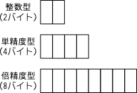
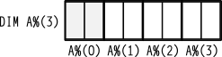
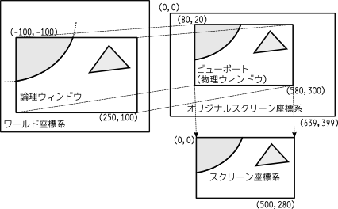
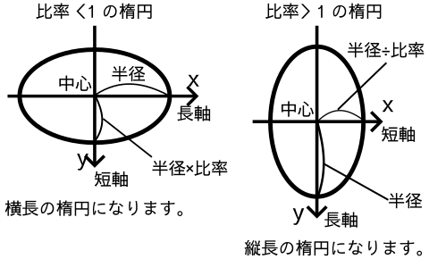
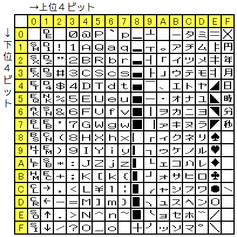

# VeySicK MATEN 取扱説明書 <!-- by 片山博文MZ (かたやまひろふみエムゼッド) -->

ヴェイシック・マテン とりあつかいせつめいしょ

- 本書の記述の正しさ、正確さ、完全性、妥当性などについては一切、保証いたしかねますので、ご了承ください。
- VeySicKの仕様は将来、変更されることがあります。
- 本書内の商標は、その商標を所有する会社の商標です。
- 記述に間違いがありましたら、片山博文MZまで積極的にご報告ください。

Copyright 2016-2024 Katayama Hirofumi MZ. All Rights Reserved.

## VeySicKについて

### VeySicKとは？

VeySicK(ヴェイシック)は、昔のパソコンのようなBASIC環境を実現するソフトウェアです。WindowsやLinuxなどで昔ながらのBASIC環境を体験できます。
VeySicK は、Very Sick BASIC Environment (マジでヤバいBASIC環境)の略です。日本語のベーシックに似たような発音で勝手に造語しました。

### VeySicKの特徴

VeySicKは、次の特徴を持っています。

- 一部のN88-BASICプログラムをインタープリター方式で実行できます。
- 8801モード、9801モードの２つの[システムモード](#system_mode)が用意されており、切り替えて使うことが可能です。
- 無制限モード（旧：VSKモード）は、ただエミュレートするだけでは回避できない、文字列を256文字以上にできない、モジュールの初期化が必要などの実機の制限を乗り越えます。
- 高速実行が可能です。エミュレーターよりも速く実行できます。動作が速すぎる場合は、遅延時間の設定で実行速度を調整できます。
- 文字を表示する[テキスト画面](#text_screen)と図形を表示する[グラフィック画面](#graphic_screen)が分離されており、合成して表示できます。
- [GRPHモード](#char_mode)で[テキスト画面](#text_screen)に[半角](#hankaku)カナや[半角](#hankaku)の[GRPH文字](#grph_chars)を表示できます。
- [SJISコード](#char_mode)で[テキスト画面](#text_screen)に漢字を直接入力・表示できます。
- [PUT@ KANJI](#putat)文で[グラフィック画面](#graphic_screen)に漢字を表示できます。
- 多彩なカラー表示が可能です。
- [グラフィック画面](#graphic_screen)は、640×200モードと640×400モードを切り替えて使うことができ、白黒グラフィック画面は合成して表示できます。
- [`PLAY`](#play)、[`CMD PLAY`](#cmd_play)文により、FM音源とSSG音源による遅延の少ない6重奏のサウンドが楽しめます。
- 空ループをウェイトに自動的に変換することにより、安定したアニメーションが可能に。

### VeySicKを開発した理由

古いパソコンは、消費電力も大きくなりがちです。さらに、コンデンサの劣化によって故障し、白煙を発する場合もあり、火災の危険も伴います。
また、ファイルシステムが現在のものとは異なるため、ファイルの変換に手間がかかることがあります。
そのため、古いパソコンを所有して使い続けることは、現実的ではありません。古いパソコンは、売却するか、博物館に寄贈するのが賢明でしょう。

一方で、古いシステムを仮想化した「エミュレータ」を現物を持たずに使用することは、著作権に関する問題が生じる可能性があります。

そこで、VeySicKは、現行のOSで動作し、著作権の問題を回避できるBASIC環境を提供することを目的に開発されました。VeySicKは、実際のROMデータを使用しない自由なソフトウェアであり、著作権の問題が発生しません。

VeySicKを使えば、一部の古いN88-BASICのコードを現在の環境で活用できます。もはや、N88-BASICのプログラムが消えてしまうことはありません。

### 歴史

- 1981年、8ビットパソコン「PC-8801」が発売された。
- 1982年、16ビットパソコン「PC-9801」が発売された。
- 1983年、X Window System (X11) が登場。
- 1995年、Windows 95が発売された。
- 2016年、VeySicK Friendが正式リリースされる。
- (開発休止)
- 2025年、VeySicK MATEN リリース。

### VeySicKの動作環境

- Windows XP、Windows Vista、Windows 7、Windows 10、Windows 11
- 32ビット日本語Ubuntu (i686)
- 実メモリー64MB以上必須

※ この他の環境で動いた場合は、ご報告ください。

### 未対応の機能

次に挙げる機能は、VeySicKではまだ利用できません。

- ハイレゾモード
- RS-232C通信
- JIS文字列の処理
- 磁気テープレコーダー
- ターミナルモード
- 機械語
- 一部のI/Oインタフェース
- ハードウェアやCPUに依存した処理

### インストール方法

GitHubの`katahiromz/VeySicK`リポジトリの`Release`ページから、お使いの環境に適したインストーラをダウンロードし、インストールしてください。

- [https://github.com/katahiromz/VeySicK](https://github.com/katahiromz/VeySicK)

インストールは、インストーラに従ってボタンをクリックするだけで完了します。

デフォルトでは、ユーザーフォルダ内の`.vsk`フォルダにインストールされます。ユーザーフォルダは、Windowsの場合は環境変数`HOMEPATH`の値に、Linuxの場合は環境変数`HOME`の値に対応します。

もし自分でビルドしたい場合は、GitHubからソースコードをダウンロードし、`CMake`を使ってビルドしてください。

### 免責事項

このソフトウェアは、フリーソフトです。このソフトを利用した事によるいかなる損害も作者は一切の責任を負いません。自己責任の上で使用してください。

配布、転載、雑誌掲載などは、自由に行ってください。

ご感想やご要望、不具合などありましたら、メールか掲示板でご連絡ください。

- 作者のホームページ [http://katahiromz.web.fc2.com/](http://katahiromz.web.fc2.com/)
- メール [katayama.hirofumi.mz@gmail.com](mailto:katayama.hirofumi.mz@gmail.com)
- 掲示板 [http://katahiromz.bbs.fc2.com/](http://katahiromz.bbs.fc2.com/)

### 著作権表示

- Copyright (C) 2014-2024 Katayama Hirofumi MZ.
- Copyright (C) 2006-2014 Naoyuki HIRAYAMA.
- Copyright (C) 2013 Yasuhiro Fujii.
- Copyright (C) 2009-2011 Shinsuke Kishi.
- Copyright (C) by cisc 1998, 2003.
- Copyright (C) by okrt 2015-2016. All Rights Reserved.

このソフトウェアの漢字イメージの生成には、「自家製フォント工房」さんの「KHドット小伝馬町16 幾何学的カナ」と「JFドット東雲ゴシック16」を使用しました。

このソフトウェアは、FM音源生成に "fmgon" モジュールを使用しました。"fmgon" は、ciscさん (cisc@retropc.net) の「FM Sound Generator」から派生したモジュールです。

プログラム「drive2/DRAW.BAS」の出展元と使用条件については、「drive2/DRAW.TXT」をご覧ください。

fmgon ライセンス (The fmgon license in Japanese)

・本ソースコードはcisc (cisc@retropc.net) が著作権を所有しています。

・本ソースコードはあるがままに提供されるものであり，暗黙及び明示的な保証を一切含みません．

・本ソースコードを利用したこと，利用しなかったこと，利用できなかったことに関して生じたあるいは生じると予測される損害について，作者は一切責任を負いません．

・本ソースコードは，以下の制限を満たす限り自由に改変・組み込み・配布・利用することができます．

  1. 本ソフトの由来(作者, 著作権)を明記すること.
  2. 配布する際にはフリーソフトとすること．
  3. 改変したソースコードを配布する際は改変内容を明示すること.
  4. ソースコードを配布する際にはこのテキストを一切改変せずにそのまま添付すること．

・公開の際に作者への連絡を頂ければ幸いです．

・商用ソフト(シェアウェア含む) に本ソースコードの一部，または全部を組み込む際には，事前に作者の合意を得る必要があります．

### VeySicKのシステムモードについて {#system_mode}

「システムモード」は、基本的な動作の振る舞いを切り替えるモードです。VeySicKのシステムモードには、「8801モード」「9801モード」の2種類あります(VeySicK拡張)。

8801モードは、実機8801に近いシステムモードです。9801モードは、実機9801に近いシステムモードです。システムモードによって利用できる命令が異なります。[`REM`](#rem)文によってシステムモードを切り替えることができます(VeySicK拡張)。詳しくは[命令リファレンス](#reference)を参照してください。

8801モードでは、[テキスト画面](#text_screen)に[ファンクションキー](#function_keys)が5個しか表示されませんが、9801モードでは、[ファンクションキー](#function_keys)が10個表示されます(`WIDTH 80`の場合)。
8801モードよりも9801モードの方が、[テキスト画面](#text_screen)の文字が見やすくなっております。

### DISKモードとは

実機BASICでは、起動ドライブにBASICのシステムディスクを入れて起動しないと、使えない機能がありました。BASICのシステムディスクから起動したBASICのことを「DISKモード」と呼びます。

VeySicK MATENは、常にDISKモードであり、ディスクから起動しなくてもDISKモードの命令が使えます。

### DOSバージョンとは

MS-DOSから起動したBASICのことをDOSバージョンと呼びます。VeySicK MATENはDOSバージョンではありません。

### VeySicKの文字モードについて {#char_mode}

VeySicKには、文字符号の表示方法を切り替えるために「文字モード」というものが存在します(VeySicK拡張)。文字モードには現在、「GRPHモード」「SJISモード」「JISモード」の二種類あります。

GRPHモードは、ASCII文字の他に[半角](#hankaku)カナと[GRPH文字](#grph_chars)を表示できる文字モードです。

SJISモードは、ASCII文字の他に[半角](#hankaku)カナと全角文字を表示できる文字モードです。

JISモードは、画面の表示はSJISと同じですが、JISコードの文字列を扱うことのできる文字モードです。VeySicKや8801モードではJISモードは選択できません。

文字モードの切り替えには、後述の[`REM`](#rem)文を使います(VeySicK拡張)。

### 全角について {#zenkaku}

VeySicKの[テキスト画面](#text_screen)では、「あいうえお」は「AIUEO」の二倍の幅で表示されます。二倍の幅の文字のことを「全角文字」と言います。漢字やひらがなは全角文字です。


全角文字を表示するには、[`REM`](#rem)文で[SJISモード](#char_mode)に切り替えないといけません。

全角文字を入力するには [`半/全`] キーを押して日本語入力システム（IME）をオンにしてください。その後、半角の入力に戻りたい場合はもう一度[`半/全`] キーを押してください。

### 半角について {#hankaku}

全角文字ではない文字のことを 「半角文字」といいます。半角のカタカナのことを半角カナと呼びます。

半角カナを入力するには [`カナ`] キーを押してください。その後、半角英数の入力に戻りたい場合はもう一度[`カナ`] キーを押してください。

### GRPH文字について {#grph_chars}

「グラフィックシンボル文字」「GRPH文字」とは、トランプのマーク、罫線などを表示できる１バイトの[半角文字](#hankaku)です。
実機では`GRPH`キーを押しながらキーボードの特定のキーを押せば、GRPH文字を入力できます。
VeySicKでは、[GRPHモード](#char_mode)の場合に、Altキーを押しながらキーボードの特定のキーを押せば、GRPH文字を入力できます。


GRPH文字は機種依存文字ですので、他のソフトウェアでは正しく表示できないことがあります。
また、[GRPHモード](#char_mode)以外のときや、画面以外のデバイスでは正しく表示できないことがあります。

### ANK {#ank}

GRPH文字が含まれる文字コードは、ANK(Alphabet Numeric Kana)と呼ばれる特殊な1バイト文字コードで、N88-BASIC以外ではほとんど使用されていません。ANKにおけるASCII文字と半角カナ文字はシフトJISと互換性がありますが、GRPH文字に関しては互換性がなく、標準化もされていません。将来的にUnicodeでANK文字がサポートされる可能性もありますが、基本的には互換性がないと考えるべきです。詳細は、付属資料の[ANK文字コード表](#charmap)をご覧ください。

### 動作モード

VeySicKを起動すると、画面に「`Ok`」という文字が表示されて、VeySicKは利用者のコマンド入力を受け付けるようになります。この状態のときは、BASICの文をキーボードで入力することができます。

#### ダイレクトモード {#direct_mode}

先頭に行番号をつけずにVeySicKの文法に沿った文を入力した場合、その文は、「Enter」(実機では「RETURN」)キーを入力後、すぐに実行されます。これを「ダイレクトモード」による実行と言います。VeySicKの文法に沿った文ではない場合、`Syntax error`エラーが発生します。ダイレクトモードで文を実行できる状態のことを「コマンドレベル」と言います。

#### プログラムモード {#program_mode}

先頭に行番号をつけて文を入力したとき、それはプログラム行として行番号とともにメモリーに格納されます。格納されたプログラムは、[`RUN`](#run)、[`GOTO`](#goto)、または[`GOSUB`](#gosub)文により、実行を開始できます。これを「プログラムモード」による実行と言います。

### 文 {#statement}

文(ステートメント; statement)とは、VeySicKが行う手続きを記述している最小単位です。文は、コンピュータに対する命令(コマンド; command)です。文の引数(ひきすう; parameter)として定数、変数、演算子、式や関数呼び出しなどを含むことができます。文の引数は、カンマ(`,`)で区切ることが多いです。文はコロン(`:`)を用いて他の文と連結できます。連結したものを、「複文」(マルチステートメント; multi-statement)と言います。複文の長さは255文字までです(無制限モードを除く)。文や関数の詳しい文法については、[命令リファレンス](#reference)を参照ください。

### 行番号

VeySicKのプログラムでは、行番号はプログラムの実行順序を決定します。行番号が小さい順に実行され、プログラムの流れを管理します。
行番号は、分岐や特定の行へのジャンプ、編集の際に目印として機能します。
一部の文では、行番号の代わりにドット(`.`)を使用することができます。以下の文で現在の行番号を表すために使われます。

- [`LIST`](#list)、[`AUTO`](#auto)、[`EDIT`](#edit)、[`DELETE`](#delete)

また、[`RENUM`](#renum) 文を使用すると、プログラムの行番号を自動的に振り直すことができます。

### プログラム

メモリー上にあるプログラムは[`SAVE`](#save)文でプログラムファイルとして保存できます。プログラムファイルは、テキストファイルとして[`LOAD`](#load)文でメモリー上に読み込むことができます。プログラムをファイルから読み込んだときに行番号がなければ、自動的に行番号がつけられます(VeySicK拡張)。[`EDIT`](#edit)文を使うと、プログラムの閲覧や編集がしやすくなります。また、アスキーセーブしたプログラムファイルは、テキスト形式ですので、その文字コードに対応している他のソフトウェア(テキストエディター、バイナリーエディタなど)でも編集ができます。VeySicKがプログラムファイルを保存する場合は、特に指定しない限り、アスキーセーブされます。

### ラベル

VeySicKでは、分岐先の行番号の代わりに「ラベル」を指定することができます。ラベルは、プログラムの行につけることができる名前です。

ラベルの使用については以下の規則を守る必要があります。

- ラベル名の直前に必ずアスタリスク(`*`)をつけなければなりません。
- ラベル名に使用できる文字は、先頭のアスタリスクを除いて英文字と数字とドット(`.`)であり、大文字と小文字の区別はありません。
- VeySicKの予約語をラベルとして使用できません。
- ラベルの後に文を書くときは、ラベルの後にコロン(`:`)をつけて区切ります。

### 特殊記号

プラス(`+`)
 ~ 足し算を表すのに使う演算子です。

マイナス(`-`)
 ~ 引き算を表すのに使う演算子です。また、[`LIST`](#list)、[`DELETE`](#delete)文などで行の範囲を表すのに使います。

アスタリスク(`*`)
 ~ ラベル名の直前につけます。また、掛け算を表すのに使う演算子でもあります。

スラッシュ(`/`)
 ~ 割り算を表すのに使う演算子です。

ハット(`^`)
 ~ べき乗を表すのに使う演算子です。

半角の円記号またはバックスラッシュ(`¥` または `\`)
 ~ 整数の除算を表す演算子です。割り算の小数点以下を切り捨てた結果となります。

二重引用符(ダブルクォーテーション)(`"`)
 ~ 二重引用符(`"`)で囲まれた内容は、[文字列](#string)として扱われます。

ドット(`.`)
 ~ ドットは、エラーが発生した行、または新しく入力した行の行番号の代わりです。[`LIST`](#list)、[`AUTO`](#auto)、[`EDIT`](#edit)、[`DELETE`](#delete)文などで使用できます。また、小数点としても使えます。

コロン(`:`)
 ~ [複文](#statement)の区切りです。

カンマ(`,`)
 ~ [`PRINT`](#print)、[`INPUT`](#input)文などの引数の区切りとして使います。

セミコロン(`;`)
 ~ [`PRINT`](#print)文などの区切りとして使います。

アポストロフィー(`'`)
 ~ [`REM`](#rem)キーワードの代用として使えます。

疑問符(クエスチョンマーク)(`?`)
 ~ [`PRINT`](#print)キーワードの代用として使えます。

スペース(空白)
 ~ VeySicKは、原則として[文字列](#string)内部以外の空白を無視します。ただし、コマンド名と引数が隣り合う場合、間にスペースを入れなければいけません。

### 型 {#type}

#### 型の種類

VeySicKの「型」とは、VeySicKで扱うデータの種類のことです。VeySicKの型は、「文字列型」と「数値型」に分類されます。

#### 文字列型 {#string}

「文字列」とは、文字の並びのことです。「文字列定数」は、[半角](#hankaku)の二重引用符(`"`)で囲まれた文字の並びのことです。[半角](#hankaku)の二重引用符そのものを記述する場合は、[`CHR$`](#chr_dollar)関数を使います。

文字には[半角文字](#hankaku)と[全角文字](#zenkaku)があります。全角文字は１文字が２バイトであり、半角の２倍の文字幅を持ちます。半角文字は１バイトで全角文字の半分の文字幅です。


実機BASICでは、256文字以上の文字列をそのまま扱うことはできません。VeySicKでは、256文字以上の文字列はヌル終端の文字列として扱われます。

#### 数値型 {#number}

数値型は、「整数型」と「実数型」に分類されます。数値型は、正の数、負の数、またはゼロです。負の数にはマイナス符号を付ける必要があります。

#### 整数型 {#shinsuu}

整数型は、「10進形式」「8進形式」「16進形式」の三つに分類されます。

10進形式
 ~ `0`から`9`までの数字の並びです。

8進形式
 ~ 先頭に「`&O`」または「`&`」を伴った`0`から`7`までの数字の並びです。10進の`8`は、8進では「`&10`」「`&O10`」などと表します。

16進形式
 ~ 先頭に「`&H`」を伴った`0`～`9`または`A`～`F`の並びです。10進の`18`は、16進では「`&H12`」と表します。

整数型は、内部表現２バイトで保存されます。10進数、8進数、16進数の関係を次の表で示します。

| 10進数 |    8進数 |  16進数 |
|-------:|---------:|--------:|
|     `0`|      `&0`|    `&H0`|
|     `1`|      `&1`|    `&H1`|
|     `2`|      `&2`|    `&H2`|
|     `3`|      `&3`|    `&H3`|
|     `4`|      `&4`|    `&H4`|
|     `5`|      `&5`|    `&H5`|
|     `6`|      `&6`|    `&H6`|
|     `7`|      `&7`|    `&H7`|
|     `8`|     `&10`|    `&H8`|
|     `9`|     `&11`|    `&H9`|
|    `10`|     `&12`|    `&HA`|
|    `11`|     `&13`|    `&HB`|
|    `12`|     `&14`|    `&HC`|
|    `13`|     `&15`|    `&HD`|
|    `14`|     `&16`|    `&HE`|
|    `15`|     `&17`|    `&HF`|
|    `16`|     `&20`|   `&H10`|
|    `17`|     `&21`|   `&H11`|
|    `18`|     `&22`|   `&H12`|
|     `:`|       `:`|      `:`|
|     `:`|       `:`|      `:`|
|   `255`|    `&377`|   `&HFF`|
|   `256`|    `&400`|  `&H100`|
|     `:`|       `:`|      `:`|
|     `:`|       `:`|      `:`|
| `65535`| `&177777`| `&HFFFF`|

ご覧のとおり、8進数は、`7`の次で繰り上がりが発生します。16進数は、`F`の次で繰り上がりが発生します。

#### 実数型 {#real}

実数型は、「単精度型」と「倍精度型」に分類されます。

単精度型
 ~ 内部表現４バイトの浮動小数点数です。有効桁7桁の精度を持ちます。

倍精度型
 ~ 内部表現８バイトの浮動小数点数です。有効桁16桁の精度を持ちます。



BASICでは実数とは言いますが、実際は浮動小数点数です。

次のいずれかで表記される定数は、「単精度型定数」です。

- 7桁以下の実数(`123.1`)
- `E`を使った指数形式(`-3.2E-03`など)
- 最後に感嘆符(`!`)がつく定数

次のいずれかで表記される定数は、「倍精度型定数」です。

- 8桁以上の数(`123456789`)
- `D`を使った指数形式(`-3.27273749236D+08`など)
- 最後にシャープ(`#`)がつく定数

#### 文字列データと数値の内部表現の違い

VeySicKでは、整数型のデータは2バイトの2進数として格納されます。ただし、符号付き整数として扱われる場合は、最上位ビットが符号を表し、残りのビットは2の補数として格納されます。実数型データは[IEEE-754](http://en.wikipedia.com/wiki/IEEE-754)に従って格納されます(実機とは浮動小数点数のビット表現が異なります)。VeySicKの数値データはリトルエンディアン形式です。

計算機内部で扱う数値データ(内部表現、バイナリ)と、数値を表示するための文字列データは全く異なるものです。例えば、`"0"`という文字は、文字コード`48`(`&H30`)として表されます。つまり、`"0"`を表示するために、1バイトの値`48`(`&H30`)が使われます。文字コードに関しては、付属資料の[ANK文字コード表](#charmap)をご覧ください。文字列データは、1バイト(8ビット)単位の文字コードの並びとして格納されます。

8ビットの整数は、16進数では2桁で表せるため、1バイトは16進2桁で表現できます。バイト列を表す際には、桁数が少なくなる16進表記がよく使われます。

2進数で符号化されたデータは、10進数よりも計算機にとって扱いやすく、データ量を節約でき、処理速度の向上にも寄与します。ただし、進数変換時に誤差が生じる可能性があるため、注意が必要です。

### 変数 {#variable}

#### 変数とは？

「変数」とは、数値や[文字列](#string)を記憶しておくための場所で、英数字などで構成された名前がつけられています。この名前を「変数名」と呼びます。

変数を使うことで、特定の値を記憶させたり、取り出したり、参照することができます。

まだ値が代入されていない変数は、ゼロ(`0`)または空文字列(`""`)を返します。

#### 変数名と型宣言文字

変数の名前のことを「変数名」と言います。変数名とは、英数字かドットの並び、またはその後に「`$`」「`!`」「`#`」「`%`」「`&`」のいずれかをつけたものです。これらの記号は、「型宣言文字」と言います。

- 最後に「`$`」がつく変数名は、文字列型であることを表します。
- 最後に「`!`」がつく変数名は、単精度型であることを表します。
- 最後に「`#`」がつく変数名は、倍精度型であることを表します。
- 最後に「`%`」がつく変数名は、16ビットの整数型であることを表します。
- 最後に「`&`」がつく変数名は、32ビットの整数型であることを表します(VeySicK拡張)。

型宣言文字が違う変数は、別の変数として区別されます。

変数名は、VeySicKの予約語ではあってはなりませんが、予約語を含むことはできます。変数名の英字には大文字・小文字の区別はありません。

[`DEFINT`/`DEFSNG`/`DEFDBL`/`DEFSTR`](#defint_defsng_defdbl_defstr)文を使うと、型宣言文字をつけない変数の型を指定できます。初期状態では、型宣言文字をつけない変数は、単精度型です。

`FN`や`USR`で始まる名前は、変数名には使えません。

#### 配列変数 {#array}

「配列」とは、同じ型のデータが集まったものであり、「配列変数」は、その配列を格納するための[変数](#variable)です。

配列変数は、`DIM`文で宣言し、各要素は、添え字(そえじ)によって表されます。

「`DIM A%(3)`」を実行すると、「`A%`」という名前の１次元の配列変数が確保されます。このとき、要素の数は`4`個(＝`3+1`)で、各要素は、整数であり、「`A%(0)`」「`A%(1)`」「`A%(2)`」「`A%(3)`」という式によってアクセスできます。



しかし、一方で`A%`という配列ではない変数を使用できます（`A%=3`、`PRINT A%`など）。配列変数と非配列変数では名前空間が異なるためです。

「`DIM B#(2,3)`」を実行すると、「`B#`」という名前の２次元の配列変数が確保されます。このとき、要素の数は`(2+1)×(3+1)＝12`個で、各要素は、倍精度型であり、「`A%(0,0)`」～「`A%(2,3)`」などの式によってアクセスできます。

`DIM`で配列変数を明示的に宣言しなくても、添え字`10`までの1次元配列変数へ代入をすると、自動で確保されます。

`FOR`ループなどで配列とループ変数を組み合わせて使用すると、配列の要素に対する繰り返し処理を記述できます。

#### 予約変数

次の変数は、VeySicKが特別に使用する「予約変数」です。

- `TIME$`
- `DATE$`
- `ERL`
- `ERR`

これらの変数は、利用者が一般の変数としては使用できません。

### 型変換

VeySicKの数値データは、以下のような場合に、必要に応じてある型から他の型に変換されます。

- 数値データが他の型の数値変数に代入された場合、数値は、その変数名に応じた数値型に変換されます。
- 精度の違う数値どうしの演算の場合、精度の高い方に変換されて演算が行われます。
- 論理演算の場合、扱われる数値はすべて整数に変換され、結果は整数を返します。
- [実数](#real)が整数に変換されるときは、小数点以下は四捨五入されます。このとき、整数型で扱える範囲を超えたときは、`Overflow`エラーが発生します。
- 倍精度変数が単精度変数に代入されたときは、変数の値は、有効数字７桁に丸めたものとなります。単精度変数の精度は７桁であり、もとの倍精度の数値との誤差の絶対値は、`5.96E-8`以下となります。

### 式と演算

「式」は、１個以上の定数や変数や関数呼び出しを「演算子」で結合して表します。式の演算結果は、１個の数値または１個の文字列になります。

#### 算術演算子

「算術演算子」(足し算`+`、引き算`-`、掛け算`*`、割り算`/`、整数除算`\`、剰余`MOD`、べき乗`^`)は、算術計算を行う演算子です。整数除算(`\`)は整数での割り算を行います。剰余(`MOD`)は割り算の余りを求めます。べき乗(`^`)は指数計算を行います。

#### 関係演算子

「関係演算子」(等号`=`、以下`<=`、以上`>=`、小なり`<`、大なり`>`、不等号`<>`)は、２つの数値や文字列を比較する場合に使います。結果は、真(`-1`)か偽(`0`)となり、[`IF～THEN～ELSE`](#if_then_else_if_goto_else)文などでプログラムの流れを変えるのに使えます。

#### 論理演算子

「論理演算子」(論理否定`NOT`、論理積`AND`、論理和`OR`、排他的論理和`XOR`、包含`IMP`、同値`EQV`)は、複数の条件を調べたり、ビット操作や論理演算を行うのに使います。論理演算は、ビットごとに計算した結果を返します。

論理演算も[`IF～THEN～ELSE`](#if_then_else_if_goto_else)文などでプログラムの流れを変えるのに使えます。

#### ゼロでの除算

式の実行時にゼロでの除算が行われたときは、`Division by zero`エラーが発生しますが、結果はシステムが扱うことのできる最大の数とみなし、それを除算の結果として、処理を続行します。

#### 桁あふれ(オーバーフロー)

代入や演算の結果がその変数の型で扱える範囲を超えた場合、桁あふれが発生します。桁あふれが発生した場合、VeySicKは、`Overflow`エラーが発生し、型が扱える最大の数を結果としてみなし、処理を続行します。

#### 関数

ゼロ個以上の値を使った演算結果を返す仕組みが「関数」です。関数は、式の中で使えます。関数に渡す値を「引数(ひきすう)」と呼びます。

BASICやVeySicKでは、組み込み関数として、[`SIN`](#sin)、[`COS`](#cos)、[`SQR`](#sqr)関数などの数値関数や、文字列を値とする[`CHR$`](#chr_dollar)関数や[`LEFT$`](#left_dollar)関数などの文字列関数が使えます。

- 【例1】 `PRINT SQR(16)`　⇒　`4`
- 【例2】 `PRINT 1+COS(0)`　⇒　`2`

また、VeySicKは、ユーザー定義関数として`FN`で始まる関数を[`DEF FN`](#def_fn)文で定義できます。

#### 文字列の連結 {#string_concat}

文字列は演算子`+`によって連結できます。

- 【例1】 `PRINT "ABC"+"123"`　⇒　`ABC123`
- 【例2】 `A$="ABC":B$="123":PRINT A$+B$`　⇒　`ABC123`

ただし、256バイト以上の文字列を作ろうとすると、制限により`String too long`エラーが発生します(無制限モードを除く)。

#### 文字列の比較

文字列も数値の比較と同様に、関係演算子で比較できます。文字列の比較は、文字ごとの文字コードの大小に応じた順になります。

- 【例】 `IF "ABC"<"ABD" THEN PRINT "GOOD"`　⇒　`GOOD`

#### 演算の優先順位 {#priority}

演算は次の順位で行われます。

 1. カッコで囲まれた式
 2. 関数
 3. べき乗(`^`)
 4. マイナス符号(`-`)
 5. `*`、`/`
 6. `\`
 7. `MOD`
 8. `+`、`-`
 9. 関係演算子(`<`, `>`, `<=`, `>=`, `=<`, `=>`, `<>`, `><`, `=`)
 10. `NOT`
 11. `AND`
 12. `OR`
 13. `XOR`
 14. `IMP`
 15. `EQV`

#### 演算の誤差

コンピューターの計算は、紙の上での計算と同じとは限りません。数値の精度のために、「誤差」が発生することがあります。

#### 誤差への対策

誤差に対処する方法は、次のとおりです。

- 実数を比較する場合は、等号(`=`)ではなく、不等号(`<`、`>`、`<=`、`>=`)を使います。
- [`FOR`～`NEXT`](#for_to_step_next)ループの変数には、整数型変数を使います。
- 結果を整数値として表示する場合は、[`INT`](#int)関数や[`FIX`](#fix)関数を使います。
- 結果を画面やプリンターに出力する場合は、[`PRINT USING`](#print_using)文を使います。
- 求められる精度に応じて、単精度型と倍精度型を使い分けます。

#### VeySicKと実機のBASICの違い

実機では、BASICそのものが基本ソフト(OS)として動作していますが、VeySicKは、WindowsやLinuxといった基本ソフト上でプログラムとして仮想的に実行されます。そのため、次のような相違点が発生します。

- ディスクに直接アクセスできない。
- 処理に遅延が発生することがある。

また、実機とはファイルシステムが異なるので、ファイル入出力におけるファイル指定は、使用している基本ソフトにおけるパスファイル名となります。ただし、ファイル指定におけるドライブ番号の指定は、次のように変換されます(VeySicK拡張)。

- Windowsの場合、「`1:`」「`2:`」…は、「`.vsk\drive1\`」「`.vsk\drive2\`」...に変換されます。
- Linuxの場合、「`1:`」「`2:`」…は、「`~/.vsk/drive1/`」「`~/.vsk/drive2/`」...に変換されます。

古い実機BASICには、ファイルシステムに「フォルダ」という概念はありませんでした。フォルダとは、階層構造を持ったファイルの入れ物であり、フォルダの中に別のフォルダを入れることができます。VeySicKでは、現在のフォルダの表示や移動に[`CHDIR`](#chdir)文を使うことができます(VeySicK拡張)。ファイルは、絶対パスと相対パスで指定でき、ドットドット(`..`)は一つ上のフォルダを意味します。Windowsの場合は、パスの区切りにバックスラッシュ(`\`)が指定できますが、Linuxと同じようにスラッシュ(`/`)を指定できます。

N88-BASICでは、`KYBD:`、`SCRN:`、`LPT1:`、`CAS1:`、`COM1:`などといったデバイスをファイルとして開くことができましたが、VeySicKでは現在、デバイスをファイルとして開くことはできません。

シーケンシャルファイルの入出力においては、VeySicKは改行コードを自動的に変換します。シーケンシャルファイルの出力においては、改行コードはCRLFになり、入力においては改行コードの違いを吸収しようとします。

古いハードウェアに依存した処理は、VeySicKでは正しく動作しないことがあります。

VeySicKと実機のBASICは、処理速度が桁違いに違いますので、次のようなキー待ち処理はうまくいかないことがあります。

```txt
...
300 IF INKEY$="" GOTO 300
...
```

このような場合は、キーを押されるのを待つ前に、キーが離されるのを待つとうまくいくことがあります。

```txt
...
300 WHILE INKEY$<>"":WEND:WHILE INKEY$="":WEND
...
```

## テキストとグラフィックの合成

文字を直接入力したり表示するのには、[テキスト画面](#text_screen)がよく使われます。直線や四角形などの図形の表示には[グラフィック画面](#graphic_screen)が使われます。

VeySicKでは、[テキスト画面](#text_screen)と[グラフィック画面](#graphic_screen)は独立しており、表示の際に２つの画面が合成されて表示されます。

テキスト画面は文字のみ、グラフィック画面は画素（pixel）のみを表示します。実際のモニターの表示は、グラフィック画面の上にテキスト画面を重ねた合成表示となります。

古い環境ではテキスト画面とグラフィック画面が分離されていないことがありました（日本語N88-BASICなど）。

#### テキスト画面 {#text_screen}

テキスト画面は、文字からなる画面であり、主に文字直接入力したり、表示するのに使います。コマンドレベルでキーボードから文字を入力すると、テキスト画面に文字が表示されます。
テキスト画面の幅は80桁か40桁であり、高さは20行か25行になります。40桁の場合、文字の横幅は２倍になります。高さが20行の場合は、行と行の間にすき間が設けられます。[`WIDTH`](#width)文によって桁数や行数を変更できます。

テキスト画面には、カラーモードと白黒モードがあり、[`CONSOLE`](#console)文により切り替えることができます。テキスト画面がカラーモードの場合、各文字には、色をつけることができます。白黒モードの場合は、文字の色は白か黒のみになりますが、点滅や反転などの文字属性を各文字につけることができます。

#### キャレット {#caret}

[テキスト画面](#text_screen)で、文字を入力できる位置を表す、点滅する四角形のことを「キャレット」と言います(昔は「カーソル」とも呼んでいましたが、マウスとまぎわらしいので使いません)。キャレットの位置は、[`LOCATE`](#locate)文で変更できます。


#### ファンクションキー {#function_keys}

キーボードの上側にある「F1」「F2」「F3」などのキーを「ファンクションキー」と言います。ファンクションキーは、テキストの入力を助けるためや、押したときに割り込みを行うために使われます。[テキスト画面](#text_screen)では、初期状態では下側にファンクションキーの内容が表示されます。8801ではF1～F5しか画面に表示されませんが、Shiftキーを押すと、F6～F10の表示に切り替わります。9801ではF1～F10が表示されます(`WIDTH 80`の場合)。コマンドレベルでは、ファンクションキーを押すと、そのキーに対応する内容が入力されます。

ファンクションキーの内容を設定するには、[`KEY`](#key)文を使います。ファンクションキーの内容を表示するには、[`KEY LIST`](#key_list)文を使います。[テキスト画面](#text_screen)のファンクションキー表示と非表示を切り替えるには、[`CONSOLE ,,0`](#console)や[`CONSOLE ,,1`](#console)を実行します。

#### スクロール {#scroll}

[テキスト画面](#text_screen)に複数の行が出力されていくと、キャレットが下の方に移動します。キャレットが一番下まで移動したら、それ以上出力できないと困るので、システムはテキスト画面の表示内容をずらして、下に余白を作ります。このように、表示内容をずらすことを「スクロール」と呼びます。

しかし、ファンクションキーの表示までずれると困るので、[テキスト画面](#text_screen)では、スクロール可能な範囲を決めています。[`CONSOLE`](#console)文でスクロール可能な範囲を指定できます。

#### グラフィック画面 {#graphic_screen}

グラフィック画面は、小さな画素(ピクセル; pixel)の集まりからなる画面であり、主に直線や四角形などの図形やグラフを表示するのに使います。グラフィック画面には、640×200モードと640×400モードがあり、[`SCREEN`](#screen)文で切り替えることができます。640×400モードは「高精細モード」とも呼ばれ、横640ピクセル縦400ピクセルの画素で、より細かい画像を表示できます。640×200モードは、縦200ピクセルをすき間のある２倍の高さに引き伸ばして表示するため、画質が劣ります。初期状態では640×200です。

グラフィック画面にもカラーモードと白黒モードがあり、[`SCREEN`](#screen)文で切り替えることができます。カラーモードでは、カラフルな色の図形を描くことができます。白黒モードでは、白か黒の図形しか描けませんが、複数の白黒画面を合成して表示できます。

### 座標系

#### 座標と座標系

「座標」とは、空間において特定の位置を表す値であり、「座標系」とは座標と位置の対応のことです。「X座標」は横方向の座標であり、「Y座標」は縦方向の座標です。特定の座標系があるとき、X座標とY座標を組み合わせると、平面上の点の位置を表すことができます。通常は、この位置と座標を`(X,Y)`のような記号で表します。VeySicKとBASICの座標系では、右へ行くほどX座標が大きくなり、下へ行くほどY座標が大きくなります。

#### 文字座標系 {#char_coord}

[テキスト画面](#text_screen)の文字の位置は[`LOCATE`](#locate)文で「文字座標」を指定することによって指定できます。一番左上の文字は、文字座標`(0,0)`であり、その一つ右の文字の文字座標は`(1,0)`です。文字座標の範囲は、ファンクションキーの表示([`CONSOLE ,,1`](#console))や、[テキスト画面](#text_screen)の表示桁数・表示行数([`WIDTH`](#width))によって変わります。

#### ワールド座標系 {#world_coord}

「ワールド座標系」は、[グラフィック画面](#graphic_screen)でのみ有効な座標系であり、実際に表示されるピクセルの位置ではなく、架空の大きな座標系を扱うために使われます。この座標系の指定により、同じ描画方法でも、図形を自由自在に拡大・縮小して描画できます。また、ワールド座標には負の座標も指定可能です。

#### オリジナルスクリーン座標系

ワールド座標系はもともと架空のものであり、私たちが実際に見ることができる画面は、「オリジナルスクリーン座標」です。640×400モードの場合、オリジナルスクリーン座標は`(0,0)`～`(639,399)`の範囲となり、640×200モードの場合、オリジナルスクリーン座標は`(0,0)`～`(639,199)`の範囲となります。`(0,0)`が一番左上のピクセルとなります。

#### 論理ウィンドウとビューポート {#viewport}

ワールド座標系において図形を描画できる特定の範囲は、「論理ウィンドウ」と呼ばれます。これは[`WINDOW`](#window1)文によって変更できます。

実際に図形が描画されるオリジナルスクリーン座標系の範囲は、「ビューポート」(または「物理ウィンドウ」)と呼ばれます。これは[`VIEW`](#view1)文によって変更できます。「スクリーン座標系」とは、ビューポートの一番左上を`(0,0)`とする座標系です。

ワールド座標系で描画される図形は、論理ウィンドウで切り抜かれ、切り抜かれた図形のイメージがビューポートに写るように拡大・縮小されて描画されます。通常、ビューポートの外側には描画されません。



[`WINDOW`](#window1)文や[`VIEW`](#view1)文を使っていない初期状態では、ワールド座標系とスクリーン座標系とオリジナルスクリーン座標系は一致します。

#### 座標の指定方法について

どんな座標を指定するかは、文によって異なります。

文字座標は、[`LOCATE`](#locate)文で指定します。

ワールド座標は、[`WINDOW`](#window1)、[`PSET`](#pset)、[`PRESET`](#preset)、[`LINE`](#line)、[`CIRCLE`](#circle)、[`PAINT`](#paint)などで指定します。

スクリーン座標は、[`GET@`](#getat)、[`PUT@`](#putat)、[`CMD TURTLE`](#cmd_turtle)などで指定します。

文によっては、`STEP`の指定により、相対座標を指定できます。

#### LPとは？ {#lp}

VeySicKおよびBASICは、最後にグラフィック操作を行った座標を覚えています。その座標を LP (last referenced point) と言います。文によっては `STEP` を指定すれば、LPを基準にした相対座標で描画を指示できるものがあります。

### カラー（色）

#### パレットとカラー

絵描きが絵を描く際に使うパレットは、さまざまな色の絵具を載せておくためのものです。コンピュータでもパレットという概念を使いますが、これは色を表すための仮の整数値です。

#### モニターとカラー

昔のモニター（ディスプレイ）は白と黒、さらには緑色と黒の二色しか表示できませんでした。こうした２色のみの表示はモノクロ（monochrome）と呼びます。一方、三色以上の表示をカラー（color）と呼びます。

#### テキスト画面のカラー

テキスト画面にはモノクロとカラーがあります。初期状態ではテキスト画面はモノクロです。モノクロでは、色の表現が限られているため、反転や点滅、下線などの文字の飾り（機能コード）を使って表現を豊かにします。

- `0` … ノーマル(通常の表示)
- `1` … シークレット(文字を表示しない)
- `2` … ブリンク (点滅する)
- `3` … シークレット(1と同じ)
- `4` … リバース(反転する)
- `5` … リバースシークレット(反転して文字は表示しない)
- `6` … リバースブリンク(反転して点滅する)
- `7` … リバースブリンクシークレット(5と同じ)

`CONSOLE`コマンドの第4引数を`1`に設定すると（例：`CONSOLE ,,,1`）、テキスト画面はカラーになります。カラーのテキスト画面では、8色の固定パレット（黒、青、赤、紫、緑、水色、黄色、白）から色を選べます。機能コードやテキストのカラーを選ぶには、`COLOR`文を使います。

#### デジタル8色パレットの初期値

|   0  |  1   |  2   |  3   |  4   |  5   |  6   |  7   |
|:----:|:----:|:----:|:----:|:----:|:----:|:----:|:----:|
|  黒  |  青  |  赤  |  紫  |  緑  | 水色 | 黄色 |  白  |

設定方法は、[`COLOR`](#color)、[`CONSOLE`](#console)文を参照してください。

#### グラフィック画面とカラー {#color_mode}

グラフィック画面でも`SCREEN`文により、モノクロとカラーを切り替えることができます。初期状態ではグラフィック画面はカラーです。`COLOR`文のパレットモードの指定により、8色モード（`0`～`7`）と16色モード（`0`～`15`）を切り替えることができ、`COLOR=`文や`CMD PAL`文により、各パレット番号に対してカラーコードを設定できます。

詳しくは、[`COLOR`](#color)、[`COLOR=`](#color_equal)、[`CMD PAL`](#cmd_pal)を参照してください。

#### アナログ8色パレットの初期値

| パレット番号 | 色   | アナログカラーコード |
|-------------:|:----:|---------------------:|
|           `0`| 黒   | `&000`               |
|           `1`| 青   | `&007`               |
|           `2`| 赤   | `&070`               |
|           `3`| 紫   | `&077`               |
|           `4`| 緑   | `&700`               |
|           `5`| 水色 | `&707`               |
|           `6`| 黄色 | `&770`               |
|           `7`| 白   | `&777`               |

BASICでは、頭に`&`が付いた数字は8進数を表します。

#### スーパー16色パレットの初期値

| パレット番号 |  色            | スーパーカラーコード |
|-------------:|:---------------|---------------------:|
|          `0` |  黒            |  `&H000`             |
|          `1` |  青            |  `&H00F`             |
|          `2` |  赤            |  `&H0F0`             |
|          `3` |  紫            |  `&H0FF`             |
|          `4` |  緑            |  `&HF00`             |
|          `5` |  水色          |  `&HF0F`             |
|          `6` |  黄色          |  `&HFF0`             |
|          `7` |  白            |  `&HFFF`             |
|          `8` |  灰色          |  `&H777`             |
|          `9` |  少し暗い青    |  `&H00A`             |
|          `10`|  少し暗い赤    |  `&H0A0`             |
|          `11`|  少し暗い紫    |  `&H0AA`             |
|          `12`|  少し暗い緑    |  `&HA00`             |
|          `13`|  少し暗い水色  |  `&HA0A`             |
|          `14`|  少し暗い黄色  |  `&HAA0`             |
|          `15`|  少し暗い白色  |  `&HAAA`             |

BASICでは、頭に`&H`の付いた数字は16進数を表します。

### ワイルドカード {#wildcard}

ワイルドカードとは、アスタリスク(`*`)や疑問符(`?`)を使った文字列のパターンマッチングです。
アスタリスクは、ゼロ文字以上の長さの任意の文字列にマッチします。疑問符は、任意の１文字にマッチします。

例えば、`"*"`はすべての文字列にマッチします。
`"A*.txt"`は `"A"` から始まる任意のテキストファイル(拡張子 `.txt`)にマッチします。
`"???"`は 3文字のファイルにマッチします。

### VeySicKのメモリーモデル {#memory}

VeySicKのメモリーモデルは仮想化されており、使用するメモリー全体が連続して存在するわけではありません。
VeySicKで使わない領域の各バイトはゼロであるかのように振る舞います。
VeySicKのメモリーモデルは、実機と若干、異なっておりますので、ご注意ください。

VeySicKの8801モードのメモリーモデルは次のとおりです。

- 文字列格納エリア：`&H600`～`&H11FF` (サイズ `&HC00` バイト)
- 変数格納エリア：`&H8400`～`&H8FFF` (サイズ `&HC00` バイト)
- フリーエリア: `&HA000`から始まり、最大`&HE5FF`、最小`&HD5FF`まで
- テキストVRAM(文字と文字属性)：`&HF3C8H`～`&HFF7F` (サイズ `3000` バイト)×1プレーン
- グラフィックVRAM：`&HC000`～`&HFFFF` (サイズ `&H4000` バイト)×3プレーン

8801のテキストVRAMとグラフィックVRAMの領域はアドレスが重なっておりますが、同じアドレスで4プレーンを切り替えてグラフィックVRAMにアクセスできます。
テキストVRAMは、80バイトの文字領域と40バイトの文字属性領域の繰り返しです。文字属性領域の文字属性は圧縮されています。

VeySicKの9801モードのメモリーモデルは次のとおりです。

- 文字列格納エリア：`&H600`～`&H11FF` (サイズ `&HC00` バイト)
- 変数格納エリア：`&H10000`～`&H10BFF` (サイズ `&HC00` バイト)
- フリーエリア: `&H10C00`～`&H7FFFF` (サイズ `&H6F400`バイト)
- テキストVRAM(文字)：`&HA0000`～`&HA1FFF` (サイズ `&H2000` バイト)
- テキストVRAM(文字属性)：`&HA2000`～～`&HA2FFF` (サイズ `&H2000` バイト)
- グラフィックVRAM(青プレーン)：`&HA8000`～`&HAFFFF` (サイズ `&H8000`バイト)
- グラフィックVRAM(赤プレーン)：`&HB0000`～`&HB7FFF` (サイズ `&H8000`バイト)
- グラフィックVRAM(緑プレーン)：`&HB8000`～`&HBFFFF` (サイズ `&H8000`バイト)
- グラフィックVRAM(輝度プレーン)：`&HE0000`～`&HEFFFF` (サイズ `&H8000`バイト) (※輝度プレーンはスーパー16色モードのみ有効)

9801ではセグメントベースがありますので、青プレーンの`&HA8000`にアクセスするには `DEF SEG=&HA800`、緑プレーンの`&HB8000`にアクセスするには`DEF SEG=&HB800`などと指定する必要があります。
`PEEK`や`POKE`、`BSAVE`などではセグメントベースからの相対アドレス(オフセット)を指定することになります。
9801では、グラフィックVRAMにいわゆる「裏画面」があり、同じアドレスで裏と表を切り替えて使うことができます。メモリー読み書きの`PEEK`/`POKE`に影響するのは、`SCREEN`文の描画ページです。

VRAMをうまく使うと、画面の内容を[`BSAVE`](#bsave)文でファイルに保存したり、[`BLOAD`](#bload)でファイルから読み込んで画面イメージを復元できます。
また、裏画面をうまく使うと、裏で描画しながら表画面で表示するなど、ゲームやアニメーションなどの表現が広がります。

なお、VeySicKのメモリーモデルは変更されることがあります。

### ドライブ番号 {#drive_number}

BASICでは、フロッピーディスクやハードディスクを区別するのに「ドライブ番号」と呼ばれる数字を使います。
特定のドライブを指定するには、このドライブ番号を使います。BASICではドライブを10個まで使えますので、ドライブ番号は1から10までの整数です。

VeySicKでは、ドライブは仮想化されており、`drive1` ... `drive10` フォルダに置き換わっています。
将来的に `d88` イメージもサポートするつもりですが、どうなるかわかりません。

### ファイル番号 {#file_number}

ファイルの読み書きを扱うには、「ファイルを開く」という処理が必要です。[`OPEN`](#open)文でファイルを開くことができます。
開いたファイルは、先頭にシャープ(`#`)を付けた番号で区別・管理されます。これを「ファイル番号」と呼びます。
読み書きが終わったファイルは、[`CLOSE`](#close)文で閉じた方がいいでしょう。

### ファイル記述子 {#file_descriptor}

ファイルの場所を指定する「ファイル記述子」は、基本的にOSのパスファイル名の文字列です。
ファイル記述子には、絶対パスまたは相対パスを指定できます。
先頭にドライブ番号とコロン(`:`)を付けると、ドライブからの相対パスになります。

VeySicK初期状態では、ドライブ `1`があればドライブ `1`が、ないときはVeySicKがあるフォルダが現在のディレクトリになっています。
ファイル記述子が相対パスで、ドライブ番号などを指定していないときは、現在のディレクトリからの相対パスになります。

【例1】`OPEN "ABS.BAS" AS #1` ⇒ ドライブ 1の `"ABS.BAS"` を開く
【例2】`OPEN "2:JANKEN.BAS" AS #2`  ⇒ ドライブ 2の `"JANKEN.BAS"` を開く

VeySicKでは、[`CHDIR`](#chdir)文や[`LOAD`](#load)文を呼ぶと現在のディレクトリが移動します。

## 命令リファレンス {#reference}

### 命令リファレンスの読み方

この章では、VeySicKで利用できる関数や文の使い方や文法を記載しています。

- アルファベットの大文字で書かれた項目は、[半角文字](#hankaku)のアルファベットとして入力します。文や関数の名前を入力する場合は、小文字でも大文字でもかまいません。実機BASICは文字列定数以外の小文字のアルファベットを自動的に大文字に変換します。
- `[` `]`で囲まれた部分は省略できます。ただし、`[` `]`で囲まれていてもそれより右側の引数を指定する場合は、カンマ(`,`)は省略できません。
- 連続した３ドット(`...`)は1回以上の繰り返しを意味します。
- 「VeySicK拡張」と書かれた項目は、VeySicKに該当しますが、実機のBASICには該当しません。
- 「8801のみ」と書かれた項目は、実機8801や[8801モード](#system_mode)に該当しますが、実機9801や[9801モード](#system_mode)には該当しません。
- 「9801のみ」と書かれた項目は、実機9801や[9801モード](#system_mode)に該当しますが、実機8801や[8801モード](#system_mode)には該当しません。
- 「無制限モードのみ」と書かれた項目は、無制限モードのみに該当します。
- 「VeySicKのみ」と書かれた項目は、VeySicKのみに該当します。
- 「DISKのみ」と書かれた項目は、DISKモードのみに該当します。
- 「DOS/Winのみ」と書かれた項目は、MS-DOSとWindowsに該当します。
- 「N-BASIC」は、8001ごろ使われていたN88-BASICよりも古いバージョンのBASICです。

---

### `ABS`関数 {#abs}

- 【機能】 絶対値を取得します。
- 【語源】 ABSolute
- 【書式】 `ABS(` *数式* `)`
- 【文例1】 `PRINT ABS(-1.2)`　⇒　`1.2`
- 【文例2】 `PRINT ABS(1.2)`　⇒　`1.2`
- 【文例3】 `PRINT ABS(0)`　⇒　`0`
- 【説明】 *数式* に指定した値の絶対値を取得します。結果は、ほとんどの場合 *数式* と同じ型になりますが、*数式* が整数でその値が `-32768` のときに限り、単精度実数の `32768` を返します。*数式* が文字列の場合は `Type mismatch` エラーが発生します。
- 【参照】 サンプルプログラム「`drive1/ABS.BAS`」

---

### `AKCNV$`関数 {#akcnv_dollar}

- 【機能】 [半角文字](#hankaku)を、対応する[全角文字](#zenkaku)に変換します。
- 【語源】 ANK kanji convert
- 【書式】 `AKCNV$(` *文字列* `)`
- 【文例】 `PRINT AKCNV$("ｱｲｳｴｵ日本語ABC")`　⇒　`アイウエオ日本語ＡＢＣ`
- 【説明】 *文字列* 中の[半角文字](#hankaku)を[全角文字](#zenkaku)に変換します。[全角文字](#zenkaku)については変換を行いません。変換する *文字列* または変換結果が255バイトを超えた場合は、`String too long` エラーとなります。無制限モードのときは文字列長に制限はありません(無制限モードのみ)。
- 【参照】 [`KACNV$`](#kacnv_dollar)、サンプルプログラム「`drive1/AKCNV_.BAS`」

---

### `AND`演算子 {#and}

- 【機能】 2つの整数の論理積を返します。
- 【語源】 AND
- 【書式】 *X* `AND` *Y*
- 【文例】 `PRINT 5 AND 3`　⇒　`1`
- 【説明】 *X*と*Y*の小数点以下を四捨五入して得られた整数についてビット単位の論理積を返します。結果は整数です。*X*と*Y*のどちらかが文字列であれば、`Type mismatch`エラーが発生します。
- 【参照】 [`IF～THEN～ELSE/IF～GOTO～ELSE`](#if_then_else_if_goto_else)
- 【参照】 [演算の優先順位](#priority)、[`IF～THEN～ELSE/IF～GOTO～ELSE`](#if_then_else_if_goto_else)

---

### `ASC`関数 {#asc}

- 【機能】 文字コードを取得します。
- 【語源】 ASCII
- 【書式】 `ASC(` *文字列* `)`
- 【文例】 `PRINT ASC("ABC")`　⇒　`65`
- 【説明】 *文字列* の最初の文字(1バイト)の文字コード(整数)を返します。
- 【注意】 *文字列* に空文字列(`""`)を指定した場合は、`Illegal function call`エラーが発生します。VeySicKの内部データの文字コードはJISではなく、シフトJISです。
- 【参照】 [`CHR$`](#chr_dollar)、[`JIS$`](#jis_dollar)、サンプルプログラム「`drive1/ASC.BAS`」

---

### `ATN`関数 {#atn}

- 【機能】 アークタンジェント(逆正接)を計算します。
- 【語源】 Arc-tangent
- 【書式】 `ATN(` *数式* `)`
- 【文例】 `PRINT ATN(1/2)`　⇒　`0.4636476090008061`
- 【説明】 *数式* のアークタンジェント(逆正接)を計算します。返される値の単位はラジアンで、値の範囲は－π／2からπ／2までです。πは円周率です。ラジアンを度に変換するには、180/πを掛けます。*数式*が倍精度なら倍精度の値を返します。それ以外の場合は単精度の値を返します。
- 【参照】 [`TAN`](#tan)、サンプルプログラム「`drive1/ATN.BAS`」

---

### `ATTR$`関数 {#attr_dollar}

- 【機能】 ファイルまたはドライブの属性を返します。
- 【語源】 Attributes
- 【書式1】 `ATTR$(` *ドライブ番号* `)`
- 【書式2】 `ATTR$(#` *ファイル番号* `)`
- 【書式3】 `ATTR$(` *ファイル記述子* `)`
- 【文例1】 `PRINT ATTR$(1)`　⇒　ドライブ１に入っているディスクの属性。
- 【文例2】 `PRINT ATTR$(#2)`　⇒　ファイル番号２を開いているファイルの属性。
- 【文例3】 `PRINT ATTR$("my_file.n88")`　⇒　ファイル名`"my_file.n88"`のファイルの属性。
- 【説明】 指定したファイルやドライブの属性を返します。返されるのは、3文字の文字列で次のとおりです。

- `"___"` ……… 属性は「なし」で、読み込みおよび書き込みが可能です。
- `"R__"` ……… 書き込んだ後に比較チェック(リードアフターライト)を行います。
- `"_E_"` ……… ファイルが暗号化されています(ファイルのみ)。
- `"__P"` ……… 書き込みが禁止されています。

※ 上記の項目は空白を下線(`_`)で表しています。

- 【注意】 VeySicKではドライブ番号を指定できません。基本ソフトのファイルシステムによっては未対応の属性があります。
- 【参照】 [`SET`](#set)、[ドライブ番号](#drive_number)、[ファイル番号](#file_number)、[ファイル記述子](#file_descriptor)、サンプルプログラム「`drive1/ATTR_.BAS`」

---

### `AUTO`文 {#auto}

- 【機能】 行番号を自動的に発生させ、プログラムリストの入力を助けます。
- 【語源】 Automate
- 【書式】 `AUTO [` *行番号* `[,` *増分* `]]`
- 【文例】 `AUTO` ⇒ 10行から増分10で行番号を発生するモードに入ります。
- 【文例】 `AUTO 1000,1` ⇒ 1000行から増分1で行番号を発生するモードに入ります。
- 【説明】 `AUTO`文は、プログラム入力を楽に行うために、行番号の入力を助ける文です。 *行番号* は、最初に発生させる行番号で、以後、Enterキー(実機ではRETURNキー)の入力ごとに *増分* だけ増えた行番号が表示されます。`Ctrl+C` (実機の `STOP`)キーを入力すると、`AUTO`モードから抜け出し、BASICのコマンドレベルに戻ります。すでに存在する行番号を発生させた場合は、アスタリスク(`*`)が追加されて表示されます。何も入力しないで、Enterキー(実機ではRETURNキー)を入力した場合は、その行はメモリーから消されます。`AUTO`文実行中もキャレットを移動して編集可能です。行番号にドット(`.`)を指定すると、現在の行から`AUTO`文を開始します。*行番号*を省略したときは、`10`となります。*増分* を省略したときは、増分は`10`となります。存在しない行番号を指定してもエラーになりません。*行番号*に存在しないラベルを指定すると`Undefined label`エラーが発生します。
- 【参照】 [`EDIT`](#edit)、[`LIST`](#list)

---

### `BEEP`文 {#beep}

- 【機能】 ビープ音(ブザー)を鳴らします。
- 【語源】 Beep
- 【書式】 `BEEP [` *スイッチ*`]`
- 【説明】 スピーカーから音を鳴らします。*スイッチ* に`1`を指定した場合は、音が鳴り続けます。*スイッチ* に`0`を指定した場合は、音が止まります。*スイッチ* を省略した場合は、`PRINT CHR$(7)`と同様に一定時間ビープ音が鳴ります。音量はシステムの設定によります。
- 【参照】 [`CMD SING`](#cmd_sing)、[`CMD PLAY`](#cmd_play)、サンプルプログラム「`drive1/BEEP.BAS`」

---

### `BLOAD`文 {#bload}

- 【機能】 ファイルから機械語プログラムやデータを直接、メモリーに読み込み(ロード)、必要ならば機械語として実行します。
- 【語源】 Binary load
- 【書式】 `BLOAD` *ファイル記述子* `[,` *ロードアドレス* `] [, R]`
- 【文例1】 `BLOAD "demo.bin", &HD000` ⇒ ファイル`"demo.bin"`からアドレス`&HD000`にメモリー領域を読み込みます。
- 【文例2】 `BLOAD "@exst*v2"` ⇒ タートルグラフィック拡張命令を読み込んで、利用可能にします(8801のみ)。
- 【説明】 *ファイル名* で指定された機械語プログラムを指定された *ロードアドレス* へ読み込みます。*ロードアドレス* が省略されたときは、`BSAVE`文で保存時に使用したアドレスが使用されます。`R`オプションを指定すると、`BSAVE`文で保存時に指定したセーブアドレスからプログラムの実行を開始します。
- 【説明】 テキスト画面やグラフィック画面で使われているVRAMのアドレスを使って [`BSAVE`](#bsave) 文を呼び出すと、画面イメージを保存できます。また `BLOAD`文は保存したイメージを読み込むことができます。読み書きには[`DEF SEG=`](#def_seg)で指定できるセグメントが使用されます(9801のみ)。詳しくは [メモリーモデル](#memory) をご覧ください。
- 【注意】 *ファイル名*が`"@exst*v1"`または`"@exst*v2"`の場合は、タートルグラフィック拡張命令を利用可能にします(8801のみ)。また、*ファイル名*が`"@exst"`の場合はCMD拡張命令も利用可能にします(8801のみ)。8801の場合は、`&H8000`～`&H83FF`および`&HE600`～`&HFFFF`の範囲は`BLOAD`できません(8801のみ)。また、8801で拡張命令を読み込んでいるときは、`&HE100`～`&HE5FF`の範囲も使えません(8801のみ)。VeySicKでは現在、`R`オプションは使えません。
- 【注意】 BASICのシステム領域、BASICのスタック領域、BASICの変数領域、BASICのプログラム領域、メモリー範囲外などに読み込むと、システムが暴走する恐れがあります。
- 【参照】 [`BSAVE`](#bsave)、[`DEF SEG=`](#def_seg)、[メモリーモデル](#memory)、[ファイル記述子](#file_descriptor)、サンプルプログラム「`drive1/BLOAD98.BAS`」

---

### `BSAVE`文 {#bsave}

- 【機能】 メモリー上のデータや機械語コードを直接ファイルへ書き込みます。
- 【語源】 Binary save
- 【書式】 `BSAVE` *ファイル記述子* `,` *セーブアドレス* `,` *長さ*
- 【説明】 指定された *セーブアドレス* にある、*長さ* のメモリー領域を指定された *ファイル名* でセーブします。8801の場合は、`&H8000`～`&H83FF`の領域を`BSAVE`することはできません(8801のみ)。9801の場合は[`DEF SEG=`](#def_seg)で指定されたセグメントが使用されます(9801のみ)。
- 【説明】 テキスト画面やグラフィック画面で使われているVRAMのアドレスを使って `BSAVE`文を呼び出すと、画面イメージを保存できます。また [`BLOAD`](#bload)文は保存したイメージを読み込むことができます。読み書きには[`DEF SEG=`](#def_seg)で指定できるセグメントが使用されます(9801のみ)。詳しくは [メモリーモデル](#memory) をご覧ください。
- 【参照】 [`BLOAD`](#bload)、[`DEF SEG=`](#def_seg)、[メモリーモデル](#memory)、[ファイル記述子](#file_descriptor)、サンプルプログラム「`drive1/BSAVE98.BAS`」

---

### `CALL`文 (未対応) {#call}

- 【機能】 BASICから機械語サブルーチンを呼び出します。
- 【語源】 Call
- 【書式】 `CALL` *変数名* `([,` *引数* `[,` *引数* `... ]])`
- 【文例】 `CALL MYPROG(X, Y, Z$)`　⇒　機械語サブルーチンを呼び出す
- 【説明】 メモリー中に用意された機械語サブルーチンに制御を移します。 *変数名* は、機械語サブルーチンの実行開始アドレスを指定します。9801の場合は[`DEF SEG=`](#def_seg)で指定されたセグメントが使用されます(9801のみ)。*変数名* には[配列変数](#array)を指定できません。 *引数* には、機械語サブルーチンに渡す変数を指定します。定数や式を渡すことはできません。`CALL`文によって呼び出されたサブルーチンからは、機械語の`RET`命令により、BASICに戻ることができます。
- 【注意】 VeySicKでは現在、`CALL`文は利用できません。
- 【参照】 サンプルプログラム「`drive1/CALL.BAS`」
- 【参照】 [`BLOAD`](#bload)、[`BSAVE`](#bsave)、[`DEF SEG=`](#def_seg)

---

### `CDBL`関数 {#cdbl}

- 【機能】 整数や単精度実数を倍精度実数に変換した結果を返します。
- 【語源】 Convert to double
- 【書式】 `CDBL(` *数式* `)`
- 【文例】 `A#=CDBL(A!)^2` ⇒ A!の2乗を倍精度で求めます。
- 【説明】 *数式* の値を倍精度実数値に変換します。変換結果の精度は変換元の精度と変わりません。*数式* が文字列の場合、`Type mismatch`エラーが発生します。
- 【注意】 浮動小数点数の誤差のため、変換前と変換後の値が一致しないことがあります。`0.1#`≠`CDBL(0.1!)`に注意してください。
- 【参照】 サンプルプログラム「`drive1/CDBL.BAS`」
- 【参照】 [`CINT`](#cint)、[`CSNG`](#csng)

---

### `CHAIN`文 {#chain}

- 【機能】 プログラムを連結し、処理を引き渡します。
- 【語源】 Chain
- 【書式】 `CHAIN [MERGE]` *ファイル記述子* `[,` *行番号* `]` `[, ALL]` `[, DELETE` *範囲* `]`
- 【説明】 *ファイル記述子* で指定されたプログラムファイルを読み込み、実行します。 *行番号* は実行開始行を指定します。 *行番号* が省略された場合は、プログラムの最初から実行します。 `ALL` が指定されたら、すべての変数を引き渡します。`ALL`を省略すると `COMMON`文で宣言された変数のみ引き渡されます。`MERGE` オプションを指定すると、プログラムをメモリー上で結合し、結合結果のプログラムを指定された *行番号* から実行します。指定されたプログラムはアスキーセーブしたものでなければなりません。同一の行番号があった場合は、その行は上書きされます。`DELETE` オプションは、`MERGE` オプションが指定された場合のみ有効であり、結合する前に `DELETE` で指定された *範囲* を削除します。行番号の代わりにラベル名を使用できます。
- 【参照】 サンプルプログラム「`drive1/CHAIN.BAS`」
- 【参照】 [`MERGE`](#merge)、[`SAVE`](#save)

---

### `CHDIR`文 (DOS/Winのみ) {#chdir}

- 【機能】 現在のディレクトリと現在のドライブを移動します。
- 【語源】 Change directory
- 【書式1】 `CHDIR` *ファイル記述子*
- 【書式2】 `CHDIR` *ドライブ番号*
- 【書式3】 `CHDIR`
- 【説明】 書式1のときは、*ファイル記述子* で指定されたディレクトリに移動します。書式2のときはドライブ番号のフォルダに移動します。書式3のときは現在のディレクトリを表示します。
- 【参照】 [`MKDIR`](#mkdir)、[`RMDIR`](#rmdir)

---

### `CHILD`文 (DOS/Winのみ) {#child}

- 【機能】 子プロセスを作成します。
- 【語源】 Child process
- 【書式】 `CHILD` *コマンドライン*
- 【説明】 *コマンドライン*をOSにより実行します。

---

### `CHR$`関数 {#chr_dollar}

- 【機能】 文字コードに対応する文字を返す。
- 【語源】 Character
- 【書式】 `CHR$(` *数式* `)`
- 【文例】 `PRINT CHR$(65)` ⇒ `A`
- 【説明】 *数式* の値を文字コードとして、対応する文字の文字列を返します。文字コードの範囲は `0`～`255`(`&H0`～`&HFF`)か、シフトJISコードで[全角](#zenkaku)コードを指定できます。文字コードが範囲外の場合は、`Illegal function call`エラーが発生します。`CHR$`とは逆に、文字の文字コードを求めるには、[`ASC`](#asc)関数を使います。
- 【参照】 [`ASC`](#asc)、[`KNJ$`](#knj_dollar)、サンプルプログラム「`drive1/CHR_.BAS`」

---

### `CINT`関数 {#cint}

- 【機能】 単精度実数や倍精度実数を四捨五入して整数に変換した結果を返します。
- 【語源】 Convert to integer
- 【書式】 `CINT(` *数式* `)`
- 【文例】 `PRINT CINT(-1.2)` ⇒ -1
- 【説明】 *数式* の小数第1位を四捨五入して整数型に変換した値を返します。結果の値が`-32768～32767`の範囲にない場合は、`Overflow`エラーが発生します。*数式* が文字列の場合、`Type mismatch`エラーが発生します。
- 【参照】 [`CSNG`](#csng)、[`CDBL`](#cdbl)、サンプルプログラム「`drive1/CINT.BAS`」

---

### `CIRCLE`文 {#circle}

- 【機能】 円(楕円)を描きます。
- 【語源】 Circle
- 【書式】 `CIRCLE(` *WX* `,` *WY* `),` *半径* `[,` *パレット番号* `]` `[,` *開始角度* `]` `[,` *終了角度* `]` `[,` *比率* `]` `[,F [, ` *パレット番号2* または *タイル文字列* `]]`
- 【書式】 `CIRCLE STEP(` *DX* `,` *DY* `),` *半径* `[,` *パレット番号* `]` `[,` *開始角度* `]` `[,` *終了角度* `]` `[,` *比率* `]` `[,F [, ` *パレット番号2* または *タイル文字列* `]]`
- 【文例】 `CIRCLE (100, 100), 50`
- 【説明】 [ワールド座標](#world_coord) `(` *WX* `,` *WY* `)`を中心とし、*半径*で指定される円を描きます。*パレット番号*で指定された色で円を描きます。*パレット番号*が省略された場合は、[`COLOR`](#color)文で指定された前景色で円を描きます。角度の指定はラジアンで、*開始角度* と *終了角度* は -2π～2πの範囲で指定します。*開始角度* の省略時は 0となります。*終了角度*の省略時は 2πとなります。範囲を超えた場合は、`Illegal function call`エラーが発生します。*開始角度*、*終了角度* が負だった場合は、絶対値の値が用いられますが、そのとき、半径が描画されるので、扇形を描くことができます。角度ゼロに対して半径を描画したい場合は、絶対値が非常に小さい負の値(`-0.000001`など)を指定してください。`F`を指定した場合は、常に弧と半径が描画されます。*比率*を指定することで楕円を描画できます。*比率*が`1`以下のときは横長の楕円となり、`1`以上のときは縦長の楕円となります。横長の楕円のときは、*半径*が長半径となり、*半径* × *比率* が短半径となります。縦長の楕円のときは、*半径*が長半径となり、*半径*÷*比率*が短半径となります。*比率*の省略時は、640×200モードでは`0.5`であり、640×400モードでは`1`となります。これは640×200モードで描画される図形は640×400モードと比べて縦方向が2倍の高さで表示されるためです。`STEP`を指定すると[LP](#lp)からの相対座標(` *DX* `,` *DY* `)となります。`F`を指定すると、描画した円または楕円の内部を塗りつぶします。塗りつぶすときは *パレット番号2* または *タイル文字列* が使用されます。タイル文字列については [`PAINT`](#paint) 文をご参照ください。`F`以降の引数は、8801では利用できません。`CIRCLE`文を実行すると、[LP](#lp)は、円の中心座標へ移動します。
- 【参照】 [`LINE`](#line)、[`PAINT`](#paint)、サンプルプログラム「`drive1/CIRCLE.BAS`」



---

### `CLEAR`文 {#clear}

- 【機能】 変数の初期化およびメモリー領域の設定を行います。
- 【語源】 Clear
- 【書式】 `CLEAR` *文字列領域の大きさ* `[,` *メモリーの上限* `] [,` *スタックの大きさ* `]`
- 【文例】 `CLEAR`
- 【説明】 すべての変数を初期化します。数値変数は、すべて`0`になり、文字列変数は空文字列(`""`)になります。 *文字列領域の大きさ* は現在では意味はありません。省略できます。VeySicKでは現在、*文字列領域の大きさ* と *スタックの大きさ* の指定には意味はありません。`CLEAR` を実行すると、[DEFINT/DEFSNG/DEFDBL/DEFSTR](#defint_defsng_defdbl_defstr)文で指定した型宣言はすべて無効になります。[`OPTION BASE`](#option_base)はゼロにクリアされます。また、乱数生成器も初期化されます。
- 【参照】 [`NEW`](#new)、[`OPTION BASE`](#option_base)、[メモリーモデル](#memory)、サンプルプログラム「`drive1/DEF.BAS`」

---

### `CLOSE`文 {#close}

- 【機能】 ファイルを閉じます。
- 【語源】 Close
- 【書式1】 `CLOSE`
- 【書式2】 `CLOSE [#]`*ファイル番号* `, [#]`*ファイル番号* `, ...`
- 【文例】 `CLOSE #1` ⇒ ファイル番号1のファイルを閉じる
- 【説明】 *ファイル番号* に対応するファイルを閉じます。*ファイル番号* を指定しなければ、現在のVeySicKプログラムで開かれているすべてのファイルを閉じます。 *ファイル番号* は複数指定して一度に閉じることができます。シャープ(`#`)は省略可能です。ファイルを閉じると、再び開かれるまでそのファイルは入出力できません。ファイルの入出力が終わったら閉じることをオススメします。ファイルが閉じるときに、入出力バッファは押し流し（flush）されます。押し流しにより、読み書きが完了します。
- 【注意】 `R`オプション指定のない[`RUN`](#run)文、`R`指定のない[`LOAD`](#load)、[`END`](#end)文、[`NEW`](#new)文のいずれかを実行すると自動的にすべてのファイルを閉じます。[`STOP`](#stop)文または`Ctrl+C`で実行を中止した場合は、ファイルを閉じる作業を行いませんので注意してください。
- 【参照】 [`OPEN`](#open)、サンプルプログラム「`drive1/CLOSE.BAS`」

---

### `CMD BGM`文 (8801のみ) (CMD拡張) {#cmd_bgm}

- 【機能】 音楽を並列動作で演奏するかどうかを設定します。
- 【語源】 Command background music
- 【書式】  `CMD BGM` *スイッチ*
- 【説明】 *スイッチ*が`1`の場合、並列動作モードになり、`0`で並列動作モードが解除されます。並列動作モードの場合、[`CMD PLAY`](#cmd_play)文などで音楽を演奏しながら、次の命令の実行を続けます。このモードを解除しているときは、音楽が終わるまで実行を待ちます。[`NEW CMD`](#new_cmd)を実行したときは、並列動作モードになっています。
- 【注意】 `CMD BGM`文はCMD拡張命令であり、8801のみで使用できます。`CMD BGM`を使用する前に[`NEW CMD`](#new_cmd)を実行する必要があります(無制限モードを除く)。
- 【参照】 [`CMD SING`](#cmd_sing)、[`CMD PLAY`](#cmd_play)、サンプルプログラム「`drive1/CMD_BGM.BAS`」

---

### `CMD CLS`文 (8801のみ) (タートル拡張) {#cmd_cls}

- 【機能】 指定した画面を消去します。
- 【語源】 Command clear screen
- 【書式】 `CMD CLS [` *機能* `]`
- 【文例】 `CMD CLS 2`
- 【説明】 *機能*に応じて、画面を消去します。*機能*の意味は次のとおりです。

- `1` … [テキスト画面](#text_screen)のみを消去します。
- `2` … 現在表示されている[グラフィック画面](#graphic_screen)が消去されます。[`SCREEN`](#screen)文によってカラーモードに設定されていれば、[`COLOR`](#color)によって指定された背景色で消去します。[`CLS`](#cls)と違うのは、[ビューポート](#viewport)が無視されることと、[LP](#lp)が移動しないことです。
- `3` … [テキスト画面](#text_screen)と[グラフィック画面](#graphic_screen)を消去します。
- `9`～`15` … 対応するグラフィックプレーンを消去します。

|  機能|青(B) |赤(R) |緑(G) |
|-----:|:----:|:----:|:----:|
|   `9`|  ○  |  ×  |  ×  |
|  `10`|  ×  |  ○  |  ×  |
|  `11`|  ○  |  ○  |  ×  |
|  `12`|  ×  |  ×  |  ○  |
|  `13`|  ○  |  ×  |  ○  |
|  `14`|  ×  |  ○  |  ○  |
|  `15`|  ○  |  ○  |  ○  |

- ※ ○…消去する　　×…そのまま

*機能*を省略した場合は、`1`が選択されます。*機能*に`5`～`8`を指定した場合、`Illegal function call`エラーが発生します。

- 【注意】 `CMD CLS`文はタートル拡張命令であり、8801のみで使用できます。`CMD CLS`を使用する前に`BLOAD "@exst*v2"`か`BLOAD "@exst"`を実行する必要があります。
- 【参照】 [`CLS`](#cls)、サンプルプログラム「`drive1/CMD_CLS.BAS`」

---

### `CMD CUT`文 (8801のみ) (タートル拡張) {#cmd_cut}

- 【機能】 タートル拡張命令を解放します。
- 【語源】 Command cut
- 【書式】 `CMD CUT`
- 【説明】 タートル拡張命令をキャンセルし、占有していたメモリー領域を解放します。この文を実行すると、`CLEAR ,&HE0FF`が自動的に実行されます。これによってタートル拡張命令がキャンセルされ、タートル拡張命令が使えなくなりますが、CMD拡張命令はキャンセルされません。
- 【参照】 [`BLOAD`](#bload)、[`CLEAR`](#clear)、[`CMD UNLINK`](#cmd_unlink)

---

### `CMD OUTM`文 (8801のみ) (CMD拡張) (未対応) {#cmd_outm}

- 【機能】 MIDIポートへ1バイトのデータを送ります。
- 【語源】 Command output music
- 【書式】 `CMD OUTM` *数式* `[,` *数式* `] ...`
- 【説明】 ミュージックインタフェースボードが必要です。
- 【注意】 VeySicKでは現在、`CMD OUTM`文は利用できません。
- 【参照】 サンプルプログラム「`drive1/CMD_OUTM.BAS`」

---

### `CMD PAL`文 (8801のみ) (CMD拡張) {#cmd_pal}

- 【機能】 パレットにアナログカラーコードを割り当てます。
- 【語源】 Command palette
- 【書式1】 `CMD PAL ` *パレット番号* `[,` *アナログカラーコード* `]`
- 【書式2】 `CMD PAL`
- 【文例】 `CMD PAL 2, &007`　⇒　パレット番号2に明るい青を設定します。
- 【説明】 *パレット番号*で指定されるパレットに*アナログカラーコード*で指定される色を設定します。*パレット番号*は、`0`～`7`で指定します。*アナログカラーコード*は、`&000`～`&777`の整数値で指定します。初期状態のパレットとアナログカラーコードの対応は次のとおりです。

| パレット番号 | 色   | アナログカラーコード |
|-------------:|:----:|---------------------:|
|           `0`| 黒   | `&000`               |
|           `1`| 青   | `&007`               |
|           `2`| 赤   | `&070`               |
|           `3`| 紫   | `&077`               |
|           `4`| 緑   | `&700`               |
|           `5`| 水色 | `&707`               |
|           `6`| 黄色 | `&770`               |
|           `7`| 白   | `&777`               |

引数に*パレット番号*のみ指定した場合は、そのパレットが初期化されます。引数に何も指定しなかった場合は、すべてのパレットを初期化します。

- 【注意】 `CMD PAL`文はCMD拡張命令であり、8801のみで使用できます。`CMD PAL`を使用する前に[`NEW CMD`](#new_cmd)を実行する必要があります(無制限モードを除く)。
- 【参照】 [`COLOR`](#color)、サンプルプログラム「`drive1/CMD_PAL.BAS`」

---

### `CMD PLAY`文 (8801のみ) (CMD拡張) {#cmd_play}

- 【機能】 音楽を演奏します。
- 【語源】 Command play
- 【書式】 `CMD PLAY [#`*音源モード*`,] [` *文字列1* `][,` *文字列2* `][,` *文字列3* `][,` *文字列4* `][,` *文字列5* `][,` *文字列6* `]`
- 【文例】 `CMD PLAY "CDE"`　⇒　ドレミを演奏
- 【説明】 6和音まで演奏できます。*文字列1*、*文字列2*、*文字列3*はチャンネル1、2、3に、*文字列4*、*文字列5*、*文字列6*はチャンネル4、5、6に対応します。*音源モード*は`0`～`4`の値で指定でき、次のような意味があります。

- `#0` … 別売のミュージックインタフェースボードのSSG音源を使います。
- `#1` … 別売のミュージックインタフェースボードのMIDIインタフェースを使います。
- `#2` … チャンネル1、2、3がFM音源を、チャンネル4、5、6がSSG音源を使用します。
- `#3` … OPNを効果音モードに切り替えます。`CMD PLAY`の`Y`文によって音を出します。
- `#4` … OPNをCSM(サイン波)モードに切り替えます。`CMD PLAY`の`Y`文によって音を出します。

VeySicKでは現在、`#0`と`#2`以外は選択できません。*音源モード*を省略した場合は、`#2`が選択されます。各チャンネルの文字列は、MML (Music Macro Language)といい、次のような意味を持ちます。

|文字列                   |意味                                                                            |初期値   |
|:------------------------|:-------------------------------------------------------------------------------|:--------|
|`Mx` (SSG音源のみ)       |エンベロープ周期を設定します(1≦`x`≦65535)。                                   |`M255`   |
|`Sx` (SSG音源のみ)       |エンベロープ形状を設定します(0≦`x`≦15)。                                      |`S1`     |
|`Vx`                     |音量を設定します(0≦`x`≦15)。                                                  |`V8`     |
|`Lx`                     |音符や休符の既定値の長さを設定します(1≦`x`≦64)。                              |`L4`     |
|`Qx`                     |音の長さの割合を設定します(1≦`x`≦8)。                                         |`Q8`     |
|`Ox`                     |オクターブを設定します(1≦`x`≦8)。                                             |`O4`     |
|`>`                      |オクターブを１つ上げます。                                                      |         |
|`<`                      |オクターブを１つ下げます。                                                      |         |
|`Nx`                     |`x`で指定された高さの音を発生します(0≦`x`≦96)。                               |         |
|`Tx`                     |テンポを設定します(32≦`x`≦255)。                                              |`T120`   |
|`Rx`                     |休符を演奏します(1≦`x`≦64)。`x`は休符の長さです。                             |`R4`     |
|`C`～`B[+/-][x][.]`      |音符を演奏します(1≦`x`≦64)。`x`は音符の長さです。                             |         |
|`+` (`#`)                |直前の音符を半音上げます。                                                      |         |
|`-`                      |直前の音符を半音下げます。                                                      |         |
|`.`                      |直前の音符や休符に符点をつけます。長さが1.5倍になります。                       |         |
|`&`                      |前後の音をつなげます。                                                          |         |
|`{ ... }x`               |指定された長さの`x`分音符を`{` `}`の中の音符の個数で等分した連符を演奏します。  |         |
|`@x` (FM音源のみ)        |音色番号`x`で指定された音色に切り替えます。                                     |`@0`     |
|`Yr,d` (OPNのみ)         |OPNのレジスタ`r`の内容を`d`にします。                                           |         |
|`Zd` (MIDIのみ)          |MIDIにデータ`d`を送ります。                                                     |         |
|`@Vx` (FM音源とMIDIのみ) |音量を細かく調整します(0≦`x`≦127)。                                           |`@V106`  |
|`@Wx`                    |`x`で指定された長さだけ状態を維持します(1≦`x`≦64)。                           |`@W4`    |

- ※音色番号については、付属資料の[FM音源の音色一覧](#voices)をご覧ください。
- 【注意】 `CMD PLAY`文はCMD拡張命令であり、8801のみで使用できます。`CMD PLAY`を使用する前に[`NEW CMD`](#new_cmd)を実行する必要があります(無制限モードを除く)。255文字を越える長さの文字列を指定すると、`String too long`エラーが発生します(無制限モードを除く)。
- 【参照】 サンプルプログラム「`drive1/CMD_PLAY.BAS`」

---

### `CMD SING`文 (8801のみ) (タートル拡張) {#cmd_sing}

- 【機能】 音楽を演奏します。
- 【語源】 Command sing
- 【書式】 `CMD SING` *サブコマンド文字列*
- 【文例】 `CMD SING "CDE"`　⇒　ドレミを演奏
- 【説明】 *サブコマンド文字列*で指定されたメロディーを演奏します。*サブコマンド文字列*は、ミュージックサブコマンドを並べた文字列です。ミュージックサブコマンドには、テンポ、オクターブ、長さ、音符、休符などを指定できます。ミュージックサブコマンドは文字と引数で指定します。引数は数字か変数名で指定できます。たとえば、テンポを`120`にしたい場合は、次の２とおりの方法があります。

    CMD SING "T120"

    tempo=120:CMD SING "T(tempo)"

- ミュージックサブコマンドの文法は次のとおりです。

|記号                 |条件      |説明                                                                                                                                                          |
|:--------------------|:---------|:-------------------------------------------------------------------------------------------------------------------------------------------------------------|
|`Tn`                 |48≦n≦255|  テンポを設定します。1分間に演奏する４分音符の数をnで指定します。                                                                                            |
|`On`                 |3≦n≦6   |  オクターブを設定します。                                                                                                                                    |
|`Ln`                 |1≦n≦32  |  音符・休符の長さの既定値を設定します。全音符の場合はn＝1、四分音符の場合はn＝4となります。                                                                  |
|`R[n][.]`            |1≦n≦32  |  休符を演奏します。nの値で長さを指定します。`.`は符点を表します。                                                                                            |
|`C`～`B[+/-][n][.]`  |1≦n≦32  |  音符を演奏します。nの値で長さを指定します。`.`は符点を表します。`+/-`でシャープかフラットを指定できます。`CDEFGAB`はそれぞれドレミファソラシに対応します。  |
|`Xn`                 |n＝0,1    |  [テキスト画面](#text_screen)の表示を制御します。0で[テキスト画面](#text_screen)を消し、`1`で表示します。                                                    |
|`RPj[...]`           |1≦j≦255 |  `[` `]`の中身を`j`回繰り返します。入れ子は8レベルまでです。                                                                                                 |

- 【注意】 `CMD SING`文はタートル拡張命令であり、8801のみで使用できます(無制限モードを除く)。`CMD SING`を使用する前に`BLOAD "@exst*v2"`か`BLOAD "@exst"`を実行する必要があります(無制限モードを除く)。古い機種では[テキスト画面](#text_screen)を消さずに演奏すると、聞きづらくなりますので、[テキスト画面](#text_screen)を`X0`か[`CMD TEXT OFF`](#cmd_text_on_off)で表示を切り替えることをおすすめします。255文字を越える長さの文字列を指定すると、`String too long`エラーが発生します(無制限モードを除く)。
- 【参照】 [`CMD PLAY`](#cmd_play)、サンプルプログラム「`drive1/DEF.BAS`」

---

### `CMD SOUND`文 (8801のみ) (CMD拡張) (未対応) {#cmd_sound}

- 【機能】 PSGのレジスタにデータをセットします。
- 【語源】 Command sound
- 【書式】 `CMD SOUND` *レジスタ番号* `,` *数式*
- 【説明】 `CMD SOUND`文を実行するには、付属のミュージックインタフェースボードが必要です。
- 【注意】 VeySicKでは現在、`CMD SOUND`文は利用できません。
- 【参照】 サンプルプログラム「`drive1/CMD_SOUND.BAS`」

---

### `CMD STOPM`文 (8801のみ) (CMD拡張) {#cmd_stopm}

- 【機能】 音の初期設定を行います。
- 【語源】 Command stop music
- 【書式】 `CMD STOPM`
- 【説明】 現在出している音を止め、音楽機能の初期化を行います。
- 【注意】 `CMD STOPM`文はCMD拡張命令であり、8801のみで使用できます。`CMD STOPM`を使用する前に[`NEW CMD`](#new_cmd)を実行する必要があります(無制限モードを除く)。
- 【参照】 [`CMD BGM`](#cmd_bgm)、[`CMD PLAY`](#cmd_play)、[`CMD SING`](#cmd_sing)、サンプルプログラム「`drive1/CMD_STOPM.BAS`」

---

### `CMD TEXT ON/OFF`文 (8801のみ) (タートル拡張) {#cmd_text_on_off}

- 【機能】 [テキスト画面](#text_screen)の表示・非表示を切り替えます。
- 【語源】 Command text on/off
- 【書式1】 `CMD TEXT ON`
- 【書式2】 `CMD TEXT OFF`
- 【説明】 [テキスト画面](#text_screen)の表示・非表示を切り替えます。`CMD TEXT ON`で[テキスト画面](#text_screen)を表示し、`CMD TEXT OFF`で[テキスト画面](#text_screen)を一時的に非表示にします。プログラムの終了時・停止時には自動的に[テキスト画面](#text_screen)が表示されます。
- 【注意】 `CMD TEXT`文はタートル拡張命令であり、8801のみで使用できます。`CMD TEXT`を使用する前に`BLOAD "@exst*v2"`か`BLOAD "@exst"`を実行する必要があります(無制限モードを除く)。
- 【参照】 サンプルプログラム「`drive1/CMD_TEXT.BAS`」

---

### `CMD TURTLE`文 (8801のみ) (タートル拡張) {#cmd_turtle}

- 【機能】 タートルで図形を描きます。
- 【語源】 Command turtle graphics
- 【書式】 `CMD TURTLE` *サブコマンド文字列*
- 【文例】 `CMD TURTLE "STFD50"`　⇒　タートルを表示して50前進
- 【説明】 画面上を動くタートル(亀)を使って描画します。タートルは位置と向きと色などの情報を持ちます。*サブコマンド文字列*は、グラフィックサブコマンドを並べた文字列です。グラフィックサブコマンドは、文字と引数で指定します。引数は数字か変数名で指定できます。たとえば、タートルを`100`進める場合、次の２とおりの指定方法があります。

```txt
CMD TURTLE "FD100"
CMD TURTLE "FD(dist)"
```

タートルの位置は、[LP](#lp)の位置になります。タートルが移動すると[LP](#lp)も移動します。

|サブコマンド   |条件                 |機能                                                                                   |
|:--------------|:--------------------|:--------------------------------------------------------------------------------------|
|`FDn`          |-32768≦`n`≦32767   |タートルを`n`進めます。タートルの向きは変化しません。                                  |
|`BKn`          |-32768≦`n`≦32767   |タートルを`n`後退します。タートルの向きは変化しません。                                |
|`MVx,y`        |-32768≦`x,y`≦32767 |タートルを(`x`,`y`)へ移動します。タートルの向きは変化しません。                        |
|`SXx`          |-32768≦`x`≦32767   |タートルのX座標を設定します。タートルの向きは変化しません。                            |
|`SYy`          |-32768≦`y`≦32767   |タートルのY座標を設定します。タートルの向きは変化しません。                            |
|`HDn`          |-32768≦`n`≦32767   |タートルの向きを角度で設定します。真上の向きが0度です。正の値で時計回りになります。    |
|`LTn`          |-32768≦`n`≦32767   |タートルの向きを`n`度左に向けます。                                                    |
|`RTn`          |-32768≦`n`≦32767   |タートルの向きを`n`度右に向けます。                                                    |
|`CPn`          |`n`＝0,1             |640×200モードでx方向の補正をします。`0`で補正しない、`1`で補正します。                |
|`PD`           |なし                 |ペンを下げます。次に`PU`が実行されるまで軌跡を残します。                               |
|`PU`           |なし                 |ペンを上げます。次に`PD`が実行されるまで軌跡を残しません。                             |
|`PCn`          |0≦`n`≦7            |ペンの色を設定します。`n`はパレット番号です。                                          |
|`HT`           |なし                 |タートルを消します。                                                                   |
|`ST`           |なし                 |タートルを表示します。                                                                 |
|`RPj[...]`     |1≦`j`≦255          |`[` `]`の間を`j`回繰り返します。入れ子は8レベルまでです。                              |

- 【注意】 `CMD TEXT`文はタートル拡張命令であり、8801のみで使用できます。`CMD TURTLE`を使用する前に`BLOAD "@exst*v2"`か`BLOAD "@exst"`を実行する必要があります(無制限モードを除く)。
- 【参照】 サンプルプログラム「`drive1/CMD_TURTLE.BAS`」

---

### `CMD UNLINK`文 (8801のみ) (CMD拡張) {#cmd_unlink}

- 【機能】 CMD拡張命令およびタートル拡張命令を解放します。
- 【語源】 Command unlink
- 【書式】 `CMD UNLINK`
- 【説明】 CMD拡張命令およびタートル拡張命令をキャンセルし、占有しているメモリー領域を解放します。この文を実行すると、`CLEAR ,&HE5FF`が自動的に行われます。`CMD UNLINK`を実行すると、CMD命令は利用できなくなります。
- 【参照】 [`NEW CMD`](#new_cmd)、[`CLEAR`](#clear)、[`CMD CUT`](#cmd_cut)

---

### `CMD VOICE`文 (8801のみ) (CMD拡張) {#cmd_voice}

- 【機能】 音色を設定します。
- 【語源】 Command voice
- 【書式】 `CMD VOICE` *整数配列名1* `[,` *整数配列名2* `] [,` *整数配列名3* `]`
- 【文例】 `CMD VOICE V%`　⇒　配列変数`V%`で音色を設定
- 【説明】 指定された配列変数の値を音色設定引数としてFM音源に渡し、音色を設定します。*整数配列名1*、*整数配列名2*、*整数配列名3*は、それぞれチャンネル1～3に対応します。
- 【注意】 `CMD VOICE`文はCMD拡張命令であり、8801のみで使用できます。`CMD VOICE`を使用する前に[`NEW CMD`](#new_cmd)を実行する必要があります(無制限モードを除く)。
- 【参照】 [`CMD VOICE COPY`](#cmd_voice_copy)、[`CMD VOICE REG`](#cmd_voice_reg)、サンプルプログラム「`drive1/CMD_VOICE.BAS`」

---

### `CMD VOICE COPY`文 (8801のみ) (CMD拡張) {#cmd_voice_copy}

- 【機能】 音色データを配列変数にコピーします。
- 【語源】 Command voice copy
- 【書式】 `CMD VOICE COPY` *音色番号* `,` *整数配列名*
- 【説明】 *音色番号*で指定された音色のデータを*整数配列名*で指定された変数にコピーします。
- 【注意】 `CMD VOICE COPY`文はCMD拡張命令であり、8801のみで使用できます。`CMD VOICE COPY`を使用する前に[`NEW CMD`](#new_cmd)を実行する必要があります(無制限モードを除く)。
- 【参照】 [`CMD VOICE`](#cmd_voice)、[`CMD VOICE REG`](#cmd_voice_reg)、サンプルプログラム「`drive1/CMD_VOICE_COPY.BAS`」

---

### `CMD VOICE LFO`文 (8801のみ) (CMD拡張) (未対応) {#cmd_voice_lfo}

- 【機能】 各チャンネルのLFO効果を設定します。
- 【語源】 Command voice LFO
- 【書式】 `CMD VOICE LFO` *チャンネル番号* `[,` *WF* `]` `[,` *SYNCスイッチ* `] [,` *スピード* `] [,` *PMD* `] [,` *AMD* `] [,` *PMS* `]`
- 【説明】 指定したチャンネルの音に、ビブラート(音程を細かく変化させること)やトレモロ(音量を細かく変化させること)をつけます。
- 【注意】 VeySicKでは現在、`CMD VOICE LFO`文は利用できません。
- 【参照】 サンプルプログラム「`drive1/CMD_VOICE_LFO.BAS`」

---

### `CMD VOICE REG`文 (8801のみ) (CMD拡張) (未対応) {#cmd_voice_reg}

- 【機能】 シンセサイザー(OPN)のレジスタに値を設定します。
- 【語源】 Command voice register
- 【書式】 `CMD VOICE REG` *OPNレジスタ番号* `,` *数式*
- 【説明】 指定されたOPNのレジスタに、*数式*によって指定された値を書き込みます。
- 【注意】 VeySicKでは現在、`CMD VOICE REG`文は利用できません。`CMD VOICE REG`文はCMD拡張命令であり、8801のみで使用できます。`CMD VOICE REG`を使用する前に[`NEW CMD`](#new_cmd)を実行する必要があります(無制限モードを除く)。
- 【参照】 [`CMD VOICE`](#cmd_voice)、[`CMD VOICE COPY`](#cmd_voice_copy)、サンプルプログラム「`drive1/CMD_VOICE_REG.BAS`」

---

### `CLS`文 {#cls}

- 【機能】 画面を消去します。
- 【語源】 Clear screen
- 【書式】 `CLS [` *機能* `]`
- 【文例】 `CLS 2`
- 【説明】 *機能* は`1`、`2`、`3`から選ぶことができます。省略された場合は、`1`が選ばれます。

- `1` … [テキスト画面](#text_screen)のスクロール範囲をクリアします。
- `2` … [グラフィック画面](#graphic_screen)の[ビューポート](#viewport)内をクリアします。
- `3` … [テキスト画面](#text_screen)と[グラフィック画面](#graphic_screen)の両方をクリアします。

[グラフィック画面](#graphic_screen)を消去した場合は、[LP](#lp)は[ビューポート](#viewport)の左上に移動します。

- 【注意】 N88-日本語BASICでは、[テキスト画面](#text_screen)と[グラフィック画面](#graphic_screen)の区別はありません。
- 【参照】 [`CMD CLS`](#cmd_cls)、サンプルプログラム「`drive1/CLS.BAS`」

---

### `COLOR`文 {#color}

- 【機能】 [テキスト画面](#text_screen)と[グラフィック画面](#graphic_screen)の色の指定をします。
- 【語源】 Color
- 【書式】 `COLOR [` *機能コード* `] [,` *背景色* `] [,` *境界色* `] [,` *前景色* `] [,` *パレットモード* `]`
- 【文例】 `COLOR 2` ⇒ [テキスト画面](#text_screen)の現在の色を赤色にする
- 【説明】 *機能コード* は[テキスト画面](#text_screen)の表示する文字の色や属性を`0`～`7`の値で以下の中から指定します。白黒モードの場合(`CONSOLE ,,,0`)、*機能コード* は以下のとおりです：

- `0` … ノーマル(通常の表示)
- `1` … シークレット(文字を表示しない)
- `2` … ブリンク (点滅する)
- `3` … シークレット(1と同じ)
- `4` … リバース(反転する)
- `5` … リバースシークレット(反転して文字は表示しない)
- `6` … リバースブリンク(反転して点滅する)
- `7` … リバースブリンクシークレット(5と同じ)

カラーモードの場合(`CONSOLE ,,,1`)、*機能コード* は以下のとおりです：

| 機能コード | `0`  | `1`  | `2`  | `3`  | `4`  | `5`  | `6`  | `7`  |
|:----------:|:----:|:----:|:----:|:----:|:----:|:----:|:----:|:----:|
|     色     |  黒  |  青  |  赤  |  紫  |  緑  | 水色 | 黄色 |  白  |

*機能コード*を省略した場合は、[テキスト画面](#text_screen)の色や属性は変化しません。

*背景色* は、主に[グラフィック画面](#graphic_screen)の消去に用いられる背景色をパレット番号で指定します。*背景色*を省略した場合は、背景色は変化しません。

*境界色* は、BASIC画面の外側の色をカラーコードで指定します。カラーコードについては [`COLOR=`](#color_equal) 文を参照してください。
*境界色*を省略した場合は境界色は変化しません。VeySicKでは*境界色*に`-1`を指定できます(VeySicK拡張)。*境界色*に`-1`を指定した場合、BASIC画面の外側は市松模様になります(VeySicK拡張)。

*前景色* は、[グラフィック画面](#graphic_screen)に点や線を描くために使われる前景色をパレット番号で指定します。*前景色*を省略した場合は、前景色は変化しません。

*パレットモード*は、9801のみで有効です。*パレットモード*には`0`、`1`、`2`、`3`のいずれかを指定できます(9801のみ)。それぞれの意味は次のとおりです。

- `0` … 通常パレットモードにします。`0`～`7`の8個のパレット番号が使え、それぞれに`0`～`7`のノーマルカラーコードを指定できます。
- `1` … [スーパー8色モード](#color_mode)にします。`0`～`7`の8個のパレット番号が使え、それぞれに`&H000`～`&HFFF`のスーパーカラーコードを指定できます。
- `2` … [スーパー16色モード](#color_mode)にします。`0`～`15`の16個のパレット番号が使え、それぞれに`&H000`～`&HFFF`のスーパーカラーコードを指定できます。

*パレットモード*を省略した場合は、パレットモードは変化しません。カラーコードについては [`COLOR=`](#color_equal) 文を参照してください。

*パレットモード*が指定されると、すべてのパレットが初期化されます。

`COLOR`のすべての引数を省略すると、8801では`Missing operand`エラーが発生し(無制限モードを除く)、9801ではすべてのパレットが初期化されます。

- 【参照】 [`COLOR=`](#color_equal)、[`SCREEN`](#screen)、[`CMD PAL`](#cmd_pal)、サンプルプログラム「`drive1/COLOR.BAS`」

---

### `COLOR=`文 {#color_equal}

- 【機能】 カラーパレットを変更します。
- 【語源】 Color assign
- 【書式】 `COLOR=(` *パレット番号* `,` *カラーコード* `)`
- 【説明】 [グラフィック画面](#graphic_screen)への色の指定には、カラーパレットが用いられます。この文は、カラーパレットへ色を割り当てます。 *パレット番号* とは、`0`～`7`の8つのカラーパレットにつけられた固有の番号で、番号にどんな色を割り当てるかは、 *カラーコード* によって指定します。ノーマルカラーコードの意味は次のとおりです。

| ノーマルカラーコード  |  `0` |  `1` |  `2` |  `3` |  `4` |  `5` |  `6` |  `7` |
|:---------------------:|:----:|:----:|:----:|:----:|:----:|:----:|:----:|:----:|
|     色                |  黒  |  青  |  赤  |  紫  |  緑  | 水色 | 黄色 |  白  |

[スーパー8色モード](#color_mode)と[スーパー16色モード](#color_mode)の場合、*カラーコード*にはスーパーカラーコードを指定します(9801のみ)。スーパーカラーコードは`&H000`～`&HFFF`の整数値になります。[スーパーカラーモード](#color_mode)の初期化時のパレット番号とカラーコードの対応は次のとおりです。

| パレット番号 |  色            | スーパーカラーコード |
|-------------:|:---------------|---------------------:|
|          `0` |  黒            |  `&H000`             |
|          `1` |  青            |  `&H00F`             |
|          `2` |  赤            |  `&H0F0`             |
|          `3` |  紫            |  `&H0FF`             |
|          `4` |  緑            |  `&HF00`             |
|          `5` |  水色          |  `&HF0F`             |
|          `6` |  黄色          |  `&HFF0`             |
|          `7` |  白            |  `&HFFF`             |
|          `8` |  灰色          |  `&H777`             |
|          `9` |  少し暗い青    |  `&H00A`             |
|          `10`|  少し暗い赤    |  `&H0A0`             |
|          `11`|  少し暗い紫    |  `&H0AA`             |
|          `12`|  少し暗い緑    |  `&HA00`             |
|          `13`|  少し暗い水色  |  `&HA0A`             |
|          `14`|  少し暗い黄色  |  `&HAA0`             |
|          `15`|  少し暗い白色  |  `&HAAA`             |

カラーパレットを変更すると、[グラフィック画面](#graphic_screen)の指定したパレット番号の色が一度に変化します。

- 【注意】 `COLOR=`は、[テキスト画面](#text_screen)の色には影響しません。
- 【参照】 [`COLOR`](#color)、[`CMD PAL`](#cmd_pal)、サンプルプログラム「`drive1/COLOR_EQUAL.BAS`」

---

### `COLOR@`文 {#color_}

- 【機能】 [テキスト画面](#text_screen)に書かれた文字の色や属性を変化させます。
- 【語源】 Color
- 【書式】 `COLOR@ (` *X1* `,` *Y1* `)-(` *X2* `,` *Y2* `) [,` *機能コード* `]`
- 【文例】 `COLOR@(3,3)-(10,7),2`
- 【説明】 [テキスト画面](#text_screen)の文字座標の２点`(` *X1* `,` *Y1* `), (` *X2* `,` *Y2* `)`を対角とする長方形領域に含まれる文字の色や属性を変化させます。 *機能コード* の指定方法については [`COLOR`](#color) 文を参照してください。 *機能コード* が省略された場合は7が使われます。`COLOR@`で指定した範囲内に白黒モードで描かれたグラフィックスがある場合、グラフィックスの色も`COLOR@`で指定した色に変わります(9801のみ)。
- 【参照】 [`COLOR`](#color)、[`CONSOLE`](#console)、サンプルプログラム「`drive1/COLORAT.BAS`」

---

### `COMMON` / `CHAIN` 文 {#common}

- 【機能】 [`CHAIN`](#chain)文が実行されたときに渡す変数を設定します。
- 【語源】 Common / Chain
- 【書式】 `CHAIN` *変数名* `[,` *変数名* `] ...`
- 【説明】 `COMMON`文は、[`CHAIN`](#chain)文と一緒に使います。`COMMON`文は、[`CHAIN`](#chain)文が実行されたときに渡す変数を決めます。 プログラム中のすべての変数を渡す場合は、[`CHAIN`](#chain)文の`ALL`オプションを使う方が便利です。
- 【参照】 [`CHAIN`](#chain)、サンプルプログラム「`drive1/COMMON.BAS`」

---

### `COM ON/OFF/STOP`文 (未対応) {#com_on_off_stop}

- 【機能】 RS-232C通信回線による割り込みを許可・禁止・停止します。
- 【語源】 Communication on/off/stop
- 【書式1】 `COM ON`
- 【書式2】 `COM OFF`
- 【書式3】 `COM STOP`
- 【書式4】 `COM`*回線番号* `ON`
- 【書式5】 `COM`*回線番号* `OFF`
- 【書式6】 `COM`*回線番号* `STOP`
- 【文例】 `COM2 ON`　⇒　回線番号2の割り込みを許可
- 【説明】 指定された通信ポート(RS-232C)に外部からの通信が入ったことによる割り込みを許可(`ON`)するか、禁止(`OFF`)するか、停止(`STOP`)するかを設定します。*回線番号*が省略された場合は第1回線(`1`)が使われます。停止中に通信が入った場合は、次に許可あるいは禁止されるまでその出来事を覚えておき、許可されたときに割り込みが発生します。
- 【注意】 VeySicKでは現在、RS-232C通信は利用できません。
- 【参照】 [`ON COM GOSUB`](#on_com_gosub)、サンプルプログラム「`drive1/ON_COM.BAS`」

---

### `CONSOLE`文 {#console}

- 【機能】 [テキスト画面](#text_screen)の設定を行います。
- 【語源】 Console
- 【書式】 `CONSOLE [` *スクロール開始行* `] [,` *スクロール行数* `] [,` *ファンクションキー表示スイッチ* `] [,` *カラー/白黒スイッチ* `]`
- 【説明】 [テキスト画面](#text_screen)のさまざまな設定を行います。*スクロール開始行* と *スクロール行数* は、スクロール範囲を設定します。 [`CLS`](#cls)と `PRINT CHR$(12)` は、このスクロール範囲の文字を消去します。*ファンクションキー表示スイッチ* は、`0`か`1`を指定でき、`1`を指定すると、画面の下部にファンクションキーを表示します。*カラー/白黒スイッチ* を`1`にすると[テキスト画面](#text_screen)がカラーモードになり、`0`にすると白黒モードになります。
- 【注意】 N-BASICではカラーモードにすると画面左端 1 文字が表示できなくなります（幅 `39` または `79` になる）。
- 【参照】 [`COLOR`](#color)、[`WIDTH`](#width)、サンプルプログラム「`drive1/CONSOLE.BAS`」

---

### `CONT`文 {#cont}

- 【機能】 停止したプログラムの実行を再開します。
- 【語源】 Continue
- 【書式】 `CONT`
- 【説明】 [`STOP`](#stop)文やCtrl+Cで停止したプログラムを再開します。実行を停止したときに、変数の値を[`PRINT`](#print)文で確認したり、変更した後でプログラムを再開できます。ただし、プログラムを変更したり、[`CLEAR`](#clear)文を実行したり、[`INPUT$@](#input_)関数で止まったら、再開できません。なお、プログラムを[`END`](#end)文で終了した場合でも、次の命令から再開します。
- 【参照】 [`STOP`](#stop)、サンプルプログラム「`drive1/CONT.BAS`」

---

### `COPY`文 {#copy}

- 【機能】 画面に表示されている情報をプリンターに出力します。
- 【語源】 Copy
- 【書式】 `COPY [` *機能* `]`
- 【説明】 [テキスト画面](#text_screen)や[グラフィック画面](#graphic_screen)に表示されている情報をプリンターに出力します。機能に指定できる値は次のとおりです。
    - 1 … [テキスト画面](#text_screen)のみを出力します。
    - 2 … [グラフィック画面](#graphic_screen)のみを出力します。
    - 3 … [テキスト画面](#text_screen)と[グラフィック画面](#graphic_screen)の両方を出力します。
    - 4 … [グラフィック画面](#graphic_screen)のみを出力します。640×200モードの場合は、縦方向を1/2に縮小して出力します。
    - 5 … [テキスト画面](#text_screen)と[グラフィック画面](#graphic_screen)の両方を出力します。640×200モードの場合は、縦方向を1/2に縮小して出力します。
    - *機能* を省略した場合は、`3`と見なされます。
- 【注意】 VeySicKの場合は、画面イメージをプリンターではなく画像ファイルに出力します(VeySicKのみ)。
- 【参照】 サンプルプログラム「`drive1/COPY.BAS`」

---

### `COS`関数 {#cos}

- 【機能】 コサイン(余弦)を計算します。
- 【書式】 `COS(` *数式* `)`
- 【文例】 `PRINT COS(0)`　⇒　`1`
- 【説明】 *数式* のコサイン(余弦)を計算します。*数式* の値の単位は、ラジアンです。*数式*が倍精度なら倍精度の値を返します。それ以外の場合は単精度の値を返します。
- 【参照】 [`SIN`](#sin)、[`TAN`](#tan)、サンプルプログラム「`drive1/COS.BAS`」

---

### `CSNG`関数 {#csng}

- 【機能】 整数値や倍精度実数値を単精度実数値に変換します。
- 【語源】 Convert to single
- 【書式】 `CSNG(` *数式* `)`
- 【文例】 `PRINT CSNG(1.1111111111)`　⇒　`1.11111`
- 【説明】 *数式* の値を有効数字6桁の単精度実数に変換した値を返します。
- 【注意】 結果の値が `-1.70141E+38`～`1.70141E+38` の範囲にない場合は、`Overflow`エラーが発生します。
- 【参照】 [`CINT`](#cint)、[`CDBL`](#cdbl)、サンプルプログラム「`drive1/CSNG.BAS`」

---

### `CSRLIN`関数 {#csrlin}

- 【機能】 テキスト画面上のキャレットの垂直位置を返します。
- 【語源】 Cursor line
- 【書式】 `CSRLIN`
- 【文例】 `PRINT CSRLIN`　⇒　現在のキャレットの垂直位置
- 【説明】 現在の[キャレット](#caret)の垂直位置を行単位で返します。
- 【参照】 [`POS`](#pos)、[`LOCATE`](#locate)、サンプルプログラム「`drive1/CSRLIN.BAS`」

---

### `CVI/CVS/CVD`関数 {#cvi_cvs_cvd}

- 【機能】 バイナリー文字列を数値データに変換した値を返します。
- 【語源】 Convert to integer / single / double
- 【書式1】 `CVI(` *2文字の文字列* `)`
- 【書式2】 `CVS(` *4文字の文字列* `)`
- 【書式3】 `CVD(` *8文字の文字列* `)`
- 【説明】 ファイルから読み込んだデータは文字列になっているため、数値として使いたい場合は、数値型に変換する必要があります。数値データは、[`MKI$/MKS$/MKD$`](#mki_mks_mkd)関数でそれぞれ、2文字、4文字、8文字のバイナリー文字列に変換できます。それらの文字列をそれぞれ、整数値、単精度実数値、倍精度実数値に戻すには、`CVI`/`CVS`/`CVD`関数を使います。
- 【注意】 浮動小数点数の形式は実機とは異なっています。
- 【参照】 [`MKI$/MKS$/MKD$`](#mki_mks_mkd)、サンプルプログラム「`drive1/CVICVSCVD.BAS`」

---

### `DATA`文 {#data}

- 【機能】 [`READ`](#read)文で読み込まれるデータを格納します。
- 【語源】 Data
- 【書式】 `DATA` *定数* `[,` *定数* `] ...`
- 【説明】 `DATA`文は、プログラム中にデータを保持します。データを保持する以外は何も実行しない文なので、プログラムのどこに置いても構いません。`DATA`で格納されたデータは、[`READ`](#read)文で一つずつ順番に読み込むことができます。データは、数値定数か文字列定数であり、カンマ（`,`）で区切って複数個指定できます。データ項目がコロン（`:`）やドット（`.`）を含む場合や、データ項目の先頭と終端に意味のある空白がある場合は、二重引用符(`"`)で囲む必要があります。その他の場合は、文字列定数を文字列定数を二重引用符(`"`)で囲む必要はありません。文字列定数が予約語（キーワード）でも構いません。[`READ`](#read)で指定した変数が数値型で、データが文字列のときは、`Syntax error`エラーが発生します。[`READ`](#read)で指定した変数が文字列型でデータが数値型の場合はデータが文字列型に変換されて処理されます。[`RESTORE`](#restore)文により、読み込む位置を指定できます。
- 【参照】 [`READ`](#read)、[`RESTORE`](#restore)、サンプルプログラム「`drive1/DATA.BAS`」

---

### `DATE$`関数 {#date_dollar}

- 【機能】 内部時計の日付を取得または設定します。
- 【語源】 Date
- 【書式1】 `DATE$`
- 【書式2】 `DATE$="01/12/25"`
- 【文例】 `PRINT DATE$`　⇒　内部時計の日付
- 【説明】 `DATE$`関数は、内部時計の日付を8文字の文字列で返します。返される文字列の形式は、`年2桁/月2桁/日2桁`です。
- 【注意】 VeySicKでは、日付の変更はできません。基本ソフトの日付設定を変更してください。
- 【参照】 [`TIME$`](#time_dollar)、サンプルプログラム「`drive1/DATE_.BAS`」

---

### `DEF FN`文 {#def_fn}

- 【機能】 利用者関数を新しく定義します。
- 【語源】 Define function
- 【書式】 `DEF FN`*名前* `[(` *引数リスト* `)]=` *関数の定義式*
- 【文例】 `DEF FNKYORI(X,Y)=SQR(X*X+Y*Y)`
- 【説明】 `DEF FN`文は、引数リストと計算式をもとに新しく利用者関数を定義します。利用者関数の名前には最初に`FN`がつきます。引数リストは、0個以上の変数の名前をカンマ(`,`)で区切ったもので、省略可能です。定義された利用者関数は、その後の式の中で関数として呼び出すことができます。BASICは`FN`で始まる識別子を利用者関数と見なします。よって`FN`で始まる変数名は使えません。
- 【注意】 `DEF FN`文を[ダイレクトモード](#direct_mode)で実行すると`Illegal direct`エラーが発生します。関数名の型を変換可能な型として結果の型にマッチさせないと利用者関数を呼び出したときに`Type mismatch`エラーが発生します。例えば計算結果が文字列であれば、*名前*の最後は `$` でなければなりません。[DEFINT/DEFSNG/DEFDBL/DEFSTR](#defint_defsng_defdbl_defstr)文は、`DEF FN`文の *名前* に対しては効果がありません。*名前*に型宣言文字がないときは単精度実数値と見なされます。計算結果が型宣言文字の型におさまらないときは、`Overflow`エラーが発生します。利用者関数はプログラムリストの内部データに保存されます。プログラムリストの変更により、以前に定義した利用者関数が消えている場合、利用者関数を呼び出すと`Undefined user function`エラーが発生します。複雑な関数式を定義すると実行時に`Out of memory`エラーが発生することがあります。
- 【参照】 サンプルプログラム「`drive1/DEF_FN.BAS`」

---

### `DEFINT/DEFSNG/DEFDBL/DEFSTR`文 {#defint_defsng_defdbl_defstr}

- 【機能】 変数の型宣言を行います。
- 【語源】 Define integer / single / double / string
- 【書式1】 `DEFINT` *文字の範囲* `[,` *文字の範囲* `] ...`
- 【書式2】 `DEFSNG` *文字の範囲* `[,` *文字の範囲* `] ...`
- 【書式3】 `DEFDBL` *文字の範囲* `[,` *文字の範囲* `] ...`
- 【書式4】 `DEFSTR` *文字の範囲* `[,` *文字の範囲* `] ...`
- 【文例】 `DEFINT A-F, K`
- 【説明】 *文字の範囲* で指定された文字で始まる変数の型を宣言します。

- `DEFINT` … 変数を整数型に宣言します。
- `DEFSNG` … 変数を単精度型に宣言します。
- `DEFDBL` … 変数を倍精度型に宣言します。
- `DEFSTR` … 変数を文字列型に宣言します。

*文字の範囲* は、1文字の英字か、ハイフン(`-`)でつなげた2つの英字で表します。

型宣言文字は、`DEF`宣言よりも優先されます。型宣言が行われていない変数は、すべて単精度型とみなされます。

- 【参照】 [`CLEAR`](#clear)、サンプルプログラム「`drive1/DEF.BAS`」

---

### `DEF SEG`文 (9801のみ) {#def_seg}

- 【機能】 セグメントベースを宣言します。
- 【語源】 Define segment
- 【書式】 `DEF SEG=` *セグメントベース*
- 【文例】 `DEF SEG=&H9E00`
- 【説明】 実機9801では、[`BLOAD`](#bload)、[`BSAVE`](#bsave)、[`PEEK`](#peek)、[`POKE`](#poke)などの命令でメモリーにアクセスしようとする場合は、アクセスするメモリー空間を含むセグメントを`DEF SEG`で指定する必要があります。これらの命令におけるアドレスの指定では、該当するセグメント内での相対アドレスで指定します。*セグメントベース*には、セグメントの物理アドレスを`16`で割った値を指定します。各変数が記憶されているデータのセグメントベースとアドレスは、[`VARPTR`](#varptr)関数で取得できます。
- 【注意】 `DEF`と`SEG`の間には空白を入れなければなりません。`DEF SEG`文は、8801モードでは使えません。
- 【参照】 [メモリーモデル](#memory)、サンプルプログラム「`drive1/DEF_SEG.BAS`」

---

### `DEF USR`文 (未対応) {#def_usr}

- 【機能】 機械語で作られた利用者関数の実行開始アドレスを定義します。
- 【語源】 Define user
- 【書式】 `DEF USR [` *番号* `]=` *開始番号*
- 【説明】 `USR`関数(利用者関数)が呼び出す機械語プログラムの実行開始アドレスを設定します。 *番号* は、`0`～`9`の値で、`USR`+*番号*が関数名となり、後の式で関数として呼び出すことができます。 *番号* が省略された場合は、0とみなされます。
- 【参照】 サンプルプログラム「`drive1/DEF_USR.BAS`」

---

### `DELETE`文 {#delete}

- 【機能】 プログラムを行単位で削除します。
- 【語源】 Delete
- 【書式】 `DELETE [` *始点行番号* `][-` *終点行番号* `]`
- 【説明】 *始点行番号* から *終了行番号* までのプログラム行を削除します。ハイフン(`-`)以降を省略すると、*始点行番号*のみが削除されます。ハイフン(`-`)と*終点行番号*のみを指定すると、プログラムの先頭から *終点行番号* までを削除します。現在の行番号をドット(`.`)で指定できます。実機では存在しない行番号を指定すると `Illegal function call`エラーが発生します。 VeySicKでは存在しない行番号を指定してもエラーになりません（VeySicKのみ）。実機では *終点行番号*を省略できません。VeySicKでは*終点行番号*を省略できます。
- 【参照】 [`LIST`](#list)、[`NEW`](#new)、サンプルプログラム「`drive1/DELETE.BAS`」

---

### `DIM`文 {#dim}

- 【機能】 [配列変数](#array)の要素の大きさを指定します。
- 【語源】 Dimension
- 【書式】 `DIM` *変数名* `(` *添え字の最大値* `[,` *添え字の最大値* `] ...)`
- 【説明】 [配列変数](#array)を使う前には、必ず `DIM`で要素の大きさを宣言しなければいけません。`DIM`文は、配列変数の添え字の最大値を設定し、同時にその配列の領域をメモリー上に割り当てます。*添え字の最大値* を超える添え字へアクセスがあれば、`Subscript out of range`エラーが発生します。添え字の最小値は、`OPTION BASE`文で`0`か`1`に設定できます。すでに宣言された配列があった場合は、`Duplicate Definition`エラーが発生します。[`ERASE`](#erase)文で配列の宣言を取り消すことができます。
- 【参照】 [`ERASE`](#erase)、サンプルプログラム「`drive1/DIM.BAS`」

---

### `DRAW`文 (9801のみ) {#draw}

- 【機能】 ワールド座標上で図形を描きます。
- 【語源】 Draw
- 【書式】 `DRAW` *文字列式*
- 【説明】 `DRAW`文では、グラフィックサブコマンドを使って図形を描きます(9801のみ)。*文字列式*内に指定可能なサブコマンドは次のような形式です。

```txt
[*修飾子*] *識別子* [ *引数1* ] [, *引数2* ] ...
```

 1. *修飾子*には`B`または`N`を指定できます。

    - `B` … *識別子* で指定されるサブコマンドの描画を行わず、[`LP`](#lp)のみを更新します。
    - `N` … *識別子* で指定されるサブコマンドを実行後、[`LP`](#lp)を(0,0)にします。

 2. *識別子*と*引数*

-識別子*は、描画機能を表すもので、英字一文字で指定します。*引数*は数値定数または変数で、以下のいずれかの形式で指定します。

- *数値定数* `[;]`
- `=` *変数* `;`

*数値定数*には指数形式は指定できません。また、16進表記で指定する場合は、必ずセミコロン(`;`)をつけなければなりません。*変数*を指定する場合は、直前に等号(`=`)を、直後にはセミコロン(`;`)をつけなければなりません。グラフィックサブコマンドは次のようなものが指定できます。

- `An` … `n`の値に応じて`DRAW`の座標系を以下のように設定します。`n`には`0`～`3`の値を指定できます。


- `Cn` … `DRAW`で描画する図形のパレット番号を`n`の値で指定します。初期状態では[`COLOR`](#color)の前景色です。
- `Dn` … [`LP`](#lp)から、Y軸に沿って(`n`の値)×(スケール値)だけ正の方向に移動した位置まで直線を描画します。スケール値については`Sn`をご覧ください。
- `En` … [`LP`](#lp)から、X軸に沿って(`n`の値)×(スケール値)だけ正の方向に、Y軸に沿って(`n`の値)×(スケール値)だけ負の方向に移動した位置まで直線を描画します。スケール値については`Sn`をご覧ください。
- `Fn` … [`LP`](#lp)から、X軸に沿って(`n`の値)×(スケール値)だけ負の方向に、Y軸に沿って(`n`の値)×(スケール値)だけ負の方向に移動した位置まで直線を描画します。スケール値については`Sn`をご覧ください。
- `Gn` … [`LP`](#lp)から、X軸に沿って(`n`の値)×(スケール値)だけ負の方向に、Y軸に沿って(`n`の値)×(スケール値)だけ正の方向に移動した位置まで直線を描画します。スケール値については`Sn`をご覧ください。
- `Hn` … [`LP`](#lp)から、X軸に沿って(`n`の値)×(スケール値)だけ正の方向に、Y軸に沿って(`n`の値)×(スケール値)だけ正の方向に移動した位置まで直線を描画します。スケール値については`Sn`をご覧ください。
- `Ln` … [`LP`](#lp)から、座標系のX軸に向かって(`n`の値)×(スケール値)だけ負の方向に移動した位置まで直線を描画します。スケール値については`Sn`をご覧ください。
- `Mx,y` … [`LP`](#lp)から、ワールド座標系の(`x`,`y`)まで直線を描画します。
- `Pn` … [`LP`](#lp)を含み、`n`で指定したパレット番号で描かれた領域を色またはタイル文字列で塗りつぶします。`n`が省略された場合は、`Cn`文で指定されたパレット番号が使われます。塗りつぶし方法やタイル文字列の指定方法については`Zs`を参照してください。
- `Qm,n` … [`LP`](#lp)から、X軸に沿って(`m`の値)×(スケール値)だけ正の方向に、Y軸に沿って(`n`の値)×(スケール値)だけ正の方向に移動した場所までを対角線とする長方形を描画します。スケール値については`Sn`をご覧ください。
- `Rn` … [`LP`](#lp)から、座標系のX軸に向かって(`n`の値)×(スケール値)だけ正の方向に移動した位置まで直線を描画します。スケール値については`Sn`をご覧ください。
- `Sn` … 相対座標のスケール値を`n`により指定します。初期状態ではスケール値は`1`です。
- `Tm,n` … `Qm,n`と同じように長方形を描画した後、その内部を塗りつぶします。塗りつぶし方法やタイル文字列の指定方法については`Zs`を参照してください。
- `Un` … [`LP`](#lp)から、座標系のY軸に向かって(`n`の値)×(スケール値)だけ負の方向に移動した位置まで直線を描画します。スケール値については`Sn`をご覧ください。
- `Wx,y` … [`LP`](#lp)から、(`x`×(スケール値), `y`×(スケール値))まで移動した点まで直線を描画します。
- `X=s;` … 文字列変数`s`で指定されたグラフィックサブコマンドに従って描画します。
- `Yn` … 描画する直線または長方形のラインスタイルを設定します。`n`は`&H0000`～`&HFFFF`の2バイト整数でなければなりません。初期状態では`&HFFFF`となっています。
- `Zn` … 塗りつぶしに使う色を指定します。`n`は、パレット番号です。
- `Z=s;` … 塗りつぶしに使うタイル文字列を指定します。`s`は、タイル文字列を格納した文字列変数です。タイル文字列については、[`PAINT`](#paint)をご覧ください。

初期状態では、描画に使われる色は[`COLOR`](#color)で指定された前景色となります。描画においては修飾子`N`が指定されなければ[`LP`](#lp)が変更されます。[`SCREEN`](#screen)を実行すると、`DRAW`は初期状態になります。

`D`、 `E`、 `F`、 `G`、 `H`、 `L`、 `M`、 `Q`、 `R`、 `T`、 `U`および`W`サブコマンドの実行では、修飾子として`N`が指定されていない限り、[`LP`](#lp)は指定された点に移ります。`A`、 `C`、 `P`、 `S`、 `Y`および`Z`サブコマンドの実行では[`LP`](#lp)は変化しません。また、`A`、 `C`、 `S`、 `Y`および`Z`サブコマンドの指定は、指定のある`DRAW`だけでなく、以降の`DRAW`にもその指定が引き継がれます。これらの指定は、[`SCREEN`](#screen)を実行すると初期状態に戻ります。

- 【注意】 `DRAW`文は、9801のみで使用できます(無制限モードを除く)。255文字を越える長さの文字列を指定すると、`String too long`エラーが発生します(無制限モードを除く)。
- 【参照】 [`CMD TURTLE`](#cmd_turtle)、[`SCREEN`](#screen)、[`LP`](#lp)、サンプルプログラム「`drive1/DRAW.BAS`」

---

### `DSKF`関数 (未対応) {#dskf}

- 【機能】 ディスクの各種情報を返します。
- 【語源】 Disk function
- 【書式】 `DSKF(` *ドライブ番号* `[,` *機能* `]`)
- 【説明】 *ドライブ番号*で指定されたドライブに関する情報を関数の値として返します。
- 【注意】 VeySicKでは`DSKF`関数は利用できません。
- 【参照】 サンプルプログラム「`drive1/DSKF.BAS`」

---

### `DSKI$`関数 (未対応) {#dski_}

- 【機能】 ディスクから直接データを読み込みます。
- 【語源】 Disk input
- 【書式】 `DSKI$(` *ドライブ番号* `,` *サーフェス番号* `,` *トラック番号* `,` *セクタ番号* `)`
- 【説明】 *ドライブ番号*で指定されたドライブから直接データを読み込みます。
- 【注意】 VeySicKでは`DSKI$`関数は利用できません。
- 【参照】 サンプルプログラム「`drive1/DSKI_.BAS`」

---

### `DSKO$`文 (未対応) {#dsko_}

- 【機能】 ディスクに直接データを書き込みます。
- 【語源】 Disk output
- 【書式】 `DSKO$` *ドライブ番号* `,` *サーフェス番号* `,` *トラック番号* `,` *セクタ番号*
- 【説明】 *ドライブ番号*で指定されたドライブへ直接データを書き込みます。
- 【注意】 VeySicKでは`DSKO$`文は利用できません。
- 【参照】 サンプルプログラム「`drive1/DSKO_.BAS`」

---

### `EDIT`文 {#edit}

- 【機能】 編集モードに入り、指定されたプログラム行の編集を助けます。
- 【語源】 Edit
- 【書式】 `EDIT` *行番号*
- 【説明】 指定された行を表示し、キャレットをその先頭へ移動して編集モードに入ります。エラー発生時や `STOP`を実行した直後に `EDIT .`を実行すると、エラーの発生した行、または停止中の行が表示され、直ちに修正作業に入ることができます。編集モードに入ると、`ROLLUP/ROLLDOWN`キー (`PageUp`/`PageDown`) で編集行の前後を表示・編集できます。存在しない行番号を指定すると`Undefined line number`エラーが発生します。*行番号*に存在しないラベルを指定すると`Undefined label`エラーが発生します。
- 【参照】 [`AUTO`](#auto)

---

### `END`文 {#end}

- 【機能】 プログラムを終了します。
- 【語源】 End
- 【書式】 `END`
- 【説明】 プログラムの実行を終了し、すべてのファイルを閉じてコマンドレベルに戻ります。`END`文は、プログラムを終了したい場所のどこでも置くことができます。
- 【注意】 プログラムの最後に`END`がない場合は、自動的に終了しますが、ファイルは閉じられません。
- 【参照】 [`STOP`](#stop)、サンプルプログラム「`drive1/END.BAS`」

---

### `EOF`関数 {#eof}

- 【機能】 ファイルが終端に達したかどうかを値として返します。
- 【語源】 End of file
- 【書式】 `EOF(` *ファイル番号* `)`
- 【説明】 シーケンシャルファイルにおいて、 *ファイル番号*で指定されたファイルが終わりに達したかどうかを調べる関数です。ファイルが終端に達した場合は、真(`-1`)を、そうでなければ偽(`0`)を返します。指定されたファイルが通信ファイル(`COM:`)であった場合は、バッファが空のときに真(`-1`)を返します。ランダムファイル (`FOR ...`省略時)やキーボードファイル（`KYBD:`）、スクリーンファイル(`SCRN:`)の場合は、`Illegal function call`エラーが発生します。
- 【参照】 [`OPEN`](#open)、サンプルプログラム「`drive1/EOF.BAS`」

---

### `EQV`演算子 {#eqv}

- 【機能】 2つの整数のビットごとの同値を返します。
- 【語源】 Equivalent
- 【書式】 *X* `EQV` *Y*
- 【文例】 `PRINT 5 EQV 3`　⇒　`-7`
- 【説明】 *X*と*Y*の小数点以下を四捨五入して得られた整数についてビットごとの同値を返します。結果は整数です。*X*と*Y*のどちらかが文字列であれば、`Type mismatch`エラーが発生します。
- 【参照】 [演算の優先順位](#priority)、[`IF～THEN～ELSE/IF～GOTO～ELSE`](#if_then_else_if_goto_else)

---

### `ERASE`文 {#erase}

- 【機能】 [配列変数](#array)の宣言を取り消します。
- 【語源】 Erase
- 【書式】 `ERASE` *配列変数名* `[,` *配列変数名* `] ...`
- 【説明】 指定した配列変数の宣言を取り消し、配列変数に割り当てられているメモリー領域を解放します。
- 【参照】 [`DIM`](#dim)、[`CLEAR`](#clear)、サンプルプログラム「`drive1/ERASE.BAS`」

---

### `ERL/ERR`関数 {#erl_err}

- 【機能】 エラーが起こったときのエラーの発生した行番号とエラー番号を返します。
- 【語源】 Error line / Error code
- 【書式1】 ERL
- 【書式2】 ERR
- 【文例】 `PRINT ERL`　⇒　エラーの発生した行番号
- 【説明】 エラーが発生した時点で、`ERL`にはエラーの発生した行番号が格納され、`ERR`には、エラー番号が格納されます。エラー番号によってエラーの種類を知ることができます。エラーが[ダイレクトモード](#direct_mode)で発生した場合は、`ERL`は65535を返します。
- 【参照】 [`ERROR`](#error)、サンプルプログラム「`drive1/ERL_ERR.BAS`」、付属資料の[エラーメッセージ一覧](#errors)

---

### `ERROR`文 {#error}

- 【機能】 エラーを発生させます。
- 【語源】 Error
- 【書式】 `ERROR` *エラー番号*
- 【文例】 `ERROR 5`　⇒　`Illegal function call`エラー
- 【説明】 *エラー番号*の値は、`1`～`255`の数値で指定します。指定した番号がエラー番号として使われている場合は、*エラー番号*に対応するエラーメッセージを表示し、コマンドレベルに戻ります。対応するエラーメッセージがなければ、`Unprintable error`を表示します。[`ON ERROR GOTO`](#on_error_goto)文がある場合は、`ERROR`が実行されると、エラー処理ルーチンへ分岐されます。このとき、`ERR`関数の値は、指定した *エラー番号* となります。
- 【参照】 [`ERL/ERR`](#erl_err)、サンプルプログラム「`drive1/ERROR.BAS`」、付属資料の[エラーメッセージ一覧](#errors)

---

### `EXP`関数 {#exp}

- 【機能】 ネイピア数(e)を底とする指数関数の値を返します。
- 【語源】 Exponential
- 【書式】 `EXP(` *数式* `)`
- 【文例】 `PRINT EXP(2)`　⇒　`7.38905609893065`
- 【説明】 *数式* の値に対する指数関数の値を返します。*数式*が倍精度なら倍精度の値を返します。それ以外の場合は単精度の値を返します。ただし、数式の値が87.33655より大きい場合は `Overflow` エラーが発生します。
- 【参照】 [`LOG`](#log)、サンプルプログラム「`drive1/EXP.BAS`」

---

### `FIELD`文 {#field}

- 【機能】 ランダムファイルのバッファに変数領域を割り当てます。
- 【語源】 Field
- 【書式】 `FIELD [#]` *ファイル番号* `,` *フィールド幅* `AS` *文字列変数* `[,` *フィールド幅* `AS` *文字列変数* `] ...`
- 【文例】 `FIELD #1, 12 AS A$, 4 AS B$
- 【説明】 *ファイル番号* で指定されたランダムファイルに書き込むデータブロックを定義します。*ファイル番号* はすでに開かれていないといけません。*フィールド幅* は、*文字列変数* に割り当てる文字数(バイト数)です。*フィールド幅*の合計は、256バイト未満でなければなりません。`FIELD`で指定した *文字列変数* は、[`LSET/RSET`](#lset_rset)文で定義します。この変数に[`LSET/RSET`](#lset_rset)以外の方法で値を代入できません。`FIELD`で指定した変数は、`FIELD`を実行した時点で *フィールド幅* で指定した文字数のヌル文字(文字コード0の文字)の文字列がセットされます。
- 【参照】 [`OPEN`](#open)、[`LSET/RSET`](#lset_rset)、[`PUT#`](#put)、サンプルプログラム「`drive1/FIELD.BAS`」

---

### `FILES`文 {#files}

- 【機能】 ファイルの一覧を[テキスト画面](#text_screen)に出力します。
- 【語源】 Files
- 【書式1】 `FILES [` *ドライブ番号* `]`
- 【書式2】 `FILES` *ファイル記述子* (VeySicK拡張)
- 【文例1】 `FILES 1` ⇒ ドライブ1のファイル群を出力
- 【文例2】 `FILES "2:A*.BAS"` ⇒ ドライブ2の`A`で始まる`BAS`ファイル群を出力 (VeySicK拡張)
- 【説明】 *ドライブ番号*で指定されたドライブに登録されているファイルの一覧を[テキスト画面](#text_screen)に出力します。引数を省略した場合は、ドライブ1のファイルを出力します。文字列として*ファイル記述子*を指定すると一致するファイル名のリストを出力します(VeySicK拡張)。*ファイル記述子*のファイル名にはワイルドカード（`*`, `?`）を指定できます(VeySicK拡張)。
- 【参照】 [`SAVE`](#save)、[`LOAD`](#load)

---

### `FIX`関数 {#fix}

- 【機能】 数値の小数部を切り捨てて整数値を返します。
- 【語源】 Fix
- 【書式】 `FIX(` *数式* `)`
- 【文例】 `PRINT FIX(-3.2)`　⇒　`-3`
- 【説明】 *数式* の絶対値の小数点以下を切り捨て、*数式*の符号を付けた値を返します。`CINT`関数とは異なり、型の変換は行いません。*数式* が文字列の場合、`Type mismatch`エラーが発生します。ワイルドカード文字列として*ファイル記述子*を指定すると一致するファイルを出力します(VeySicK拡張)。
- 【参照】 [`INT`](#int)、サンプルプログラム「`drive1/FIX.BAS`」

---

### `FOR～TO～STEP～NEXT`文 {#for_to_step_next}

- 【機能】 一連の命令を指定回数だけ繰り返して実行します。
- 【語源】 For / to / stop / next
- 【書式】 `FOR` *変数* `=` *初期値* `TO` *終値* `[STEP` *増分* `] :` ～ `: NEXT [` *変数* `, ...]`
- 【文例】 `FOR I=1 TO 10:PRINT I:NEXT I`　⇒　`1`から`10`まで表示
- 【説明】 `FOR`文と`NEXT`文の間にはさまれた命令を次のように繰り返し実行します。

1. 最初の`FOR`で、*変数*に*初期値*が代入されます。
2. `FOR`～`NEXT`の間の命令を実行します。
3. *変数*を*増分*だけ増やします。
4. *変数* が *終値* を超えるまで、2.～3.を繰り返します。

*増分*は負でもかまいません。*増分*が正の場合、*変数*は増加し、負の場合は減少します。

次の場合は、`FOR`～`NEXT`ループの内部は実行されません。

- *増分*が正で*初期値*が *終値*より大きい場合。
- *増分*が負で*初期値*が *終値*より小さい場合。
- *初期値*と*終値*が同じ値で*増分*が`0`の場合。

`FOR`～`NEXT`は「入れ子」にすることができます。これは、`FOR`～`NEXT`の中に別の`FOR`～`NEXT`を入れることができるということです。`FOR`と`NEXT`は１対１に対応していなければなりません。`NEXT`の*変数*は、省略したり、複数指定することが可能です。「`STEP` *増分*」は省略可能です。

- 【参照】 [`WHILE`～`WEND`](#while_wend)、サンプルプログラム「`drive1/FOR_NEXT.BAS`」

---

### `FPOS`関数 (未対応) {#fpos}

- 【機能】 指定されたファイルの物理的な現在位置を返します。
- 【語源】 File position
- 【書式】 `FPOS(` *ファイル番号* `)`
- 【説明】 *ファイル番号*によって指定されたファイルが最後に読み書きした位置を返します。ファイルがディスクファイルの場合は、最後に読み書きしたセクタの番号を返します。この番号は、トラック0、サーフェス0、セクタ1を`0`とした通し番号になります。指定されたファイルがプリンターの場合、[`LPOS`](#lpos)と同じようにプリンターのヘッダ位置を返します。
- 【注意】 VeySicKではディスクファイルに対する`FPOS`は現在、利用できません。
- 【参照】 [`OPEN`](#open)、[`PUT#`](#put)、サンプルプログラム「`drive1/GET.BAS`」

---

### `FRE`関数 {#fre}

- 【機能】 メモリーの未使用領域の大きさを返します。
- 【語源】 Free area
- 【書式】 `FRE(` *機能* `)`
- 【文例】 `PRINT FRE(0)`　⇒　未使用変数領域のバイト数
- 【説明】 *機能* は、0、1、2のいずれかの値をとり、それぞれ次のような意味です。

- `0` … 未使用変数領域のバイト数。
- `1` … 未使用テキスト領域のバイト数。プログラムテキストを格納する領域です。
- `2` … 未使用変数領域と未使用テキスト領域を合わせたバイト数。
- `3` … 配列データセグメントの未使用領域のバイト数(9801のみ)。

*機能* が`0`または`2`の場合、ガーベジコレクションが実行されますので、処理が終わるのに時間がかかることがあります(VeySicKを除く)。

- 【参照】 [`CLEAR`](#clear)、サンプルプログラム「`drive1/FRE.BAS`」

---

### `GET#`文 {#get}

- 【機能】 ファイル中のデータをバッファに読み込む。
- 【語源】 Get number
- 【書式】 `GET [#]`*ファイル番号* `[,` *レコード番号* `]`
- 【文例】 `GET #1, 64`　⇒　64番目のレコードを読み込みます。
- 【説明】 *ファイル番号*で指定されたファイル中のデータを、対応するバッファの中に読み込みます。*レコード番号*は、整数値 `1`～`65000`を指定できます。*レコード番号*が省略された場合は、現在のレコード番号となります。ファイルを開いた直後は、レコード番号は `1` です。ただし、キーボードファイル(`KYBD:`)については、*レコード番号*は読み込むバイト数を表し、省略された場合や、`0`が指定された場合は、`256`バイト読み込みます。`GET#`文で読み込んだデータを参照するには、あらかじめ[`FIELD`](#field)文で変数を割り当てておく必要があります。`GET#`が成功したら、次のレコードに移動します。
- 【参照】 [`OPEN`](#open)、[`PUT#`](#put)、サンプルプログラム「`drive1/GET.BAS`」

---

### `GET@`文 {#getat}

- 【機能】 [グラフィック画面](#graphic_screen)のイメージを配列変数に読み込みます。
- 【語源】 Get art
- 【書式1】 `GET[@](` *SX1* `,` *SY1* `)-(` *SX2* `,` *SY2* `),` *配列変数名* `[(` *添え字* `)]`
- 【書式2】 `GET[@](` *SX1* `,` *SY1* `)-STEP(` *DX* `,` *DY* `),` *配列変数名* `[(` *添え字* `)]`
- 【説明】 スクリーン座標の２点(*SX1*, *SY1*),(*SX2*, *SY2*)を対角とする長方形領域を *配列変数名*で指定された配列変数に読み込みます。配列に先頭に読み込まない場合は、*添え字*を指定できます。`GET@`を実行する前に、[`DIM`](#dim)文で配列変数を宣言する必要があります。配列変数の大きさは、読み込む領域の大きさ、パレットモード、配列変数の型により異なります。配列の大きさは、次の計算式で求めることができます。

- (必要なバイト数) = (((横のピクセル数)`+7`)`\8`)\*`(縦のピクセル数)`\*M+4`

※ [グラフィック画面](#graphic_screen)が白黒モードの場合は`M=1`、[8色モード](#color_mode)の場合は`M=3`、[16色モード](#color_mode)の場合は`M=4`

- (配列の添え字の最大値) = (必要なバイト数)`\N+1`

    ※ 整数型配列の場合N=2、単精度型配列の場合N=4、倍精度型配列の場合N=8

`GET@`を実行した結果は[`PUT@`](#putat)文で活用できます。`GET@`実行後は、[LP](#lp)は(*SX2*, *SY2*)に移動します。`STEP`が指定された場合は、相対座標となります。*配列変数名*の直後にはカッコで囲った*添え字*を指定できます。*添え字*を指定すると、配列の途中に読み込むことができます。

- 【参照】 [`PUT@`](#putat)、サンプルプログラム「`drive1/GETAT.BAS`」

---

### `GOSUB`文 {#gosub}

- 【機能】 サブルーチンの呼び出しを行います。
- 【語源】 go to subroutine
- 【書式】 `GOSUB` *行番号*
- 【文例1】 `GOSUB 1000`　⇒　1000行から始まるサブルーチンを呼び出す
- 【文例2】 `GOSUB *MYSUB`　⇒　ラベル`*MYSUB`から始まるサブルーチンを呼び出す
- 【説明】 `GOSUB`は、*行番号*から始まるサブルーチンを呼び出し、サブルーチン内の[`RETURN`](#return)文によりサブルーチンから戻ります。1つのサブルーチンから別のサブルーチンを呼び出すことも可能です。[`RETURN`](#return)は、`GOSUB`と正しく対応していなければなりません。存在しない行番号を指定すると`Undefined line number`エラーが発生します。*行番号*に存在しないラベルを指定すると`Undefined label`エラーが発生します。`GO`と`SUB`の間に空白を入れることが許されます。
- 【参照】 [`GOTO`](#goto)、[`RETURN`](#return)、サンプルプログラム「`drive1/GOSUB.BAS`」

---

### `GOTO`文 {#goto}

- 【機能】 指定された行へ制御を移動します。
- 【語源】 Go to
- 【書式】 `GOTO` *行番号*
- 【文例1】 `GOTO 1000`　⇒　1000行へ制御を移動する
- 【文例2】 `GOTO *MYLABEL`　⇒　ラベル`*MYLABEL`のある位置へ制御を移動する
- 【説明】 *行番号* で指定した行へ制御を移します。言い換えると、*行番号*で指定した行から実行を続けます。存在しない行番号を指定すると`Undefined line number`エラーが発生します。*行番号*に存在しないラベルを指定すると`Undefined label`エラーが発生します。`GO`と`TO`の間に空白を入れることが許されます。
- 【参照】 [`GOSUB`](#gosub)、サンプルプログラム「`drive1/GOTO.BAS`」

---

### `HELP ON/OFF/STOP`文 {#help_on_off_stop}

- 【機能】 `HELP`キーによる割り込みを許可・禁止・停止します。
- 【語源】 Help on/off/stop
- 【書式1】 `HELP ON`
- 【書式2】 `HELP OFF`
- 【書式3】 `HELP STOP`
- 【説明】 `HELP`キーを押したときに発生する割り込みを、許可(`ON`)するか、禁止(`OFF`)するか、停止(`STOP`)するかを設定します。停止中に`HELP`が押された場合は、次に許可あるいは禁止されるまでその出来事を覚えておき、許可されたときに割り込みが発生します。
- 【参照】 [`ON HELP GOSUB`](#on_help_gosub)、サンプルプログラム「`drive1/HELP.BAS`」

---

### `HEX$`関数 {#hex_dollar}

- 【機能】 数値を16進数の文字列に変換した値を返します。
- 【語源】 Hexadecimal
- 【書式】 `HEX$(` *数式* `)`
- 【説明】 *数式*の値を16進数に変換して、その文字列を返します。数式の値の範囲は`-32768`～`65535`です。数値に小数点が含まれる場合は、小数点以下を四捨五入してから変換します。
- 【参照】 [`VAL`](#val)、[`OCT$`](#oct_dollar)、サンプルプログラム「`drive1/HEX_.BAS`」

---

### `IF～THEN～ELSE/IF～GOTO～ELSE`文 {#if_then_else_if_goto_else}

- 【機能】 論理式の条件判断を行い、次に実行する文を選択します。
- 【語源】 If / then / else / go to
- 【書式1】 `IF` *論理式* `THEN` *文* `[ELSE` *文* `]`
- 【書式2】 `IF` *論理式* `THEN` *行番号* `[ELSE` *文* `]`
- 【書式3】 `IF` *論理式* `GOTO` *行番号* `[ELSE` *文* `]`
- 【書式4】 `IF` *論理式* `THEN` *文* `ELSE` *行番号*
- 【書式5】 `IF` *論理式* `THEN` *行番号* `ELSE` *行番号*
- 【書式6】 `IF` *論理式* `GOTO` *行番号* `ELSE` *行番号*
- 【説明】 *論理式*の条件によってプログラムの実行を制御します。*論理式*が真(0以外)なら、`THEN`または`GOTO`の直後の *文* を実行し、偽(0)ならば`ELSE`の直後の *文* を実行します。*文* ではなく*行番号*があれば、その *行番号*に移動します。 `ELSE`以降が省略された場合、偽ならばIFの次の行へ制御が移動します。存在しない行番号を指定すると`Undefined line number`エラーが発生します。*行番号*に存在しないラベルを指定すると`Undefined label`エラーが発生します。*文*は空でも構いません。
- 【参照】 [`GOTO`](#goto)、サンプルプログラム「`drive1/IF_THEN_ELSE.BAS`」

---

### `IMP`演算子 {#imp}

- 【機能】 2つの整数の包含を返します。
- 【語源】 Implication
- 【書式】 *X* `IMP` *Y*
- 【文例】 `PRINT 5 IMP 3`　⇒　`-5`
- 【説明】 *X*と*Y*の小数点以下を四捨五入して得られた整数についてビットごとの包含を返します。結果は整数です。*X*と*Y*のどちらかが文字列であれば、`Type mismatch`エラーが発生します。
- 【参照】 [演算の優先順位](#priority)、[`IF～THEN～ELSE/IF～GOTO～ELSE`](#if_then_else_if_goto_else)

---

### `INKEY$`関数 {#inkey_dollar}

- 【機能】 キーが押されていればその文字を返します。
- 【語源】 Input key
- 【書式】 `INKEY$`
- 【文例】 `A$=INKEY$`
- 【説明】 キーボードバッファが空であれば、空文字列(`""`)を返します。キー入力により空でなければバッファの先頭から一文字取り出し、その文字を返します。キー入力された文字は画面に表示されません。
- 【参照】 [`INP`](#inp)、サンプルプログラム「`drive1/INKEY_.BAS`」

---

### `INP`関数 (一部未対応) {#inp}

- 【機能】 入力ポートから読み込んだ値を返します。
- 【語源】 In port
- 【書式】 `INP(` *I/Oアドレス* `)`
- 【文例】 `A=INP(2)`　⇒　02Hポートから入力データを`A`に代入
- 【説明】 *I/Oアドレス*から8ビットのデータを読み込み、その値を返します。*I/Oアドレス*に指定できる値は、整数値 `0`～`255`です。
- 【注意】 VeySicKの`INP`で現在利用できるのはキーボード入力だけです(VeySicKのみ)。
- 【参照】 [入力ポート表](#inport_table)、[`INKEY$`](#inkey_dollar)、[`OUT`](#out)、サンプルプログラム「`drive1/INP88.BAS`」「`drive1/INP98.BAS`」

---

### `INPUT`文 {#input}

- 【機能】 キーボードから入力したデータを指定した変数に代入します。
- 【語源】 Input
- 【書式1】 `INPUT `[` "`*プロンプト文字列* `" ; ]` *変数名* `[,` *変数名* `] ...`
- 【書式2】 `INPUT `[` "`*プロンプト文字列* `" , ]` *変数名* `[,` *変数名* `] ...`
- 【文例】 `INPUT "DATA=";D$`
- 【説明】 `INPUT`文が実行されると、プログラムは入力待ち状態になります。*プロンプト文字列*の後に、セミコロン(`;`)が続いた場合は、*プロンプト文字列*の後に疑問符(`?`)と１文字の空白を画面に表示します。カンマ(`,`)が続いた場合は、*プロンプト文字列*の後には何も表示しません。データは、`Enter`キー(実機では`RETURN`キー)を押すことで入力され、変数に代入されます。2個以上の*変数名*がカンマ(`,`)で区切られて指定された場合は、カンマで区切った入力を受け付け、対応する変数に代入されます。*変数名*と入力されたデータの型や個数が一致しなかった場合は、`?Redo from start`と表示され、再び入力待ちになります。`Enter`キー(実機では`RETURN`キー)のみ入力された場合は、0または空文字列(`""`)が入力されたとみなされます。文字列変数に意味のある空白を入力したい場合は二重引用符(`"`)で文字列を囲んでください。
- 【注意】 値として二重引用符を入力することはできません。
- 【参照】 [`INPUT WAIT`](#input_wait)、[`INPUT#`](#input_sharp)、[`LINE INPUT`](#line_input)、サンプルプログラム「`drive1/INPUT.BAS`」

---

### `INPUT#`文 {#input_sharp}

- 【機能】 シーケンシャルファイルからデータを読み込みます。
- 【語源】 Input
- 【書式】 `INPUT #`*ファイル番号* `,` *変数* `[,` *変数* `] ...`
- 【文例】 `INPUT #1, DAT`　⇒　`#1`からデータを読み込み、変数`DAT`に代入
- 【説明】 データをシーケンシャルファイルから読み込むことと、プロンプトが表示されないことを除けば、[`INPUT`](#input)文と同じです。*ファイル番号*には、[`OPEN`](#open)文で事前に開いたファイルを指定します。
- 【参照】 [`INPUT`](#input)、[`LINE INPUT#`](#line_input_sharp)、サンプルプログラム「`drive1/INPUT_SHARP.BAS`」

---

### `INPUT$`関数 {#input_}

- 【機能】 指定されたファイルより指定された長さの文字列を読み込み、返します。
- 【語源】 Input
- 【書式】 `INPUT$(` *文字数* `[, #`*ファイル番号* `])`
- 【文例】 I$=INPUT$(1)
- 【説明】 *ファイル番号*によって指定されたファイルから、*文字数*分の文字列を読み込み、その文字列を返します。*ファイル番号*が省略された場合は、キーボードから入力が行われますが、[`INPUT`](#input)文とは異なり、入力された文字は表示されません。`INPUT$`関数は、指定された*文字数*の文字列が入力されるまで待ちます。`INPUT$`は、改行文字なども読み込むことができます。
- 【参照】 [`INPUT`](#input)、[`INKEY$`](#inkey_dollar)、サンプルプログラム「`drive1/INPUT_.BAS`」

---

### `INPUT WAIT`文 {#input_wait}

- 【機能】 キーボードから時間制限のある入力を行います。
- 【語源】 Input wait
- 【書式1】 `INPUT WAIT` *待ち時間* `, `[` "`*プロンプト文字列*`";` `]` *変数名* `[,` *変数名* `] ...`
- 【書式2】 `INPUT WAIT` *待ち時間* `, `[` "`*プロンプト文字列*`",` `]` *変数名* `[,` *変数名* `] ...`
- 【文例】 `INPUT WAIT 100, "Your name";NA$`　⇒　`"Your name? "`と表示して入力を10秒待つ
- 【説明】 *待ち時間*で指定された時間だけ、キーボードの入力を待ちます。*待ち時間*の単位は0.1秒です。`INPUT WAIT`文は、時間制限があることを除けば [`INPUT`](#input)と同じです。この文の後に[マルチステートメント](#statement)として文を続けた場合、制限時間内に入力されたとき、次の文から実行しますが、制限時間内に入力されなかった場合は、次の行から実行を続けます。
- 【参照】 [`INPUT`](#input)、[`LINE INPUT WAIT`](#line_input_wait)、サンプルプログラム「`drive1/INPUT_WAIT.BAS`」

---

### `INSTR`関数 {#instr}

- 【機能】 文字列から任意の文字列を探し、その文字の位置をバイト数で返します。
- 【語源】 In string
- 【書式】 `INSTR([` *数式* `, ]` *文字列1* `,` *文字列2* `)`
- 【説明】 *文字列1* の中から *文字列2* を探し、見つかればその位置をバイト数で返します。*数式* には読み始める位置を指定します。*数式* が省略された場合は、文字列の先頭から探します。*文字列2*が見つからない場合、*文字列1*が空文字列(`""`)の場合、*数式*が*文字列1*の長さより大きい場合は、0を返します。*文字列2*に空文字列(`""`)を指定すると、*数式*と同じ値を返します。全角文字は2バイト分として計算されます。
- 【参照】 [`KINSTR`](#kinstr)、サンプルプログラム「`drive1/INSTR.BAS`」

---

### `INT`関数 {#int}

- 【機能】 小数点以下を切り捨てた整数値を返します。
- 【語源】 Integer
- 【書式】 `INT(` *数式* `)`
- 【文例】 `PRINT INT(-3.14)`　⇒　`-4`
- 【説明】 *数式*の値を超えない最大の整数値を返します。`CINT`関数とは異なり、型の変換は行いません。*数式* が文字列の場合、`Type mismatch`エラーが発生します。
- 【参照】 [`FIX`](#fix)、サンプルプログラム「`drive1/INT.BAS`」

---

### `JIS$`関数 (DISKモードのみ) {#jis_dollar}

- 【機能】 2バイトの文字列データを16進4桁の文字列に変換します。
- 【語源】 JIS code
- 【書式】 `JIS$(` *文字列* `)
- 【文例】 `PRINT JIS$("漢")`　⇒　8ABF (SJISモード)
- 【説明】 *文字列*の最初の2バイトを16進表記の文字列に変換します。*文字列*が2バイト未満のときは`Illegal function call`エラーが発生します。
- 【注意】 `JIS$`関数は文字コードと関係なく、最初の2バイトを使うだけです。[JISモード](#char_mode)の場合、日本語を含む文字列には KI/KO コードが含まれています。
- 【参照】 [`ASC`](#asc)、[`KNJ$`](#knj_dollar)、[`KMID$`](#kmid_)、サンプルプログラム「`drive1/JIS_.BAS`」

---

### `KACNV$`関数 {#kacnv_dollar}

- 【機能】 文字列中の[全角文字](#zenkaku)を[半角文字](#hankaku)に変換した文字列を返します。
- 【語源】 Kanji ANK convert
- 【書式】 `KACNV$(` *文字列* `)`
- 【説明】 *文字列*に含まれる[全角文字](#zenkaku)を[半角文字](#hankaku)に変換します。変換できない文字はそのまま返します。[GRPHモード](#char_mode)では[全角文字](#zenkaku)は表示できませんが、[SJISモード](#char_mode)と同じ動作を行います。
- 【参照】 [`AKCNV$`](#akcnv_dollar)、サンプルプログラム「`drive1/KACNV_.BAS`」

---

### `KEXT$`関数 (9801のみ) {#kext_}

- 【機能】 文字列から[半角文字](#hankaku)だけ、あるいは[全角文字](#zenkaku)だけを取り出します。
- 【語源】 Kanji extract
- 【書式】 `KEXT$(` *文字列* `,` *機能* `)`
- 【文例】 `PRINT KEXT$("漢字ABC123",1)`　⇒　漢字
- 【説明】 *機能*に指定する値によって、特定の種類の文字だけを抽出します。

- `0` … [半角文字](#hankaku)だけ抽出します。
- `1` … [全角文字](#zenkaku)だけ抽出します。KI/KO (Kanji-In/Kanji-Out) コードは抽出されません。

指定された種類の文字がない場合は、空文字列(`""`)を返します。[GRPHモード](#char_mode)では[全角文字](#zenkaku)は表示できませんが、[SJISモード](#char_mode)と同じ動作を行います。

- 【参照】 サンプルプログラム「`drive1/KEXT_.BAS`」

---

### `KEY`文 {#key}

- 【機能】 ファンクションキーの内容を設定します。
- 【語源】 Key
- 【書式】 `KEY` *キー番号* `,` *文字列*
- 【文例】 `KEY 1, "width 80"+CHR$(13)`
- 【説明】 ファンクションキーの内容を定義します。各ファンクションキーには最大15文字までの文字列(制御文字を含む)を設定できます。キーボードから直接入力できない文字は、[`CHR$`](#chr_dollar)関数を使って入力してください。*キー番号*は`1`～`10`のファンクションキーの番号です。*キー番号*が`1`～`10`の範囲外のときは、`Illegal function call`エラーが発生します。*文字列*の長さが15バイトを超えたときは、`Illegal function call`エラーが発生します(無制限モードを除く)。
- 【参照】 [`KEY LIST`](#key_list)、[ANK文字コード表](#charmap)、サンプルプログラム「`drive1/KEY.BAS`」

---

### `KEY LIST`文 {#key_list}

- 【機能】 ファンクションキーの内容を表示します。
- 【語源】 Key list
- 【書式】 `KEY LIST`
- 【説明】 現在、ファンクションキーに定義されている内容を画面に表示します。制御文字もそのまま表示されます。
- 【参照】 [`KEY`](#key)

---

### `KEY ON/OFF/STOP`文 {#key_on_off_stop}

- 【機能】 ファンクションキーによる割り込みを許可・禁止・停止します。
- 【語源】 Key on/off/stop
- 【書式1】 `KEY[(`*キー番号*`)] ON`
- 【書式2】 `KEY[(`*キー番号*`)] OFF`
- 【書式3】 `KEY[(`*キー番号*`)] STOP`
- 【説明】 ファンクションキーを押したときに発生する割り込みを許可(`ON`)するか、禁止(`OFF`)するか、停止(`STOP`)するかを設定します。*キー番号*は、`1`～`10`のファンクションキーの番号です。これが省略された場合はすべてのファンクションキーに対して設定します。停止中に割り込み対象のファンクションキーが押された場合は、次に許可あるいは禁止されるまでその出来事を覚えておき、許可されたときに割り込みが発生します。
- 【参照】 [`ON KEY GOSUB`](#on_key_gosub)、サンプルプログラム「`drive1/ON_KEY.BAS`」

---

### `KILL`文 {#kill}

- 【機能】 ファイルを削除します。
- 【語源】 Kill
- 【書式】 `KILL` *ファイル記述子*
- 【文例】 `KILL "2:demo.bas"`　⇒　ドライブ2のファイル「demo.bas」を削除
- 【説明】 *ファイル記述子*で指定されたファイルを削除します。
- 【注意】 セキュリティ上の理由から、VeySicKフォルダの外側のファイルを消すことはできません。
- 【参照】 [`NAME`](#name)、サンプルプログラム「`drive1/KILL.BAS`」

---

### `KINPUT`文 (9801のみ) {#kinput}

- 【機能】 キーボードから入力された日本語文字列を、文字列変数に代入します。
- 【語源】 Kanji input
- 【書式】 `KINSTR` *変数名*
- 【文例】 `KINSTR K$`
- 【説明】 *変数名*には、文字列変数の名前を指定します。`KINPUT`が実行されると、日本語が入力できる状態になります。VeySicKでは自動的に[SJISモード](#char_mode)になります(VeySicKのみ)。
- 【注意】 `KINPUT`では、[`INPUT`](#input)とは違って１つの文字列変数しか指定できません。`Alt+[半角／全角]`キーを押すと日本語のON/OFFを切り替えできます。
- 【参照】 [`INPUT`](#input)、[`LINE INPUT`](#line_input)、サンプルプログラム「`drive1/KINPUT.BAS`」

---

### `KINSTR`関数 (9801のみ) {#kinstr}

- 【機能】 [全角文字](#zenkaku)を含む文字列の中から指定文字列を探し、その位置を返します。
- 【語源】 Kanji in string
- 【書式】 `KINSTR([` *開始位置* `,]` *文字列1* `,` *文字列2* `)`
- 【文例】 `PRINT KINSTR("国語算数理科社会", "社会")`　⇒　7
- 【説明】 *文字列1*の中から*文字列2*を探し出し、見つかればその位置を、見つからなければ`0`を返します。*開始位置*が指定されれば、*開始位置*番目の文字から探し始めます。*開始位置*が省略された場合は、`1`とみなされ、最初から探し始めます。位置は、バイト数ではなく文字数です。*文字列2*に空文字列(`""`)を指定すると、`KINSTR`の値は*開始位置*と同じになります。[GRPHモード](#char_mode)では[全角文字](#zenkaku)は表示できませんが、[SJISモード](#char_mode)と同じ動作を行います。
- 【注意】 VeySicKでは現在、[全角文字]#(zenkaku)はシフトJISになります。
- 【参照】 [`INSTR`](#instr)、サンプルプログラム「`drive1/KLEN.BAS`」

---

### `KLEN`関数 (DISKモードのみ) {#klen}

- 【機能】 文字列に含まれる文字数を返します。
- 【語源】 Kanji length
- 【書式】 `KLEN(` *文字列* `[,` *機能* `])`
- 【文例】 `PRINT KLEN("ＣＡＴ電気")`　⇒　6
- 【説明】 *文字列*に含まれる文字数を返します。空文字列(`""`)の場合は`0`を返します。[GRPHモード](#char_mode)では[全角文字](#zenkaku)は表示できませんが、[SJISモード](#char_mode)と同じ動作を行います。*機能* の値と意味は次のとおりです。

- `0` ... 文字列全体の文字数。2バイト文字やKI/KOコードもそれぞれ1文字として数える。
- `1` ... 英数字、半角カナなどのANK文字の文字数。
- `2` ... KI/KOコードを含まない、2バイト文字の文字数。
- `3` ... 2バイト文字のうち、非ASCII系全角文字の文字数。
- `4` ... 2バイト文字のうち、ASCII系全角文字の文字数。
- `5` ... KI/KOコードの文字数。

*機能*を省略したときは、`0`となります。8801モードのときは *機能* は指定できません。

- 【注意】 [SJISモード](#char_mode)と[JISモード](#char_mode)では動作が異なります。
- 【参照】 [`LEN`](#len)、サンプルプログラム「`drive1/KLEN.BAS`」

---

### `KMID$`関数 (9801のみ) {#kmid_}

- 【機能】 [全角文字]#(zenkaku)を含む文字列の中から任意の長さの文字列を抜き出します。
- 【語源】 Kanji middle
- 【書式】 `KMID$(` *文字列* `,` *式1* `[,` *式2* `])`
- 【文例】 `PRINT KMID$("ＣＡＴ電気", 2, 2)`　⇒　ＡＴ
- 【説明】 *文字列*の中の*式1*番目の文字から始まる、*式2*文字の長さの文字列を返します。ここで、*式1*、*式2*の単位は、バイト数ではなく文字数であり、[全角文字](#zenkaku)も1文字として数えます。*文字列*の文字数が*式1*より短い場合、空文字列(`""`)を返します。*式2*を省略した場合や、*文字列*の*式1*番目の文字から右の文字数が*式2*より小さい場合は、*文字列*の*式1*番目の文字から始まる右のすべての文字列が結果として返されます。
- 【注意】 [SJISモード](#char_mode)と[JISモード](#char_mode)では動作が異なります。
- 【参照】 [`MID$`](#mid_dollar_2)、サンプルプログラム「`drive1/KMID_.BAS`」

---

### `KNJ$`関数 (9801のみ) (JISモードのみ) {#knj_dollar}

- 【機能】 4字の16進文字列を[全角文字](#zenkaku)に変換します。
- 【語源】 Kanji
- 【書式】 `KNJ$(` *文字列* `)`
- 【文例1】 `PRINT KNJ$("1B4B")+KNJ$("4A38")+KNJ$("1B48")`　⇒　文 (JISモード)
- 【説明】 *文字列*に指定したコードを[全角文字](#zenkaku)に変換します。*文字列*は以下の条件を満たしていなければなりません。

- *文字列* が4文字以上であること。
- 最初の4文字が16進数(`0`～`9`、`A`～`F`)の範囲内の文字であること。
- 最初の4文字がJIS漢字コードの範囲内あるいはKI/KOコードであること。

*文字列*が4文字を超える場合、最初の4文字だけが使われます。

- 【注意】 この関数は、JISコード専用関数です。[SJISモード](#char_mode)ではこの関数の戻り値を正しく表示できません。
- 【注意】 [JISモード](#char_mode)で漢字を表示するには、前後にKI/KOコード(`KNJ$("1B4B")`と`KNJ$("1B48")`)が必要です。
- 【参照】 [`CHR$`](#chr_dollar)、[`JIS$`](#jis_dollar)、サンプルプログラム「`drive1/KNJ_.BAS`」

---

### `KPLOAD`文 (未対応) {#kpload}

- 【機能】 利用者定義文字(外字)パターンの文字イメージを定義します。
- 【語源】 Kanji pattern load
- 【書式】 `KPLOAD` *文字コード* `,` *整数型配列名*
- 【説明】 *文字コード*で指定された漢字の文字イメージを、*整数型配列名*で設定します。*文字コード*は、`EB9FH`～`EBDDH`(シフトJIS)と`&H7621`～`&H767E`と`&H7721`～`&H777E`(JIS)の値が指定できます。*文字コード*がこの範囲にない場合は、`Illegal function call`エラーが発生します。*整数型配列名*には、18要素を持つ一次元の整数型配列を指定します。配列の最初の2要素には`16`を代入してください。残りの16要素には、上から順番に16ドットのビットイメージを2バイトの整数として格納してください。指定した文字は[`PUT@ KANJI`](#putat)や[SJISモード](#char_mode)の[テキスト画面](#text_screen)で使えるようになります。
- 【注意】 VeySicKではまだ`KPLOAD`は利用できません。
- 【参照】 [`PUT@ KANJI`](#putat)、サンプルプログラム「`drive1/KPLOAD.BAS`」「`drive1/S34.BAS`」

---

### `KPOS`関数 (8801のみ) {#kpos}

- 【機能】 日本語文字列の先頭からの位置をバイト数で返します。
- 【語源】 Kanji position
- 【書式】 `KPOS(` *文字列* `,` *数式* `)`
- 【文例】 `PRINT KPOS("電気CAT", 4)`　⇒　6 (SJISモード)
- 【説明】 *文字列*の*数式*番目の文字が先頭から何バイト目かを返します。*数式*の値は整数値 `0`～`255`の範囲とします(8801のみ)。*文字列*の文字数が*数式*の値に満たない場合は`0`を返します。[GRPHモード](#char_mode)では[全角文字](#zenkaku)は表示できませんが、[SJISモード](#char_mode)と同じ動作を行います。
- 【注意】 [SJISモード](#char_mode)と[JISモード](#char_mode)では動作が異なります。
- 【参照】 サンプルプログラム「`drive1/KPOS.BAS`」

---

### `KTYPE`関数 (9801のみ) {#ktype}

- 【機能】 [全角文字](#zenkaku)を含む文字列の中の指定された文字の種類を返します。
- 【語源】 Kanji type
- 【書式】 `KTYPE(` *文字列* `,` *式* `)`
- 【文例】 `PRINT KTYPE("日本語", 2)`　⇒　1 (JISモードのみ)
- 【説明】 *文字列*の*式*文字目の文字の種類を返します。*式*は1以上で、2バイト文字は1文字として数えられます。文字の種類は次のような意味を持ちます。

- `0` … 1バイト系英数カナ文字
- `1` … 2バイト系全角文字
- `2` … 2バイト系半角文字 (JISモードのみ)
- `3` … KIコード (JISモードのみ)
- `4` … KOコード (JISモードのみ)

*式*の値が`0`もしくは*文字列*の文字数より大きい場合、あるいは*文字列*が空文字列(`""`)の場合は、`Illegal function call`エラーが発生します。

- 【注意】 [SJISモード](#char_mode)と[JISモード](#char_mode)では動作が異なります。
- 【参照】 サンプルプログラム「`drive1/KTYPE.BAS`」

---

### `LEFT$`関数 {#left_dollar}

- 【機能】 文字列の左側から、指定した長さの文字列を返します。
- 【語源】 Left
- 【書式】 `LEFT$(` *文字列* `,` *数式* `)`
- 【文例】 `PRINT LEFT$("BlueCat", 4)` ⇒ `Blue`
- 【説明】 `LEFT$`関数は、*文字列*の左側から指定した長さの文字列を抜き出して返します。*数式*はバイト数を表し、範囲は整数値 `0`～`255`です。ただし、無制限モードの場合はバイト数の上限に制限はありません(無制限モードのみ)。シフトJISでは全角文字は2バイトとして扱われます。*数式*が負の値の場合は、`Illegal function call`エラーが発生します。
- 【参照】 [`RIGHT$`](#right_dollar)、[`MID$`](#mid_dollar_2)、[`LEN`](#len)、サンプルプログラム「`drive1/LEFT_.BAS`」

---

### `LEN`関数 {#len}

- 【機能】 文字列の長さをバイト数で返します。
- 【語源】 Length
- 【書式】 `LEN(` *文字列* `)`
- 【文例】 `PRINT LEN("BlueCat")`　⇒　`7`
- 【説明】 与えられた文字列の長さをバイト数で返します。
- 【参照】 [`KLEN`](#klen)、サンプルプログラム「`drive1/LEN.BAS`」

---

### `LET`文 {#let}

- 【機能】 変数に値を代入します。
- 【語源】 Let
- 【書式】 `[LET]` *変数名* `=` *式*
- 【文例】 `PI=3.14159`　⇒　変数`PI`に3.14159を代入
- 【説明】 `LET`は省略できます。変数の型と*式*の型は一致しなければなりません。言い換えると、両方が数値型か、両方が文字列型でなければなりません。型の異なる数値型の場合、左辺の型に変換されます。
- 【参照】 [`INPUT`](#input)、サンプルプログラム「`drive1/LET.BAS`」

---

### `LFILES`文 {#lfiles}

- 【機能】 ファイルの一覧をラインプリンターに出力します。
- 【語源】 Line printer files
- 【書式1】 `LFILES [` *ドライブ番号* `]`
- 【書式2】 `LFILES` *ファイル記述子* (VeySicK拡張)
- 【文例1】 `LFILES 1` ⇒ ドライブ1のファイル群を出力
- 【文例2】 `LFILES "2:A*.BAS"` ⇒ ドライブ2の`A`で始まる`BAS`ファイル群を出力 (VeySicK拡張)
- 【説明】 *ドライブ番号*で指定されたドライブに登録されているファイルの一覧をラインプリンターに出力します。引数を省略した場合は、ドライブ1のファイルを出力します。文字列として*ファイル記述子*を指定すると一致するファイル名のリストを出力します(VeySicK拡張)。*ファイル記述子*のファイル名にはワイルドカード（`*`, `?`）を指定できます (VeySicK拡張)。
- 【注意】 VeySicKの場合、ラインプリンターは標準出力になります。
- 【参照】 [`SAVE`](#save)、[`LOAD`](#load)、[`LPRINT`](#lprint)

---

### `LINE`文 {#line}

- 【機能】 [グラフィック画面](#graphic_screen)に直線や長方形を描きます。
- 【語源】 Line
- 【書式1】 `LINE(` *WX1* `,` *WY1* `)-[STEP]`( *WX2* `,` *WY2* `) [,` *パレット番号* `] [,` *B/BF* `] [,` *ラインスタイル* `]`
- 【書式2】 `LINE STEP(` *WX1* `,` *WY1* `)-[STEP](` *WX2* `,` *WY2* `) [,` *パレット番号* `] [,` *B/BF* `] [,` *ラインスタイル* `]`
- 【書式3】 `LINE-[STEP](` *WX2* `,` *WY2* `),` *パレット番号* ` [,` *B/BF* `] [,` *ラインスタイル* `]`
- 【書式4】 (N-BASICのみ) `LINE(` *WX1* `,` *WY1* `)-(` *WX2* `,` *WY2* `) [,` *PSET/PRESET* `] [,` *パレット番号* `] [,` *B/BF* `] [,` *ラインスタイル* `]`
- 【文例】 `LINE(100,100)-(120,140),2,BF`　⇒　赤い長方形を描く
- 【説明】 [ワールド座標](#world_coord) の２点(*WX1*, *WY1*), (*WX2*, *WY2*) を結ぶ直線か、２点を対角とする長方形を描きます。(*WX1*, *WY1*)が省略された場合は、[LP](#lp)の値をとります。線を描くときは、*パレット番号*の色を使います。*パレット番号*が省略された場合は、[`COLOR`](#color)文で指定された前景色を使います。*B/BF*には`B`または`BF`を指定します。*B/BF*が省略された場合は、直線が描かれます。`B`が指定された場合は、塗りつぶさない長方形を描きます。`BF`が指定された場合は、*パレット番号*で指定された色で塗りつぶした長方形を描きます。*ラインスタイル*が指定された場合は、そのビットパターンで破線や点線などを描きます。*ラインスタイル*に指定できる値は、`&H0000`～`&HFFFF`の16ビット整数値です。`STEP`が指定された場合は、直前に指定された座標の相対座標になります。N-BASICでは書式4のように *PSET/PRESET* が指定できます。
- 【参照】 [`CIRCLE`](#circle)、サンプルプログラム「`drive1/LINE.BAS`」

---

### `LINE (2)`文 (N-BASICのみ) {#line2}

- 【機能】 [テキスト画面](#graphic_screen)に直線や長方形を描きます。
- 【語源】 Line
- 【書式1】 `LINE(` *TX1* `,` *TY1* `)-`( *TX2* `,` *TY2* `) [,` *文字列* `] [,` *機能コード* `] [,` *B/BF* `]
- 【書式2】 `LINE *行のインデックス* `,` *機能コード*
- 【文例】 `LINE(100,100)-(120,140),2,BF`　⇒　赤い長方形を描く
- 【説明】 書式1の場合は、文字列の最初の文字を使って、[テキスト画面](#text_screen) の２点(*TX1*, *TY1*), (*TX2*, *TY2*) を結ぶ直線か、２点を対角とする長方形を描きます。線を描くときは、*機能コード*の色または属性を使います。*機能コード*の指定方法は [`COLOR`](#color)文を参照してください。*B/BF*には`B`または`BF`を指定します。*B/BF*が省略された場合は、直線が描かれます。`B`が指定された場合は、塗りつぶさない長方形を描きます。`BF`が指定された場合は、*機能コード*で指定された色または属性の文字で塗りつぶした長方形を描きます。書式2の場合はテキスト画面の1行の色または属性を変更します。

---

### `LINE INPUT`文 {#line_input}

- 【機能】 区切ることなくキーボードから1行の文字列を読み込みます。
- 【語源】 Line input
- 【書式1】 `LINE INPUT ["`*プロンプト文字列*`";] *文字列変数*
- 【書式2】 `LINE INPUT ["`*プロンプト文字列*`",] *文字列変数*
- 【文例】 `LINE INPUT "Name? ";NA$`　⇒　変数`NA$`に1行の文字列を読み込む
- 【説明】 *プロンプト文字列*を表示し、Enterキー(実機ではRETURNキー)が入力されるまで入力を待ちます。Enterキー(実機ではRETURNキー)が入力されたら、入力された1行の文字列がそのまま*文字列変数*に代入されます。Enterキー(実機ではRETURNキー)のみの場合は、空文字列(`""`)が代入されます。`STOP`キーにより、入力を中断できます。その場合、コマンドレベルに戻ります。*プロンプト文字列*の後の区切りは、セミコロン(`;`)でもカンマ(`,`)でも構いません。
- 【参照】 [`INPUT`](#input)、[`LINE INPUT#`](#line_input_sharp)、[`LINE INPUT WAIT`](#line_input_wait)、サンプルプログラム「`drive1/LINE_INPUT.BAS`」

---

### `LINE INPUT#`文 {#line_input_sharp}

- 【機能】 区切ることなくファイルから1行の文字列を読み込みます。
- 【語源】 Line input
- 【書式】 `LINE INPUT #`*ファイル番号* `,` *文字列変数*
- 【文例】 `LINE INPUT #1, L$`　⇒　ファイル`#1`から一行読み込み、変数`L$`に代入
- 【説明】 *ファイル番号*は、[`OPEN`](#open)文で開かれたファイルの番号を指定します。ファイルから1行読み込み、それを*文字列変数*に代入します。読み込める文字数は、255文字以内です。
- 【参照】 [`LINE INPUT`](#line_input)、[`INPUT#`](#input_sharp)、サンプルプログラム「`drive1/LINE_INPUT_SHARP.BAS`」

---

### `LINE INPUT WAIT`文 {#line_input_wait}

- 【機能】 キーボードから時間制限のある入力を行います。
- 【語源】 Line input wait
- 【書式1】 `LINE INPUT WAIT` *待ち時間* `[, "`*プロンプト文字列*`";]` *文字列変数*
- 【書式2】 `LINE INPUT WAIT` *待ち時間* `[, "`*プロンプト文字列*`",]` *文字列変数*
- 【文例】 `LINE INPUT WAIT 50, "NO=",NO$`　⇒　`NO=`を表示し文字列の入力を5秒待ち、NO$に代入
- 【説明】 `LINE INPUT WAIT`は時間制限つきの[`LINE INPUT`](#line_input)です。[`LINE INPUT`](#line_input)と[`INPUT WAIT`](#input_wait)の両方の機能を備えています。詳しくはそれぞれの命令を参照してください。
- 【参照】 [`LINE INPUT`](#line_input)、[`INPUT WAIT`](#input_wait)、サンプルプログラム「`drive1/LINE_INPUT_WAIT.BAS`」

---

### `LIST`文 {#list}

- 【機能】 プログラムの内容を出力します。
- 【語源】 List
- 【書式1】 `LIST`
- 【書式2】 `LIST` *行番号*
- 【書式3】 `LIST` *行番号*`-`*行番号*
- 【書式4】 `LIST` `-`*行番号*
- 【文例】 `LIST 100-.`　⇒　行番号100から現在の行まで表示
- 【説明】 プログラムの内容を画面に表示します。引数を省略すると、プログラム全部が出力されます。*行番号*が一つだけ指定されると、その行のみを出力します。ハイフン(`-`)で行番号の範囲を指定すると、その範囲の行が出力されます。*行番号* の代わりに現在の行を表すドット(`.`)を指定できます。`LIST`が実行されるとコマンドレベルに戻ります。存在しない行番号を指定してもその行が表示されないだけでエラーにはなりません。存在しないラベルを*行番号*に指定すると`Undefined label`エラーが発生します。
- 【参照】 [`LLIST`](#llist)

### `LLIST`文 {#llist}

- 【機能】 プログラムの内容をラインプリンターに出力します。
- 【語源】 Line printer list
- 【書式1】 `LLIST`
- 【書式2】 `LLIST` *行番号*
- 【書式3】 `LLIST` *行番号*`-`*行番号*
- 【書式4】 `LLIST` `-`*行番号*
- 【文例】 `LLIST 100-.`　⇒　行番号100から現在の行まで出力
- 【説明】 プログラムの内容をラインプリンターに出力します。引数を省略すると、プログラム全部が出力されます。*行番号*が一つだけ指定されると、その行のみを出力します。ハイフン(`-`)で行番号の範囲を指定すると、その範囲の行が出力されます。*行番号* の代わりに現在の行を表すドット(`.`)を指定できます。`LIST`が実行されるとコマンドレベルに戻ります。存在しない行番号を指定してもその行が表示されないだけでエラーにはなりません。存在しないラベルを*行番号*に指定すると`Undefined label`エラーが発生します。
- 【注意】 VeySicKの場合、ラインプリンターは標準出力になります。
- 【参照】 [`LIST`](#list)

---

### `LOAD`文 {#load}

- 【機能】 ファイルからプログラムを読み込みます。
- 【語源】 Load
- 【書式】 `LOAD` *ファイル記述子* `[,R]`
- 【文例】 `LOAD "2:demo.bas"`　⇒　ドライブ2からプログラムファイル「demo.bas」を読み込む
- 【説明】 *ファイル記述子*で指定されたプログラムファイルをメモリー上に読み込みます(ロード)。その前にメモリーにあったプログラムは消され、変数の値も初期化されます。開いているファイルがあった場合はすべて閉じられます。`R`オプションを付けると、ファイルを開いたままプログラムを読み込み、直ちに実行を開始します。プログラムファイルを読み込むと、自動的にそのファイルがあるフォルダへ移動します(VeySicKのみ)。拡張子`.BAS`と`.N88`は省略可能です。
- 【参照】 [`SAVE`](#save)、[`MERGE`](#merge)、[`RUN`](#run)

---

### `LOAD?`文 (未対応) {#load_}

- 【機能】 カセットテープに正しくプログラムが保存されたか確認します。
- 【語源】 Load
- 【書式】 `LOAD?` *ファイル記述子*
- 【文例】 `LOAD? "CAS:TEST.BAS"`
- 【説明】 この文は、カセットファイルに正しくファイルが保存されたか確認するために使用します。
- 【注意】 VeySicKでは`LOAD?`文は利用できません。
- 【参照】 [`SAVE`](#save)

---

### `LOC`関数 (未対応) {#loc}

- 【機能】 ファイルの中での論理的な現在位置を取得します。
- 【語源】 Location
- 【書式】 `LOC(` *ファイル番号* `)`
- 【説明】 *ファイル番号*で指定されたファイルの種類によって、取得できる値の意味は異なります。
    - ランダムファイルの場合: 現在のレコード番号（`1`以上）を返します。
    - シーケンシャルファイルの場合: 読み書きしたセクター(`256`バイト)数を返します。
    - キーボードファイルの場合: キーボードバッファにたまっている文字数を返します。
    - RS-232C回線ファイルの場合: 入力バッファにたまっている文字のバイト数を返します。
- 【参照】 [`OPEN`](#open)、サンプルプログラム「`drive1/LOC.BAS`」

---

### `LOCATE`文 {#locate}

- 【機能】 テキスト画面上のキャレット位置を移動させます。
- 【語源】 Locate
- 【書式】 `LOCATE [`*X*`],[`*Y*`][,`*キャレットスイッチ*`]`
- 【文例】 `LOCATE 0,10`　⇒　文字座標(0,10)にキャレットを移動
- 【説明】 [キャレット](#caret)位置を[テキスト画面](#text_screen)の文字座標(*X*, *Y*)へ移動します。キャレットは入力待ちのときに[テキスト画面](#text_screen)で入力位置を表す点滅する四角形です。*X*は水平座標を表し、一番左が`0`です。*X*を省略したときは、水平座標は`0`になります。*Y*は垂直座標を表し、一番上が`0`です。*Y*を省略したときは現在のキャレットの垂直座標になります。*キャレットスイッチ*には、`0`か`1`を指定できます。*キャレットスイッチ*が`0`の場合は、キャレットは表示されなくなります。*X*、*Y*いずれかに負の値を指定すると、`Illegal function call`エラーが発生します。*X*、*Y*が大きすぎる場合は、[テキスト画面](#text_screen)の一番端の文字座標に合わせて補正されます。すべての引数を省略したときは、`Missing operand`エラーが発生します。
- 【注意】 9801のときは、*キャレットスイッチ*が `0`と`1`以外の数値も受け付けます(9801のみ)。
- 【注意】 *水平座標* が奇数桁のときは、正しく日本語文字の入力・出力ができないことがあります(VeySicKを除く)。
- 【参照】 [`POS`](#pos)、[`CSRLIN`](#csrlin)、サンプルプログラム「`drive1/LOCATE.BAS`」

---

### `LOF`関数 {#lof}

- 【機能】 ファイルの大きさを返します。
- 【語源】 Length of file
- 【書式】 `LOF(` *ファイル番号* `)`
- 【文例】 `PRINT LOF(2)`　⇒　ファイル`#2`の大きさ
- 【説明】 *ファイル番号*で指定したファイルの大きさを返しますが、ファイルの種類によって大きさの意味が異なります。ファイルがシーケンシャルファイル(`FOR INPUT` / `FOR OUTPUT` / `FOR APPEND`)のとき、ファイルが占めるセクタ（`256`バイト）の個数を返します。ファイルがランダムファイルのとき (`FOR ...`省略時)、レコードの個数を返します。通信ファイルのときは、バッファ内の未使用バイト数を返します。キーボードファイル（`KYBD:`）やスクリーンファイル（`SCRN:`）の場合は、`Illegal function call`エラーが発生します。
- 【参照】 [`OPEN`](#open)、[`EOF`](#eof)、サンプルプログラム「`drive1/LOF.BAS`」

---

### `LOG`関数 {#log}

- 【機能】 自然対数を返します。
- 【語源】 Logarithm
- 【書式】 `LOG(` *数式* `)`
- 【文例】 `PRINT LOG(1)`　⇒　`0`
- 【説明】 *数式*によって与えられた値の自然対数(ネイピア数を底とした対数)を返します。*数式*には正の数を指定します。*数式*が倍精度なら倍精度の値を返します。それ以外の場合は単精度の値を返します。ただし *数式* がゼロ以下なら、`Illegal function call`エラーが発生します。
- 【参照】 [`EXP`](#exp)、サンプルプログラム「`drive1/LOG.BAS`」

---

### `LPOS`関数 {#lpos}

- 【機能】 ラインプリンターの現在の水平ヘッド位置を返します。
- 【語源】 Line printer position
- 【書式】 `LPOS(` *式* `)`
- 【文例】 `PRINT LPOS(0)`　⇒　現在の水平ヘッド位置
- 【説明】 ラインプリンターのヘッドがどの位置にあるかを返します。*式*は意味を持たず、通常は`0`を指定します。*式*を省略することはできません。
- 【注意】 VeySicKの場合、ラインプリンターは標準出力になります。
- 【参照】 [`POS`](#pos)、サンプルプログラム「`drive1/LPOS.BAS`」

---

### `LPRINT`文 {#lprint}

- 【機能】 数値や文字列をラインプリンターに出力します。
- 【語源】 Line printer print
- 【書式】 `LPRINT` *式* `[,` *式* `] ...`
- 【説明】 `LPRINT`文が[`PRINT`](#print)と違うのは、出力先がラインプリンターであることだけです。[`PRINT`](#print)を参照してください。
- 【注意】 VeySicKの場合、ラインプリンターは標準出力になります。
- 【参照】 [`PRINT`](#print)

---

### `LPRINT USING`文 {#lprint_using}

- 【機能】 数値や文字列を指定した書式でラインプリンターに出力します。
- 【語源】 Line printer print using
- 【書式】 `LPRINT USING` *書式文字列* `;` *式* `[` *式区切り* *式* `]`...`
- 【説明】 *書式文字列*によって、*式*の出力される領域や書式を決定します。`LPRINT USING`文が[`PRINT USING`](#print_using)と違うのは、出力先がラインプリンターであることだけです。*書式文字列*の指定方法については[`PRINT USING`](#print_using)を参照してください。
- 【注意】 VeySicKの場合、ラインプリンターは標準出力になります。
- 【参照】 [`PRINT USING`](#print_using)

---

### `LSET/RSET`文 {#lset_rset}

- 【機能】 ファイルバッファへデータを書き込みます。
- 【語源】 Left set / Right set
- 【書式1】 `LSET` *文字列変数* `=` *文字列*
- 【書式2】 `RSET` *文字列変数* `=` *文字列*
- 【文例】 `RSET A$="BASIC"`　⇒　バッファ変数`A$`に右詰めで`"BASIC"`を代入する
- 【説明】 [`FIELD`](#field)文で定義した文字列型変数に該当するファイルバッファ領域にデータを格納します。格納するデータは文字列型です。数値データは、事前に`MKI$`/`MKS$`/`MKD$`により文字列に変換してから格納してください。*文字列* の長さが、[`FIELD`](#field)で割り当てられた長さより短い場合、`LSET`は左詰めで、`RSET`は右詰めで格納され、余った領域は空白(`CHR$(20)`)になります。*文字列*が、[`FIELD`](#field)で割り当てられた長さより長い場合は、はみ出た右側が無視されます。*文字列変数*は、[`FIELD`](#field)文であらかじめ定義されておく必要があります。
- 【参照】 [`OPEN`](#open)、[`FIELD`](#field)、サンプルプログラム「`drive1/LSET_RSET.BAS`」

---

### `MAP`関数 {#map}

- 【機能】 スクリーン座標と[ワールド座標](#world_coord)の相互変換を行います。
- 【語源】 Map
- 【書式】 `MAP(` *数式* `,` *機能* `)`
- 【文例】 `PRINT MAP(100, 1)`　⇒　スクリーン座標系のY座標
- 【説明】 *数式*で表されるスクリーン座標、あるいは[ワールド座標](#world_coord)を、*機能*の値に応じて対応する[ワールド座標](#world_coord)あるいはスクリーン座標に変換します。*機能* の値は`0`～`3`の値を指定でき、次のような意味を持ちます。

- `0` … [ワールド座標系](#world_coord)のX座標をスクリーン座標系のX座標に変換します。
- `1` … [ワールド座標系](#world_coord)のY座標をスクリーン座標系のY座標に変換します。
- `2` … スクリーン座標系のX座標を[ワールド座標系](#world_coord)のX座標に変換します。
- `3` … スクリーン座標系のY座標を[ワールド座標系](#world_coord)のY座標に変換します。

- 【参照】 [`VIEW`](#view1)、[`WINDOW`](#window1)、サンプルプログラム「`drive1/MAP.BAS`」

---

### `MERGE`文 {#merge}

- 【機能】 メモリー上にあるプログラムにプログラムファイルの内容を結合します。
- 【語源】 Merge
- 【書式】 `MERGE` *ファイル記述子*
- 【説明】 メモリー上にあるプログラムに*ファイル記述子*で指定したプログラムをメモリー上で結合します。指定するプログラムは、アスキーセーブしたものでなければなりません。ファイル中にメモリー上と同じ行番号があった場合は、その行は上書きされます。`MERGE`文を実行すると必ずコマンドレベルに戻ります。
- 【参照】 [`CHAIN`](#chain)、サンプルプログラム「`drive1/MERGE.BAS`」

---

### `MID$`文 {#mid_dollar_1}

- 【機能】 文字列の一部を指定された文字列で置き換えます。
- 【語源】 Middle
- 【書式】 `MID$(` *文字列変数* `,` *式1* `[,` *式2* `])=` *文字列*
- 【説明】 *文字列変数*の*式1*バイト目の位置から*式2*バイト分の文字列を*文字列*の最初から*式2*バイト分の文字列で置き換えます。ただし、`(` *式1* `+` *式2* `)` が*文字列変数*の長さより長い場合は*文字列変数*の長さの範囲で置き換えます。したがって、この文によって*文字列変数*の長さが変化することはありません。*式2*が省略された場合は、*式2*の文字数を指定したことになります。*文字列変数*に空文字列(`""`)を指定することはできません。[全角文字](#zenkaku)はそれぞれ2バイト分となります。*式1*に`0`以下の整数が指定されたり、*式2*に`0`未満の整数が指定されたり、*式1*が*文字列*のバイト数より大きかったら、`Illegal function call`エラーが発生します。
- 【参照】 [`LEN`](#len)、[`LEFT`](#left_dollar)、[`RIGHT$`](#right_dollar)、サンプルプログラム「`drive1/MID_.BAS`」

---

### `MID$`関数 {#mid_dollar_2}

- 【機能】 文字列の指定された位置から任意の長さの文字列を返します。
- 【語源】 Middle
- 【書式】 `MID$(` *文字列* `,` *式1* `, [` *式2* `])`
- 【説明】 *文字列*の*式1*バイト目から、*式2*バイト分の文字列を抜き出して返します。*式2*が省略された場合、*式1*バイト目以降から文字列の最後までを返します。*式2*が`0`の場合は空文字列(`""`)を返します。[全角文字](#zenkaku)はそれぞれ2バイト分となります。*式1*に`0`以下の整数が指定されたり、*式2*に0未満の整数が指定されたり、*式1*が*文字列*のバイト数より大きかったら、`Illegal function call`エラーが発生します。`(` *式1* `+` *式2* `- 1)` が *文字列*のバイト数を超えたら、*式1*バイト目以降から文字列の最後までを返します。
- 【参照】 [`LEN`](#len)、[`LEFT`](#left_dollar)、[`RIGHT$`](#right_dollar)、サンプルプログラム「`drive1/MID_2.BAS`」

---

### `MKDIR`文 (DOS/Winのみ) {#mkdir}

- 【機能】 ディレクトリを作成します
- 【語源】 Make directory
- 【書式1】 `MKDIR` *ファイル記述子*
- 【書式2】 `MKDIR` *ドライブ番号*
- 【説明】 書式1のときは、*ファイル記述子* で指定されたディレクトリを作成します。書式2のときはドライブ番号のフォルダを作成します。
- 【参照】 [`CKDIR`](#mkdir)、[`RMDIR`](#rmdir)

---

### `MKI$/MKS$/MKD$`関数 {#mki_mks_mkd}

- 【機能】 数値をバイナリー文字列に変換した値を返します。
- 【語源】 Make integer / single / double
- 【書式1】 `MKI$(` *整数* `)`
- 【書式2】 `MKS$(` *単精度実数* `)`
- 【書式3】 `MKD$(` *倍精度実数* `)`
- 【説明】 これらの関数は、数値をバイナリー文字列に変換した値を返します。変換した値は、それぞれ2バイト、4バイト、8バイトの文字列になり、それぞれ[`CVI`/`CVS`/`CVD`](#cvi_cvs_cvd)関数で、もとの数値に戻すことができます。
- 【注意】 浮動小数点数の形式は実機とは異なっています。
- 【参照】 [`CVI/CVS/CVD`](#cvi_cvs_cvd)、サンプルプログラム「`drive1/MKIMKSMKD.BAS`」

---

### `MOD`演算子 {#mod}

- 【機能】 割り算の余りを返します。
- 【語源】 Modular
- 【書式】 *X* `MOD` *Y*
- 【文例】 `PRINT 5 MOD 3`　⇒　`2`
- 【説明】 *X*と*Y*の小数点以下を四捨五入して得られた整数について割り算の余りを返します。余りは整数です。*Y*がゼロのときは`Division by Zero`エラーが発生します。*X*と*Y*のどちらかが文字列であれば、`Type mismatch`エラーが発生します。
- 【参照】 [演算の優先順位](#priority)、[`IF～THEN～ELSE/IF～GOTO～ELSE`](#if_then_else_if_goto_else)

---

### `MON`文 (未対応) {#mon}

- 【機能】 機械語モニターに制御を移します。
- 【語源】 Monitor
- 【書式】 `MON`
- 【説明】 BASICモードから機械語モニターへ制御を移す文です。機械語モニターに入ると、`h]`というプロンプトが表示されます。`Ctrl+B`でBASICに戻ることができます。
- 【注意】 VeySicKでは現在、機械語モニターは利用できません。

---

### `MOUSE`関数 (DOS/Winのみ) (一部未対応) {#mouse_func}

- 【機能】 マウスの状態を取得します。
- 【語源】 Mouse
- 【書式1】 `MOUSE(0)` ⇒ 現在のマウスのX座標を返します。
- 【書式2】 `MOUSE(1)` ⇒ 現在のマウスのY座標を返します。
- 【書式3】 `MOUSE(2,` *ボタン番号* `)` ⇒ 指定されたボタンが押されていれば `1` を、押されていなければ `0` を返します。
- 【書式4】 `MOUSE(3,` *ボタン番号* `)` ⇒ 最後にこの関数が実行されてから現在までの間に、指定されたボタンが押された回数を返します。
- 【書式5】 `MOUSE(4,` *ボタン番号* `)` ⇒ 指定されたボタンが最後に押されたときの X座標を返します。
- 【書式6】 `MOUSE(5,` *ボタン番号* `)` ⇒ 指定されたボタンが最後に押されたときの Y座標を返します。
- 【書式7】 `MOUSE(6,` *ボタン番号* `)` ⇒ 最後にこの関数が実行されてから現在までの間に、指定されたボタンが離された回数を返します。
- 【書式8】 `MOUSE(7,` *ボタン番号* `)` ⇒ 指定されたボタンが最後に離されたときの X座標を返します。
- 【書式9】 `MOUSE(8,` *ボタン番号* `)` ⇒ 指定されたボタンが最後に離されたときの Y座標を返します。
- 【書式10】 `MOUSE(9,` *ボタン番号* `)` ⇒ 最後にこの関数が実行されてから現在までに移動したX方向の距離を返します。右向きが正、左向きが負となります。
- 【書式11】 `MOUSE(10,` *ボタン番号* `)` ⇒ 最後にこの関数が実行されてから現在までに移動したY方向の距離を返します。右向きが正、左向きが負となります。
- 【説明】 *ボタン番号* `1`は左ボタン、*ボタン番号* `2`は右ボタンです。この関数を使用する前に必ず [`MOUSE` 文](#mouse) でマウスを初期化してください。
- 【注意】 これは関数です。[`MOUSE` 文](#mouse)や[`MOUSE ON/OFF/STOP`](#mouse_on_off_stop)と混同しないでください。
- 【注意】 マウスを使用する前に `MOUSE 0`でマウスを初期化してください(無制限モードを除く)。`MOUSE 0`を実行せずにマウス関連命令を使用すると、`MOUSE not initialized`エラーが発生します(無制限モードを除く)。マウスを使い終わったときは、`MOUSE 6`でマウスを解放してください(無制限モードを除く)。
- 【参照】 [`MOUSE` 文](#mouse)、[`MOUSE ON/OFF/STOP`](#mouse_on_off_stop)、サンプルプログラム「`drive1/MOUSE.BAS`」「`drive1/ON_MOUSE.BAS`」

---

### `MOUSE`文 (DOS/Winのみ) (一部未対応) {#mouse}

- 【機能】 マウスの処理を行います。
- 【語源】 Mouse
- 【書式1】 `MOUSE 0` ⇒ マウスを初期化します。
- 【書式2】 `MOUSE 1,` *X* `,` *Y* ⇒ マウスを(*X*, *Y*)の位置に移動します。
- 【書式3】 `MOUSE 1,,,0` ⇒ マウスポインタを隠します。
- 【書式4】 `MOUSE 1,,,1` ⇒ マウスポインタを表示します。
- 【書式5】 `MOUSE 2,` *X指示点* `,` *Y指示点* `,` *XOR文字列* ⇒ マウスポインタの形状を指定します。
- 【書式6】 `MOUSE 3,` *方向* `,` *移動比率* ⇒ マウスポインタの移動比率を指定します（未対応）。
- 【書式7】 `MOUSE 4,` *X0* `,` *Y0* `,` *X1* `,` *Y1* ` ⇒ マウスの移動範囲を制限します（マウス クリッピング）。
- 【書式7】 `MOUSE 5,` *色* ⇒ マウスポインタの色を指定します（未対応）。
- 【書式8】 `MOUSE 6` ⇒ マウスを解放します。
- 【説明】 マウスを使用する前に `MOUSE 0`でマウスを初期化してください(無制限モードを除く)。`MOUSE 0`を実行せずにマウス関連命令を使用すると、`MOUSE not initialized`エラーが発生します(無制限モードを除く)。マウスを使い終わったときは、`MOUSE 6`でマウスを解放してください(無制限モードを除く)。マウス クリッピングは、`Ctrl`キーで解除できます（VeySicK拡張）。
- 【注意】 これは文です。[`MOUSE` 関数](#mouse_func)や[`MOUSE ON/OFF/STOP`](#mouse_on_off_stop)と混同しないでください。
- 【注意】 グラフィック命令で画面に描画する前に表示しているマウスポインタを`MOUSE 1,,,0`で隠してください。
- 【参照】 [`MOUSE` 関数](#mouse_func)、[`MOUSE ON/OFF/STOP`](#mouse_on_off_stop)、サンプルプログラム「`drive1/MOUSE.BAS`」「`drive1/ON_MOUSE.BAS`」

---

### `MOUSE ON/OFF/STOP`文 (DOS/Winのみ) (一部未対応) {#mouse_on_off_stop}

- 【機能】 マウス入力による割り込みを許可・禁止・停止する。
- 【語源】 Mouse on/off/stop
- 【書式1】 `MOUSE(` *事象番号* `) ON`
- 【書式2】 `MOUSE(` *事象番号* `) OFF`
- 【書式3】 `MOUSE(` *事象番号* `) STOP`
- 【説明】 マウスの操作に対して割り込みによって分岐する処理ルーチンの開始行を定義します。処理ルーチンから戻る方法は、一般のサブルーチンの場合と同じで、[`RETURN`](#return)文で戻ります。*事象番号* の意味は次のとおりです。
    - *事象番号* が`1`のとき、マウスが移動したときのイベントを処理します。 
    - *事象番号* が`2`のとき、左ボタンが押されたときのイベントを処理します。 
    - *事象番号* が`3`のとき、右ボタンが押されたときのイベントを処理します。 
    - *事象番号* が`4`のとき、左ボタンが離されたときのイベントを処理します。 
    - *事象番号* が`5`のとき、右ボタンが離されたときのイベントを処理します。 
- 【注意】 マウスを使用する前に `MOUSE 0`でマウスを初期化してください(無制限モードを除く)。`MOUSE 0`を実行せずにマウス関連命令を使用すると、`MOUSE not initialized`エラーが発生します(無制限モードを除く)。マウスを使い終わったときは、`MOUSE 6`でマウスを解放してください(無制限モードを除く)。
- 【参照】 [`MOUSE` 関数](#mouse_func)、[`MOUSE` 文](#mouse)、[`ON MOUSE GOSUB`](#on_mouse_gosub)、サンプルプログラム「`drive1/MOUSE.BAS`」「`drive1/ON_MOUSE.BAS`」

---

### `MOTOR`文 (未対応) {#motor}

- 【機能】 カセットテープレコーダーのモーターを制御します。
- 【語源】 Motor
- 【書式】 `MOTOR` *スイッチ*
- 【説明】 *スイッチ*を`0`にすれば、モーターはOFFに、0以外の値にすれば、モーターはONになります。*スイッチ*を省略した場合は、ON/OFFを切り替えます。
- 【注意】 VeySicKでは現在、カセットテープは利用できません。昔、モーターが回転すると音が出ることを利用して、効果音の出力方法として利用されたようです。

---

### `NAME`文 {#name}

- 【機能】 ファイルの名前を変更します。
- 【語源】 Name
- 【書式】 `NAME` *古いファイル名* `AS` *新しいファイル名*
- 【説明】 ファイル名を変更します。ファイル名を変更するときは、ファイルが閉じられた状態でなければなりません。
- 【注意】 セキュリティ上の理由から、VeySicKフォルダの外側のファイルの名前を変えることはできません。
- 【参照】 [`KILL`](#kill)、サンプルプログラム「`drive1/NAME.BAS`」

---

### `NEW`文 {#new}

- 【機能】 メモリーにあるプログラムを消去します。
- 【語源】 New
- 【書式】 `NEW`
- 【説明】 メモリーに記憶されている現在のプログラムを消去します。さらに、すべての変数を初期化し、開かれているすべてのファイルを閉じて、コマンドレベルに戻ります。また、乱数生成器も初期化されます。
- 【参照】 [`NEW ON`](#new_on)、[`CLEAR`](#clear)、サンプルプログラム「`drive1/NEW.BAS`」

---

### `NEW CMD`文 (8801のみ) {#new_cmd}

- 【機能】 拡張命令を利用可能にします。
- 【語源】 New cmd
- 【書式】 `NEW CMD`
- 【説明】 拡張命令を使用できるようにします(8801のみ)。
- 【注意】 9801モードでは`NEW CMD`は利用できません。
- 【参照】 [`CMD BGM`](#cmd_bgm)、[`CMD OUTM`](#cmd_outm)、[`CMD PAL`](#cmd_pal)、[`CMD PLAY`](#cmd_play)、[`CMD STOPM`](#cmd_stopm)、[`CMD UNLINK`](#cmd_unlink)、[`CMD VOICE COPY`](#cmd_voice_copy)、[`CMD VOICE LFO`](#cmd_voice_lfo)、[`CMD VOICE REG`](#cmd_voice_reg)、[`CMD VOICE`](#cmd_voice)

---

### `NEW ON`文 {#new_on}

- 【機能】 システムを指定されたモードにリセットします。
- 【語源】 New on
- 【書式】 `NEW ON` *式*
- 【説明】 *式*で指定されたモードでシステムの電源を入れ直し、システムをリセットします。*式*は、16ビットの整数で指定します。各ビットの意味は次のとおりです。

|ビット   |意味                                                                                      |
|:-------:|:-----------------------------------------------------------------------------------------|
|ビット0  |  BASICセレクトスイッチ(`0`: N88-BASIC V1、`1`: N-BASIC)                                  |
|ビット1  |  システムモード(`0`: BASICモード、`1`: ターミナルモード)                                 |
|ビット2  |  桁数(`0`: 40桁、`1`: 80桁)                                                              |
|ビット3  |  行数(`0`: 20行、`1`: 25行)                                                              |
|ビット4  |  Sパラメータ(`0`: OFF、`1`: ON)                                                          |
|ビット5  |  DELコード(`0`: 無視する、`1`: 処理する)                                                 |
|ビット7  |  文字モード(`0`: [GRPHモード](#char_mode)、`1`: [SJISモード](#char_mode))(VeySicKのみ)   |
|ビット8  |  パリティスイッチ(`0`: OFF、`1`: ON)                                                     |
|ビット9  |  パリティ(`0`: 奇数パリティ、`1`: 偶数パリティ)                                          |
|ビット10 |  ビット数(`0`: 7ビット、`1`: 8ビット)                                                    |
|ビット11 |  ストップビット(`0`: ストップビット1、`1`: ストップビット2)                              |
|ビット12 |  XONスイッチ(`0`: OFF、`1`: ON)                                                          |
|ビット13 |  モード(`0`: フルデュプレックス、`1`: ハーフデュプレックス)                              |
|ビット14 |  [8801モード](#system_mode)(`0`: OFF、`1`: ON)(VeySicKのみ)                              |
|ビット15 |  [9801モード](#system_mode)(`0`: OFF、`1`: ON)(VeySicKのみ)                              |

- ※ビット14とビット15が同じ値の場合、無制限モードになります。
- 【注意】 VeySicKではビット2、3、7、14、15以外のビットは無視されます。
- 【参照】 [`CLEAR`](#clear)、[`REM`](#rem)

---

### `OCT$`関数 {#oct_dollar}

- 【機能】 数値を8進数の文字列に変換した値を返します。
- 【語源】 Octal
- 【書式】 `OCT$(` *数式* `)`
- 【説明】 *数式*の値を8進数に変換して、その文字列を返します。*数式*の値の範囲は、`-32768`～`65535`です。*数式*の値に小数点以下の値が含まれている場合は、小数点以下は変換前に四捨五入されます。
- 【参照】 [`HEX$`](#hex_dollar)、[`VAL`](#val)、サンプルプログラム「`drive1/OCT_.BAS`」

---

### `NOT`演算子 {#not}

- 【機能】 整数の論理否定を返します。
- 【語源】 Not
- 【書式】 `NOT` *X*
- 【文例】 `PRINT NOT -3`　⇒　`2`
- 【説明】 *X*の小数点以下を四捨五入して得られた整数について論理否定を返します。結果は整数です。
- 【参照】 [演算の優先順位](#priority)、[`IF～THEN～ELSE/IF～GOTO～ELSE`](#if_then_else_if_goto_else)

---

### `ON COM GOSUB`文 (未対応) {#on_com_gosub}

- 【機能】 RS-232C通信回線による割り込みルーチンの開始行を定義します。
- 【語源】 On communication go to subroutine
- 【書式1】 `ON COM GOSUB` *行番号*
- 【書式2】 `ON COM`*回線番号* `GOSUB` *行番号*
- 【文例】 `ON COM3 GOSUB 100`
- 【説明】 通信ポート(RS-232C)に外部からの通信が入ったことによる割り込みによって分岐する処理ルーチンの開始行を定義します。処理ルーチンから戻る方法は、一般のサブルーチンの場合と同じで、[`RETURN`](#return)文で戻ります。割り込みを有効にするには、[`COM ON`](#com_on_off_stop)文を使います。存在しない行番号を指定すると`Undefined line number`エラーが発生します。*行番号*に存在しないラベルを指定すると`Undefined label`エラーが発生します。
- 【注意】 VeySicKでは現在、RS-232C通信は利用できません。
- 【参照】 [`COM ON/OFF/STOP`](#com_on_off_stop)、サンプルプログラム「`drive1/ON_COM.BAS`」

---

### `ON ERROR GOTO`文 {#on_error_goto}

- 【機能】 エラー処理ルーチンの開始行を指定して、エラートラップを有効にします。
- 【語源】 On error go to
- 【書式】 `ON ERROR GOTO` *行番号*
- 【説明】 エラートラップを有効にすると、エラーが発生したときに、指定されたエラー処理ルーチンへプログラムの制御が移ります。エラートラップを無効にするには、`ON ERROR GOTO 0`を実行してください。エラー処理の後、プログラムの実行を再開するには、[`RESUME`](#resume)文を使ってください。エラー処理ルーチンでエラーが起こったときは、そのエラーに対応するエラーメッセージが表示され、実行が中断されます。エラー処理ルーチンに`ON ERROR GOTO 0`があった場合は、エラートラップの原因になったエラーのエラーメッセージが表示され、実行が停止されます。存在しない行番号を指定すると`Undefined line number`エラーが発生します。*行番号*に存在しないラベルを指定すると`Undefined label`エラーが発生します。
- 【参照】 [`RESUME`](#resume)、[`ERROR`](#error)、サンプルプログラム「`drive1/ON_ERROR.BAS`」

---

### `ON～GOSUB`/`ON～GOTO`文 {#on_gosub_on_goto}

- 【機能】 数式の値に応じて、それぞれの行へ分岐します。
- 【語源】 On ... go to subroutine / go to
- 【書式1】 `ON` *数式* `GOSUB` *行番号* `[,` *行番号* `] ...`
- 【書式2】 `ON` *数式* `GOTO` *行番号* `[,` *行番号* `] ...`
- 【説明】 数式の値がどの行番号に分岐するかを決定します。最初の*行番号*は、*数式*の値が`1`の場合に分岐します。2番目の行番号は、*数式*の値が`2`の場合に分岐します。*数式*の値の範囲は、1バイトの整数値 `0`～`255`です。値が`0`または行番号リストの個数よりも大きくなった場合は、次の文へプログラムの制御が移ります。`ON`…`GOSUB`の場合は、*行番号*はサブルーチンの開始行を表し、[`RETURN`](#return)文でサブルーチンから戻ります。途中の *行番号* は省略できますが、省略した行番号に分岐しようとすると、`Syntax error`エラーが発生します。存在しない行番号を指定すると`Undefined line number`エラーが発生します。*行番号*に存在しないラベルを指定すると`Undefined label`エラーが発生します。
- 【参照】 [`GOSUB`](#gosub)、[`GOTO`](#goto)、サンプルプログラム「`drive1/ON_GOTO.BAS`」

---

### `ON HELP GOSUB`文 {#on_help_gosub}

- 【機能】 `HELP`キーによる割り込みルーチンの開始行を定義します。
- 【語源】 On help go to subroutine
- 【書式】 `ON HELP GOSUB` *行番号*
- 【説明】 `HELP`キーを押したときに、割り込みによって分岐する処理ルーチンの開始行を定義します。処理ルーチンから戻る方法は、一般のサブルーチンの場合と同じで、[`RETURN`](#return)文で戻ります。`ON HELP GOSUB`は、`ON KEY GOSUB`文と使い方が同じです。しかし、ファンクションキーの場合は、`INPUT`文などのキー入力待ちの状態での割り込みは禁止されていますが、`HELP`の割り込みはそれが可能です。割り込みを有効にするには、[`HELP ON`](#help_on_off_stop)文を使います。存在しない行番号を指定すると`Undefined line number`エラーが発生します。*行番号*に存在しないラベルを指定すると`Undefined label`エラーが発生します。
- 【参照】 [`HELP ON/OFF/STOP`](#help_on_off_stop)、サンプルプログラム「`drive1/ON_HELP.BAS`」

---

### `ON KEY GOSUB`文 {#on_key_gosub}

- 【機能】 ファンクションキーによる割り込みルーチンの開始行を定義します。
- 【語源】 On key go to subroutine
- 【書式】 `ON KEY GOSUB` *行番号* `[,` *行番号* `] ...`
- 【説明】 ファンクションキーを押したときに、割り込みによって分岐する処理ルーチンの開始行を定義します。*行番号*の並びは、ファンクションキーの番号と1対1に対応し、最初の *行番号* は、`F1`キーに、2番目の *行番号* は `F2`キーに対応します。ファンクションキーは10個ありますから、最大10個の*行番号*を並べて記述できます。割り込みを有効にするには、[`KEY ON`](#key_on_off_stop)文を使います。存在しない行番号を指定すると`Undefined line number`エラーが発生します。*行番号*に存在しないラベルを指定すると`Undefined label`エラーが発生します。
- 【参照】 [`KEY ON/OFF/STOP`](#key_on_off_stop)、[`KEY`](#key)、[`KEY LIST`](#key_list)、サンプルプログラム「`drive1/ON_KEY.BAS`」

---

### `ON MOUSE GOSUB`文 (DOS/Winのみ) (一部未対応) {#on_mouse_gosub}

- 【機能】 マウスによる割り込みルーチンの開始行を定義します。
- 【語源】 On mouse go subroutine
- 【書式】 `ON MOUSE(` *事象番号* `) GOSUB` *行番号*
- 【説明】 マウスのイベントに対する割り込みによって分岐する処理ルーチンの開始行を定義します。処理ルーチンから戻る方法は、一般のサブルーチンの場合と同じで、[`RETURN`](#return)文で戻ります。割り込みを有効にするには、[`MOUSE ON`](#help_on_off_stop)文を使います。*事象番号*の意味は次のとおりです。
    - *事象番号* が`1`のとき、マウスが移動したときに割り込みを行います。
    - *事象番号* が`2`のとき、左ボタンが押されたときに割り込みを行います。
    - *事象番号* が`3`のとき、右ボタンが押されたときに割り込みを行います。
    - *事象番号* が`4`のとき、左ボタンが離されたときに割り込みを行います。
    - *事象番号* が`5`のとき、右ボタンが離されたときに割り込みを行います。
- 存在しない行番号を指定すると`Undefined line number`エラーが発生します。*行番号*に存在しないラベルを指定すると`Undefined label`エラーが発生します。
- 【参照】 [`MOUSE` 関数](#mouse_func)、[`MOUSE` 文](#mouse)、[`MOUSE ON/OFF/STOP`](#mouse_on_off_stop)、サンプルプログラム「`drive1/MOUSE.BAS`」「`drive1/ON_MOUSE.BAS`」

---

### `ON PEN GOSUB`文 {#on_pen_gosub}

- 【機能】 ライトペン入力による割り込みルーチンの開始行を定義します。
- 【語源】 On pen go to subroutine
- 【書式】 `ON PEN GOSUB` *行番号*
- 【説明】 ライトペンによる入力があったときに、割り込みによって分岐する処理ルーチンの開始行を定義します。割り込みを有効にするには、[`PEN ON`](#pen_on_off_stop)文を使います。存在しない行番号を指定すると`Undefined line number`エラーが発生します。*行番号*に存在しないラベルを指定すると`Undefined label`エラーが発生します。
- 【注意】 VeySicKでは、ライトペン入力の代わりにマウス入力ができます。
- 【参照】 [`PEN ON/OFF/STOP`](#pen_on_off_stop)、サンプルプログラム「`drive1/ON_PEN.BAS`」

---

### `ON PLAY～GOSUB`文 (未対応) {#on_play_gosub}

- 【機能】 [`PLAY`](#play)割り込みルーチンの開始行を定義します。
- 【語源】 On play go to subroutine
- 【書式】 `ON PLAY (` *チャンネル番号* `,` *残りバイト数* `) GOSUB` *行番号*
- 【説明】 この命令を実行しておくと、バックグラウンドで演奏中に、*チャンネル番号*のバッファが*残りバイト数*以下になったとき、指定した *行番号* から始まる処理ルーチンに処理を移します。*チャンネル番号*に指定する値とその意味は次のとおりです。

- `0` … 全チャンネルの中で最大の残りバイト数を持つもの。
- `1`～`6` … 各チャンネル。
- 負の値 … 全チャンネルの中で最小の残りバイト数を持つもの。

残りバイト数*は、`0`～`32767`の範囲で指定します。この命令によって割り込み処理ルーチンへ分岐させるためには、割り込みのあったときに[`PLAY ON`](#play_on_off_stop)の状態でなければなりません。存在しない行番号を指定すると`Undefined line number`エラーが発生します。*行番号*に存在しないラベルを指定すると`Undefined label`エラーが発生します。

- 【注意】 VeySicKでは現在、`ON PLAY～GOSUB`は利用できません。
- 【参照】 [`PLAY`](#play)、[`PLAY ON/OFF/STOP`](#play_on_off_stop)、サンプルプログラム「`drive1/PLAY.BAS`」

---

### `ON STOP GOSUB`文 {#on_stop_gosub}

- 【機能】 `STOP`キーによる割り込みルーチンの開始行を定義します。
- 【語源】 On stop go to subroutine
- 【書式】 `ON STOP GOSUB` *行番号*
- 【説明】 `STOP`キー(または`Ctrl+C`)を押したときに、割り込みによって分岐する処理ルーチンの開始行を定義します。割り込みを有効にするには、[`STOP ON`](#stop_on_off_stop)文を使います。存在しない行番号を指定すると`Undefined line number`エラーが発生します。*行番号*に存在しないラベルを指定すると`Undefined label`エラーが発生します。
- 【注意】 `STOP`キーによる割り込みを有効にすると、プログラムを中断できなくなります。不具合のないプログラムにしてから使用してください。
- 【参照】 [`STOP ON/OFF/STOP`](#stop_on_off_stop)、サンプルプログラム「`drive1/ON_STOP.BAS`」

---

### `ON TIME$ GOSUB`文 {#on_time_gosub}

- 【機能】 時刻による割り込み発生時刻と割り込みルーチン開始行を定義します。
- 【語源】 On time go to subroutine
- 【書式】 `ON TIME$="hh:mm:ss" GOSUB` *行番号*
- 【説明】 割り込み時刻の指定は、`TIME$`(#time_dollar)と同じ形式です。割り込みを有効にするには、[`TIME$ ON`](#time_on_off_stop)文を使います。割り込みルーチンから戻るには、[`RETURN`](#return)文を使います。存在しない行番号を指定すると`Undefined line number`エラーが発生します。*行番号*に存在しないラベルを指定すると`Undefined label`エラーが発生します。
- 【注意】 3秒程度の誤差が出ることもあります。
- 【参照】 [`TIME$ ON/OFF/STOP`](#time_on_off_stop)、サンプルプログラム「`drive1/ON_TIME_.BAS`」

---

### `OPEN`文 {#open}

- 【機能】 ファイルを開きます。
- 【語源】 Open ... for ... as ...
- 【書式】 `OPEN` *ファイル記述子* `[FOR` *モード* `] AS [#]`*ファイル番号*
- 【説明】 *ファイル記述子*で指定されたファイルを、指定された *ファイル番号* で開きます(オープン)。以後、ファイルへの入出力は、この *ファイル番号*を使って指示します。*モード*は、ファイルへのアクセス方法を指定します。モードには次の４種類あります。

- `INPUT` … 既存のシーケンシャルファイルから読み込みを行う。
- `OUTPUT` … 新しくシーケンシャルファイルを作り、書き込みを行う。
- `APPEND` … 既存のシーケンシャルファイルの終わりから追加書き込みを行う。
- 省略時 … ランダムファイルに対して入出力を行う。

`INPUT`、`APPEND`モードでは、指定したファイルが存在しなければ、`File not found`エラーが発生します。`OUTPUT`モードでは、同一の名前のファイルがあった場合、内容は削除されます。*ファイル番号*は、`How many files (0-15)?`で指定したファイル数を超えてはなりません。モードが省略された場合に、ファイルが存在しない場合は、新たにファイルが作成されます。

- 【注意】 VeySicKでは現在、RS-232C通信やカセットテープは利用できません。
- 【注意】 セキュリティ上の理由から、VeySicKフォルダの外側のファイルを書き換えることはできません。
- 【参照】 [`CLOSE`](#close)、[`FIELD`](#field)、[`LSET/RSET`](#lset_rset)、[`GET#`](#get)、[`PUT#`](#put)、[`INPUT#`](#input_sharp)、[`LINE INPUT#`](#line_input_sharp)、[`PRINT#`](#print_sharp)、[`PRINT# USING`](#print_sharp_using)、[`WRITE#`](#write_sharp)、[ファイル記述子](#file_descriptor)、サンプルプログラム「`drive1/OPEN.BAS`」

---

### `OPTION BASE`文 {#option_base}

- 【機能】 配列の添え字の下限を宣言します。
- 【語源】 Option base
- 【書式1】 `OPTION BASE 0`
- 【書式2】 `OPTION BASE 1`
- 【説明】 配列の添え字の下限を`0`か`1`にすることを宣言します。通常、添え字の下限は`0`ですが、`OPTION BASE 1`によって`1`にすることができます。`0`と`1`以外の変数などを指定すると、`Syntax error`エラーが発生します。以後、配列の添え字に`0`が使われると`Subscript out of range`エラーが発生します。この宣言は、プログラム中で配列変数が宣言された後に行うことはできません。一度宣言すると、再宣言によって変更できません。このような場合、`Duplicate Definition`エラーが発生します。`OPTION BASE`文は、一度宣言すると、[`RUN`](#run)文か[`CLEAR`](#clear)文が実行されるまで解除・変更することはできません。
- 【参照】 [`DIM`](#dim)、[`CLEAR`](#clear)、[`RUN`](#run)、サンプルプログラム「`drive1/OPTION_BASE.BAS`」

---

### `OR`演算子 {#or}

- 【機能】 2つの整数の論理和を返します。
- 【語源】 Or
- 【書式】 *X* `OR` *Y*
- 【文例】 `PRINT 5 OR 2`　⇒　`7`
- 【説明】 *X*と*Y*の小数点以下を四捨五入して得られた整数についてビットごとの論理和を返します。結果は整数です。*X*と*Y*のどちらかが文字列であれば、`Type mismatch`エラーが発生します。
- 【参照】 [演算の優先順位](#priority)、[`IF～THEN～ELSE/IF～GOTO～ELSE`](#if_then_else_if_goto_else)

---

### `OUT`文 (未対応) {#out}

- 【機能】 出力ポートに1バイトのデータを送ります。
- 【語源】 Out port
- 【書式】 `OUT` *I/Oアドレス* `,` *数式*
- 【説明】 *I/Oアドレス* は、出力ポートの番号で、*数式*は出力する1バイトのデータです。*I/Oアドレス*、*数式*はともに1バイトの整数値`0`～`255`の整数値で指定します。
- 【注意】 VeySicKでは現在、`OUT`文は利用できません。
- 【参照】 [`INP`](#inp)、サンプルプログラム「`drive1/OUT.BAS`」

---

### `PAINT`文 {#paint}

- 【機能】 指定された境界色で指定された領域を塗りつぶします。
- 【語源】 Paint
- 【書式1】 `PAINT (` *WX* `,` *WY* `) [,` *領域色* `] [,` *境界色* `]`
- 【書式2】 `PAINT STEP(` *DX* `,` *DY* `) [,` *領域色* `] [,` *境界色* `]`
- 【書式3】 `PAINT (` *WX* `,` *WY* `),` *タイル文字列* `[,` *境界色* `] [,` *背景文字列* `]`
- 【書式4】 `PAINT STEP(` *DX* `,` *DY* `),` *タイル文字列* `[,` *境界色* `] [,` *背景文字列* `]`
- 【説明】 ワールド座標( *WX* , *WY* )を中心点として、*境界色*で囲まれた領域を塗りつぶします。`STEP`をつけると、[LP](#lp)からの相対座標になります。*領域色*と*境界色*はともに、パレット番号で指定します。*領域色*が省略された場合は、[`COLOR`](#color)で指定された前景色が用いられます。*境界色*が省略された場合は、*領域色*と同じ色が使われます。( *WX* , *WY* )の色が*境界色*と同じ色の場合は、何もしません。

*タイル文字列*が指定された場合は、その文字列の文字コードの2進数表現(ビットパターン)の繰り返しに従って塗りつぶされます。タイルの横幅は8ドット分と決められていますが、高さはタイル文字列の長さによって決まります。高さが`n`ドットのタイルを作るためには、白黒モードの場合`n`文字の文字列を、[8色モード](#color_mode)の場合は、`n*3`文字の文字列を、[16色モード](#color_mode)の場合は、`n*4`文字の文字列を指定する必要があります。ビットパターンの文字列を作るには、[`CHR$`](#chr_dollar)関数と16進数を使うとわかりやすいでしょう。白黒モードの場合、ビットが`0`の場合は黒に、ビットが`1`の場合は白に対応します。[8色モード](#color_mode)の場合は、3文字単位で青、赤、緑の各ビットパターンを指定します。[16色モード](#color_mode)の場合は、4文字ずつで指定します。例えば、8色モードで*タイル文字列*に `CHR$(&H55)+CHR$(&H33)+CHR$(&H0F)`が指定されたときは、青のビットパターンが`&H55`(`01010101`)となり、赤のビットパターンが `&H33`(`00110011`)となり、緑のビットパターンが`&H0F`(`00001111`)となるので、合成するとパレット番号の並びが `01234567`になります。*背景文字列*は、8801のみ有効であり、VeySicKでは無視されます。色モードを変えるには [`SCREEN`](#screen) 文を使います。

- 【注意】 `PAINT`は[ビューポート](#viewport)の内部のみで働きます。[ビューポート](#viewport)の外側は境界とみなされます。
- 【参照】 [`LINE`](#line)、[`CIRCLE`](#circle)、[`SCREEN`](#screen)、[`CHR$`](#chr_dollar)、サンプルプログラム「`drive1/OUT.BAS`」

---

### `PEEK`関数 {#peek}

- 【機能】 メモリー上の指定されたアドレスの内容を返します。
- 【語源】 Peek
- 【書式】 `PEEK(` *アドレス* `)`
- 【説明】 *アドレス*によって指定されたメモリーアドレスの内容を`0`～`255`の値で返します。*アドレス*の範囲は、`0`～`65535`(`&H0`～`&HFFFF`)です。符号付きの2バイトの整数値(`-32768`～`32767`)の範囲であれば負のアドレスも受け付けます。*アドレス*の値は[`DEF SEG`](#def_seg)文で指定したセグメントベースからのオフセットアドレスを表します(9801のみ)。小数点が含まれる場合は、小数点以下が四捨五入されます。
- 【注意】 VeySicKとBASICではメモリーモデルが異なるため、想定された値を返さないことがあります。
- 【参照】 [`POKE`](#poke)、[`DEF SEG`](#def_seg)、[メモリーモデル](#memory)、サンプルプログラム「`drive1/PEEK.BAS`」

---

### `PEN`関数 {#pen}

- 【機能】 ライトペンから情報を取得します。
- 【語源】 Pen
- 【書式】 `PEN(` *機能* `)`
- 【説明】 *機能*に応じてライトペンの状態を取得します。*機能* の意味は次のとおりです。
    - `0`: ライトペンを押しているときは`-1`を返し、離しているときに `0` を返します。ただし、[`ON PEN GOSUB`](#on_pen_gosub)文で定義したサブルーチンに割り込み処理で入ると`0`を返します。
    - `1`: ライトペンを押した場所を文字のX座標で返します。
    - `2`: ライトペンを押した場所を文字のY座標で返します。
- 【注意】 `PEN`関数は`PEN ON`文を実行していないと無効です。
- 【注意】 VeySicKでは、ライトペン入力の代わりにマウス入力ができます。
- 【参照】 [`PEN ON/OFF/STOP`](#pen_on_off_stop)、[`ON PEN GOSUB`](#on_pen_gosub)、サンプルプログラム「`drive1/ON_PEN.BAS`」

---

### `PEN ON/OFF/STOP`文 {#pen_on_off_stop}

- 【機能】 ライトペン入力による割り込みを許可・禁止・停止する。
- 【語源】 Pen on/off/stop
- 【書式1】 `PEN ON`
- 【書式2】 `PEN OFF`
- 【書式3】 `PEN STOP`
- 【説明】 ライトペンによる入力があったときに発生する割り込みを許可(`ON`)、禁止(`OFF`)、または停止(`STOP`)します。停止中にライトペン入力が入った場合は、次に許可あるいは禁止されるまでその出来事を覚えておき、許可されたときに割り込みが発生します。
- 【注意】 VeySicKでは、ライトペン入力の代わりにマウス入力ができます。
- 【参照】 [`ON PEN GOSUB`](#on_pen_gosub)、[`PEN`](#pen)、サンプルプログラム「`drive1/ON_PEN.BAS`」

---

### `PLAY`文 (9801のみ) {#play}

- 【機能】 音楽を演奏します。
- 【語源】 Play
- 【書式】 `PLAY [#`*音源モード*`,] [` *文字列1* `][,` *文字列2* `][,` *文字列3* `][,` *文字列4* `][,` *文字列5* `][,` *文字列6* `]`
- 【文例】 `PLAY "CDE"`　⇒　ドレミを演奏
- 【説明】 6和音まで演奏できます。*文字列1*、*文字列2*、*文字列3*はチャンネル1、2、3に、*文字列4*、*文字列5*、*文字列6*はチャンネル4、5、6に対応します。*音源モード*は`0`～`2`の値で指定でき、次のような意味があります。

- `#0` … 楽音モード(通常の演奏に適する)。
- `#1` … 効果音モード(効果音に適する)。
- `#2` … CSMモード(複合正弦波合成モード)。

*モード番号*を省略した場合は、`#0`が選択されます。各チャンネルの文字列は、MML (Music Macro Language)といい、次のような意味を持ちます。

|文字列                   |意味                                                                             | 初期値   |
|:------------------------|:--------------------------------------------------------------------------------|:---------|
|`Mx` (SSG音源のみ)       | エンベロープ周期を設定します(1≦`x`≦65535)。                                   |  `M255`  |
|`Sx` (SSG音源のみ)       | エンベロープ形状を設定します(0≦`x`≦15)。                                      |  `S1`    |
|`Vx`                     | 音量を設定します(0≦`x`≦15)。                                                  |  `V8`    |
|`Lx`                     | 音符や休符の既定値の長さを設定します(1≦`x`≦64)。                              |  `L4`    |
|`Qx`                     | 音の長さの割合を設定します(1≦`x`≦8)。                                         |  `Q8`    |
|`Ox`                     | オクターブを設定します(1≦`x`≦8)。                                             |  `O4`    |
|`>`                      | オクターブを１つ上げます。                                                      |          |
|`<`                      | オクターブを１つ下げます。                                                      |          |
|`Kx`                     | `x`で指定された高さの音を発生します(0≦`x`≦96)。                               |          |
|`Tx`                     | テンポを設定します(32≦`x`≦255)。                                              |  `T120`  |
|`Rx` / `Px`              | 休符を演奏します(1≦`x`≦64)。`x`は休符の長さです。                             |  `R4`    |
|`C`～`B[+/-][x][.]`      | 音符を演奏します(1≦`x`≦64)。`x`は音符の長さです。                             |          |
|`+` (`#`)                | 直前の音符を半音上げます。                                                      |          |
|`-`                      | 直前の音符を半音下げます。                                                      |          |
|`.`                      | 直前の音符や休符に符点をつけます。長さが1.5倍になります。                       |          |
|`&` / `^`                | 前後の音をつなげます。                                                          |          |
|`{ ... }x`               | 指定された長さの`x`分音符を`{` `}`の中の音符の個数で等分した連符を演奏します。  |          |
|`@x` (FM音源のみ)        | 音色番号`x`で指定された音色に切り替えます。                                     |  `@0`    |
|`Yr,d`                   | シンセサイザLSIのレジスタ`r`の内容を`d`にします。VeySicKでは無視されます。      |          |
|`@Vx` (FM音源とMIDIのみ) | 音量を細かく調整します(0≦`x`≦127)。                                           |  `@V106` |
|`@Wx`                    | `x`で指定された長さだけ状態を維持します(1≦`x`≦64)。                           |  `@W4`   |
|`_x`                     | x移調を指示します。VeySicKでは無視されます。                                    |          |
|`!`                      | LFO効果(ビブラート、トレモロ)を加えます。VeySicKでは無視されます。              |          |
|`*`                      | LFO効果を切ります。VeySicKでは無視されます。                                    |          |
|`Zp,v`                   | 指定チャンネルの音色パラメータの内容を設定します。VeySicKでは無視されます。     |          |
|`MF`                     | 演奏が終了してから次の命令の実行へ移ります。                                    |          |
|`MB`                     | 演奏しながら次の命令の実行へ移ります。                                          |          |

- ※VeySicKで使用できる音色番号については、付属資料の[FM音源の音色一覧](#voices)をご覧ください。
- 【注意】 `PLAY`は、9801のみで使用できます(無制限モードを除く)。`PLAY`を使用する前に[`PLAY ALLOC`](#play_alloc)を実行する必要があります(無制限モードを除く)。
- 【参照】 サンプルプログラム「`drive1/PLAY.BAS`」

---

### `PLAY ALLOC`文 (9801のみ) {#play_alloc}

- 【機能】 サウンドバッファの確保および初期化を行う
- 【語源】 Play allocation
- 【書式】 `PLAY ALLOC [` *CH1サイズ* `][,` *CH2サイズ* `][,` *CH3サイズ* `][,` *CH4サイズ* `][,` *CH5サイズ* `][,` *CH6サイズ* `]`
- 【文例】 `PLAY ALLOC 255,255,255`
- 【説明】 音楽演奏のためのサウンドバッファを指定されたサイズのバイト数分、各チャンネルごとに確保します。省略されたチャンネルのバッファサイズは`0`になります。実機9801では、サウンド命令を使用する前に必ず一度実行しなければなりません。確保しようとするバッファサイズの合計は必ず[`CLEAR`](#clear)で確保した機械語プログラム領域よりも小さくなければなりません。また、`PLAY ALLOC`はサウンド機能を初期化します。
- 【注意】 VeySicKでは、`PLAY ALLOC`はサウンド機能を初期化するだけで、バッファサイズを無視します。
- 【参照】 [`PLAY`](#play)

---

### `PLAY ON/OFF/STOP`文 (未対応) {#play_on_off_stop}

- 【機能】 [`PLAY`](#play)割り込みを許可・禁止・停止する。
- 【語源】 Play on/off/stop
- 【書式1】 `PLAY ON`
- 【書式2】 `PLAY OFF`
- 【書式3】 `PLAY STOP`
- 【説明】 [`PLAY`](#play)によって演奏中に発生する割り込みを許可(`ON`)、禁止(`OFF`)、または停止(`STOP`)します。停止中に`PLAY`割り込みが発生した場合は、次に許可あるいは禁止されるまでその出来事を覚えておき、許可されたときに割り込みが発生します。
- 【注意】 VeySicKでは現在、`PLAY ON/OFF/STOP`は利用できません。
- 【参照】 [`PLAY`](#on_stop_gosub)、[`ON PLAY～GOSUB`](#on_play_gosub)、サンプルプログラム「`drive1/ON_PLAY.BAS`」

---

### `POINT`文 {#point}

- 【機能】 [LP](#lp) を変更します。
- 【語源】 Point
- 【書式1】 `POINT (` *WX*, *WY* `)`
- 【書式2】 `POINT STEP(` *DX*, *DY* `)`
- 【説明】 BASICは、最後にグラフィック操作を行った座標を覚えています。その座標を LP (last referenced point) と言います。`POINT`文は、単に[LP](#lp)を設定する場合に使います。`STEP`を指定すると、相対座標となります。
- 【参照】 [`PSET`](#pset)、[`LINE`](#line)、[`CIRCLE`](#circle)、サンプルプログラム「`drive1/POINT.BAS`」

---

### `POINT`関数 (1) {#point1}

- 【機能】 LP の値を返します。
- 【語源】 Point
- 【書式】 `POINT(` *機能* `)`
- 【説明】 最後にグラフィック操作を行った座標 ([LP](#lp)) を*機能*の指定に応じてスクリーン座標、あるはワールド座標で返します。*機能*は`0`～`3`の整数値で、次のような意味を持ちます。

- `0` … [ワールド座標系](#world_coord)のX座標を返す。
- `1` … [ワールド座標系](#world_coord)のY座標を返す。
- `2` … スクリーン座標系のX座標を返す。
- `3` … スクリーン座標系のY座標を返す。

- 【参照】 [`MAP`](#map)、[`VIEW`](#view1)、[`WINDOW`](#window1)、サンプルプログラム「`drive1/POINT2.BAS`」

---

### `POINT`関数 (2) {#point2}

- 【機能】 スクリーン座標上の指定された座標にあるピクセルのパレット番号を返します。
- 【語源】 Point
- 【書式】 `POINT(` *SX* `,` *SY* `)`
- 【説明】 スクリーン座標(*SX*, *SY*)にあるピクセルの色をパレット番号で返します。[グラフィック画面](#graphic_screen)がカラーモードの場合は、パレット番号が返され、白黒モードの場合は、白のとき`1`を、黒のときは`0`を返します。指定された座標が[ビューポート](#viewport)の外にある場合は、`-1`を返します。
- 【参照】 [`PSET`](#pset)、[`PRESET`](#preset)、サンプルプログラム「`drive1/POINT2.BAS`」

---

### `POKE`文 {#poke}

- 【機能】 メモリー上の指定されたアドレスへデータを書き込みます。
- 【語源】 Poke
- 【書式】 `POKE` *アドレス* `,` *式*
- 【説明】 指定されたメモリーアドレスに1バイトのデータを書き込みます。*アドレス*は符号なし2バイトの整数値 `0`～`65535` (`&H0`～`&HFFFF`)、または符号付きの2バイトの整数値(`-32768`～`32767`)の範囲でなければなりません。*式*は1バイトの整数値 `0`～`255`(`&H0`～`&HFF`)です。*アドレス*の値は[`DEF SEG`](#def_seg)文で指定したセグメントベースからのオフセットアドレスを表します(9801のみ)。小数点が含まれる場合は、小数点以下が四捨五入されます。
- 【注意】 VeySicKとBASICではメモリーモデルが異なるため、想定された動作をしないことがあります。
- 【参照】 [`PEEK`](#peek)、[`DEF SEG`](#def_seg)、[メモリーモデル](#memory)、サンプルプログラム「`drive1/POKE.BAS`」

---

### `POS`関数 {#pos}

- 【機能】 テキスト画面上のキャレットの水平位置を返します。
- 【語源】 Position
- 【書式】 `POS(` *式* `)`
- 【説明】 [テキスト画面](#text_screen)上の現在の[キャレット](#caret)の水平位置を返します。*式*の値は意味を持ちません。通常は`0`とします。*式*を省略することはできません。
- 【参照】 [`LOCATE`](#locate)、[`CSRLIN`](#csrlin)、サンプルプログラム「`drive1/POS.BAS`」

---

### `PRESET`文 {#preset}

- 【機能】 [グラフィック画面](#graphic_screen)上の点を消去します。
- 【語源】 Pixel reset
- 【書式1】 `PRESET(` *WX* `,` *WY* `) [,` *パレット番号* `]`
- 【書式2】 `PRESET STEP(` *DX* `,` *DY* `) [,` *パレット番号* `]`
- 【説明】 指定されたワールド座標のピクセルを消去します。通常、*パレット番号*は省略し、[`COLOR`](#color)文で指定された背景色でピクセルを描きます。`STEP`を付けた場合は、[LP](#lp)からの相対座標となります。*パレット番号*を指定した場合は、[`PSET`](#pset)文と同じ動作になります。`PRESET`の実行後は、[LP](#lp)は (*WX*, *WY*)に移動します。
- 【参照】 [`PSET`](#pset)、サンプルプログラム「`drive1/PRESET.BAS`」

---

### `PRINT`文 {#print}

- 【機能】 数値や文字列を画面に出力します。
- 【語源】 Print
- 【書式】 `PRINT` *式* `[` *式区切り* *式* `]` ...
- 【文例】 `PRINT "Computer"`　⇒　`Computer`と出力
- 【説明】 指定した*式* の値を[テキスト画面](#text_screen)に出力します。*式*が数式の場合は数値を、文字列式の場合は文字列を出力します。*式*が省略された場合は、改行のみを出力します。*式区切り*にカンマ(`,`)を使うと、*式*の間にいくつかの空白を出力します。*式区切り*にセミコロン(`;`)を使うと、続けて出力します。*式*の最後にセミコロンかカンマを付けると改行しません。数値を出力した場合、その後ろには１文字の空白が挿入されます。また、数値の前には符号のための桁を確保します(正の数の場合は空白を、負の数の場合はマイナスを出力します)。`PRINT`というキーワードは入力時に`?`で代用できます。
- 【参照】 [`PRINT USING`](#print_using)、[`PRINT#`](#print_sharp)、[`WRITE`](#write)、サンプルプログラム「`drive1/PRINT.BAS`」

---

### `PRINT#`文 {#print_sharp}

- 【機能】 数値や文字列をシーケンシャルファイルに出力します。
- 【語源】 Print
- 【書式】 `PRINT #`*ファイル番号* `,` *式* `[` *式区切り* *式* `]` ...
- 【文例】 `PRINT #1, "Computer"`　⇒　`#1`に`Computer`と出力
- 【説明】 *式*を[`PRINT`](#print)文と同じ形式でファイルに出力します。*ファイル番号*は、[`OPEN`](#open)文ですでに開かれていなければなりません。
- 【注意】 セキュリティ上の理由から、VeySicKフォルダの外側のファイルを書き換えることはできません。
- 【参照】 [`PRINT`](#print)、[`PRINT# USING`](#print_sharp_using)、[`WRITE#`](#write_sharp)、サンプルプログラム「`drive1/PRINT_SHARP.BAS`」

---

### `PRINT USING`文 {#print_using}

- 【機能】 数値や文字列を指定した書式で出力します。
- 【語源】 Print using
- 【書式】 `PRINT USING` *書式文字列* `;` *式* `[` *式区切り* *式* `]` ...
- 【説明】 *書式文字列*によって、*式*の出力される領域や書式を決定します。*式区切り*は、カンマ(`,`)とセミコロン(`;`)のどちらでも変わりませんが、*書式文字列*直後の区切りはセミコロンでなければなりません。

文字の書式：

- `!` … *式*に与えられた文字列の最初の1文字のみを出力します。
- `&    &` … `&`と`&`の間が`n`個の空白のとき、*式*に与えられた文字列の先頭から`(n + 2)`文字の文字列を出力します。与えられた文字列が`(n + 2)`より長い場合は、余分な文字は無視され、短い場合は、左詰めで出力され、余った部分には空白が出力されます。
- `@` … *式*に与えられた１つの文字列をそのまま出力します。

数値の書式：

- `#` … 数値の出力する桁の数を`#`の個数で指定します。
- `.` … 数値の小数点の位置を指定します。
- `+` … 数値の符号を数値の前か後ろに出力します。
- `-` … 数値が負の数の場合に、数値の後ろに`-`を出力します。
- `**` … 数値の左側に余裕がある場合にそこに`*`で埋めて出力します。`**`は2文字分の領域を確保します。
- `\\` … 数値の左側に`\`を出力します。`**`は2文字分の領域を確保しますが、`\`を出力するのは1文字のみです。
- `**\` … `**` と `\\` の両方の機能となります。`**\`は3文字分の領域を確保します。
- `,` … 桁区切りとして3桁ごとにカンマ(`,`)を出力します。`,`は1文字分の領域を確保します。
- `^^^^` … `#`の後で指定された場合、数値は指数形式で出力されます。
- `_` … この文字の次にある書式文字を単に文字として出力するのに使います。

これら以外の文字は、そのまま出力されます。桁数が指定された幅を超えた場合は`%`が出力されます。

*書式文字列*は、最初にあるルールに従っていくつかの「書式項目（format item）」と呼ばれる部分文字列に分割され、書式項目を単位として処理されます。書式項目の個数が*式*の個数よりも大きいときは、余った*式*は無視されます。書式項目の個数が*式*の個数よりも小さいときは最初の書式項目に戻って順番に循環します。その他のときは、書式項目と*式*は順番に1対1に対応します。

- 【参照】 [`PRINT`](#print)、[`PRINT# USING`](#print_sharp_using)、サンプルプログラム「`drive1/PRINT_USING.BAS`」

---

### `PRINT# USING`文 {#print_sharp_using}

- 【機能】 数値や文字列を書式つきでシーケンシャルファイルに出力します。
- 【語源】 Print using
- 【書式】 `PRINT #`*ファイル番号* `, USING` *書式文字列* `;` *式* `[` *式区切り* *式* `]` ...
- 【説明】 [`PRINT USING`](#print_using)と[`PRINT#`](PRINT_SHARP)文の両方の機能を持った文です。*書式文字列*の指定方法については[`PRINT USING`](#print_using)を参照してください。
- 【注意】 セキュリティ上の理由から、VeySicKフォルダの外側のファイルを書き換えることはできません。
- 【参照】 [`PRINT#`](#print_sharp)、サンプルプログラム「`drive1/PRINT_SHARP_USING.BAS`」

---

### `PSET`文 {#pset}

- 【機能】 [グラフィック画面](#graphic_screen)上に点を描きます。
- 【語源】 Pixel set
- 【書式1】 `PSET(` *WX* `,` *WY* `) [,` *パレット番号 `]`
- 【書式2】 `PSET STEP(` *DX* `,` *DY* `) [,` *パレット番号 `]`
- 【説明】 指定したワールド座標に点を描きます。点の色は*パレット番号*によって指定します。省略された場合は、[`COLOR`](#color)文の前景色になります。`PSET`の実行後、[LP](#lp)は(*WX*,*WY*)へ移動します。`STEP`を指定すると[LP](#lp)からの相対座標になります。
- 【参照】 [`PRESET`](#preset)、[`CLS`](#cls)、サンプルプログラム「`drive1/PSET.BAS`」

---

### `PUT#`文 {#put}

- 【機能】 バッファをランダムファイルに書き出します。
- 【語源】 Put number
- 【書式】 `PUT [#]`*ファイル番号* `[,` *レコード番号* `]`
- 【説明】 *ファイル番号*で指定されたファイルのバッファの内容をランダムファイルに書き込みます。指定されたファイルは、ランダムファイルで開かれていなければなりません。*レコード番号* は`1`以上`65000`以下のレコード番号です。*レコード番号*が省略された場合、現在のレコード番号に書き込まれます。ファイルを開いた直後、レコード番号は`1`です。ただし、スクリーンファイル(`SCRN:`)については、*レコード番号*は書き込むバイト数を表し、*レコード番号*が省略された場合や `0`が指定された場合は `256`となります。書き出すバッファは[`FIELD`](#field)、[`LSET`/`RSET`](#lset_rset)文で準備しなければなりません。`PUT#`が成功したら、次のレコードに移動します。
- 【参照】 [`OPEN`](#open)、[`FIELD`](#field)、[`LSET/RSET`](#lset_rset)、[`GET#`](#get)、サンプルプログラム「`drive1/PUT.BAS`」

---

### `PUT@`文 {#putat}

- 【機能】 グラフィックイメージや文字を[グラフィック画面](#graphic_screen)に出力します。
- 【語源】 Put art
- 【書式1】 `PUT[@](` *SX* `,` *SY* `),` *配列変数名* `[(` (*添え字*) `)] [,` *条件* `] [,` *前景色* `,` *背景色* `]`
- 【書式2】 `PUT[@](` *SX* `,` *SY* `), KANJI(` *文字コード* `) [,` *条件* `] [,` *前景色* `,` *背景色* `]`
- 【文例1】 `PUT@(100, 100),G%,PSET`　⇒　(100,100)にイメージを出力
- 【文例2】 `PUT@(50, 50),KANJI(&H3441)`　⇒　(50,50)に「漢」を出力
- 【説明】 [`GET@`](#getat)文で読み込んだグラフィックイメージや、*文字コード*で指定した文字を[グラフィック画面](#graphic_screen)のスクリーン座標(*SX*, *SY*)で指定された位置に出力します。`PUT@`を実行すると、[LP](#lp)は(*SX*, *SY*)に移動します。*条件*は、ピクセルの出力方法を指定するもので、次のものが使用できます。

- `PSET` … グラフィックイメージをそのまま出力します。
- `PRESET` … 反転して出力します。
- `OR` … [グラフィック画面](#graphic_screen)とグラフィックイメージをピクセルごとに論理和(OR)によって合成して出力します。
- `AND` … [グラフィック画面](#graphic_screen)とグラフィックイメージをピクセルごとに論理積(AND)によって合成して出力します。
- `XOR` … [グラフィック画面](#graphic_screen)とグラフィックイメージをピクセルごとに排他的論理和(XOR)によって合成して出力します。

*条件*を省略した場合は`XOR`となります。ピクセルは、グラフィック画面が白黒の場合は `0`か `1`かによって計算され、カラーモードの場合はパレット番号を使って計算されます。
*配列変数名*の直後にカッコで囲った*添え字*を指定できます。*添え字*を指定すると、配列の途中から読み込むことが可能です。
*文字コード*にはANKコード、シフトJISコード、JIS第一水準、第二水準および利用者定義文字(外字)を指定できます。*前景色* と *背景色* は、白黒モードによって読み込んだイメージに色をつけて出力する場合に使用する引数です。
*前景色* と *背景色*は両方省略するか、両方指定しないといけません。`PUT@ KANJI` 文で出力できるのは、8x16ピクセルのANK文字と16x16ピクセルの全角文字のみとなります(VeySicKの制限)。`PUT@`のANKコード（PANK）では、GRPH文字がひらがなになっています。
- 【注意】 VeySicKの `PUT@ KANJI` 文は、1/4角文字や2バイト系半角文字をサポートしません。
- 【参照】 [`GET@`](#getat)、[`COLOR`](#color)、サンプルプログラム「`drive1/PUTAT.BAS`」

---

### `RANDOMIZE`文 {#randomize}

- 【機能】 乱数生成系の種を指定します。
- 【語源】 Randomize
- 【書式】 `RANDOMIZE [` *式* `]`
- 【説明】 新しい乱数の種(seed)を与えることにより、以後[`RND`](#rnd)関数によって生成される乱数のパターンを変更します。種は*式*によって`-32768`～`32767`の範囲で指定します。*式*を省略した場合は、乱数の種を入力するように`Random number seed (-32768 to 32767)`というメッセージを表示し、利用者に種の入力を要求します。[`CLEAR`](#clear)文を実行すると、乱数の種が初期化されます。
- 【参照】 [`RND`](#rnd)、サンプルプログラム「`drive1/RANDOMIZE.BAS`」

---

### `READ`文 {#read}

- 【機能】 [`DATA`](#data)文に格納されている値を変数に代入します。
- 【語源】 Data
- 【書式】 `READ` *変数* `[,` *変数* `] ...`
- 【説明】 `READ`文は、プログラム中の[`DATA`](#data)文に格納されている定数値を順番に取り出し、変数に代入します。読み込むデータが足りない場合は、`Out of DATA`エラーが発生します。[`RESTORE`](#restore)文でデータを読み込む位置を指定できます。*変数*は文字列型でも数値型でも構いませんが、[`DATA`](#data)文のデータ項目の型と一致しなければいけません。ただし、[`DATA`](#data)文のデータ項目が数字の並びであれば型はどちらでも構いません。
- 【参照】 [`DATA`](#data)、[`RESTORE`](#restore)、サンプルプログラム「`drive1/READ.BAS`」

---

### `REM`文 {#rem}

- 【機能】 プログラム中にコメントを入れたり、モードを切り替えます。
- 【語源】 Remark
- 【書式1】 `REM` *コメント*
- 【書式2】 `'`*コメント*
- 【説明】 `REM`文は、プログラムを読みやすくしたり、コメントを書くのに使います。`REM`キーワードの代わりにアポストロフィー(`'`)を使うことができます。`REM`文では、コロン(`:`)もコメントになりますので、`REM`の右に命令を続けることはできません。

コメントに次の文字列が含まれていると、直ちに対応するモードに変更されます(VeySicK拡張)。

- `{GRPH}` … 文字モードが[GRPHモード](#char_mode)に変更されます。
- `{SJIS}` … 文字モードが[SJISモード](#char_mode)に変更されます。
- `{8801}` … システムモードが[8801モード](#system_mode)に変更されます。
- `{9801}` … システムモードが[9801モード](#system_mode)に変更されます。

- 【参照】 [`NEW ON`](#new_on)、サンプルプログラム「`drive1/REM.BAS`」

---

### `RENUM`文 {#renum}

- 【機能】 プログラムの行番号を付け替えます。
- 【語源】 Renumber
- 【書式】 `RENUM` *新行番号* `[,` *旧行番号* `] [,` *増分* `]`
- 【説明】 `RENUM`文は、行番号を振りなおします。*旧番号* で指定された行は、*新行番号*になり、それ以降の行の行番号は、*増分*ずつ増加していきます。*旧番号*が省略された場合は、プログラムの最初の行になります。*増分*が省略されたときは、増分は`10`になります。プログラム中で分岐するために記載された行番号も変更されますが、参照している行番号が存在しない場合は`Undefined line xxxxx in yyyyy`のようなメッセージが表示されます。
- 【参照】 [`LIST`](#list)、[`DELETE`](#delete)、サンプルプログラム「`drive1/RENUM.BAS`」

---

### `RESTORE`文 {#restore}

- 【機能】 [`READ`](#read)の読み込み位置を行番号で指定します。
- 【語源】 Restore
- 【書式】 `RESTORE [` *行番号* `]`
- 【説明】 [`READ`](#read)文でデータの読み込みを開始する位置を *行番号*で指定します。*行番号*を省略すると、読み込み位置は最初の[`DATA`](#data)文に移動します。存在しない行番号を指定すると`Undefined line number`エラーが発生します。*行番号*に存在しないラベルを指定すると`Undefined label`エラーが発生します。
- 【参照】 [`READ`](#read)、[`DATA`](#data)、サンプルプログラム「`drive1/RESTORE.BAS`」

---

### `RESUME`文 {#resume}

- 【機能】 エラー処理ルーチンを終了し、プログラムの実行を再開します。
- 【語源】 Resume
- 【書式1】 `RESUME [0]`
- 【書式2】 `RESUME NEXT`
- 【書式3】 `RESUME` *行番号*
- 【説明】 `ON ERROR GOTO`によりエラー処理ルーチンに分岐した後にプログラムの実行を再開するときに`RESUME`を使います。

- `RESUME`または`RESUME 0` … エラーの原因となった文からプログラムの実行が再開されます。エラー処理ルーチンがエラーの原因を取り除かないと再びエラー処理ルーチンへ戻ります。
- `RESUME NEXT` … エラーの原因となった文のすぐ次の文から処理を再開します。
- `RESUME` *行番号* … *行番号*で指定された行から実行を再開します。

存在しない行番号を指定すると`Undefined line number`エラーが発生します。*行番号*に存在しないラベルを指定すると`Undefined label`エラーが発生します。
- 【参照】 [`ON ERROR GOTO`](#on_error_goto)、サンプルプログラム「`drive1/RESUME.BAS`」

---

### `RETURN`文 {#return}

- 【機能】 サブルーチンから戻ります。
- 【語源】 Return
- 【書式】 `RETURN [` *行番号* `]`
- 【説明】 [`GOSUB`](#gosub)などで呼び出されたサブルーチンからサブルーチン呼び出し側に制御を戻します。*行番号*を省略すると、呼び出した文のすぐ次の文から実行を続けます。存在しない行番号を指定すると`Undefined line number`エラーが発生します。*行番号*に存在しないラベルを指定すると`Undefined label`エラーが発生します。
- 【参照】 [`GOSUB`](#gosub)、サンプルプログラム「`drive1/GOSUB.BAS`」

---

### `RIGHT$`関数 {#right_dollar}

- 【機能】 [文字列](#string)の右側から、指定した長さの文字列を返します。
- 【語源】 Right
- 【書式】 `RIGHT$(` *文字列* `,` *数式* `)`
- 【説明】 `RIGHT$`関数は、*文字列*の右側から*数式*で指定したバイト数分の文字列を抜き出して返す関数です。*数式*はバイト数を表し、範囲は整数値`0`～`255`です。無制限モードの場合、バイト数の上限には制限がありません(無制限モードのみ)。*数式*が`0`の場合は、空文字列(`""`)を返します。*数式*の値が*文字列*の長さを超える場合は、*文字列*全体を返します。シフトJISでは、全角文字は2バイトとして扱われます。*数式*が負の値の場合は、`Illegal function call`エラーが発生します。
- 【参照】 [`LEFT$`](#left_dollar)、[`MID$`](#mid_dollar_2)、[`LEN`](#len)、サンプルプログラム「`drive1/RIGHT_.BAS`」

---

### `RMDIR`文 (DOS/Winのみ) {#rmdir}

- 【機能】 空のディレクトリを削除します
- 【語源】 Remove directory
- 【書式1】 `RMDIR` *ファイル記述子*
- 【書式2】 `RMDIR` *ドライブ番号*
- 【説明】 書式1のときは、*ファイル記述子* で指定されたディレクトリを削除します。書式2のときはドライブ番号のフォルダを削除します。フォルダやディレクトリが空でないと削除できません。
- 【参照】 [`CHDIR`](#chdir)、[`MKDIR`](#mkdir)

---

### `RND`関数 {#rnd}

- 【機能】 乱数を返します。
- 【語源】 Random
- 【書式】 `RND [(` *数式* `)]`
- 【文例】 `PRINT RND` ⇒ 次の乱数
- 【説明】 `RND`関数は、0以上1未満の乱数値を返します。乱数列は[`RUN`](#run)や[`CLEAR`](#clear)が実行されると初期化されます。[`RANDOMIZE`](#randomize)文を使うことで、生成される乱数のパターンを変更できます。*数式*の値によって返される乱数は次のとおりです。

  - *数式*が負の場合 … 乱数系が初期化され、初期の乱数を返します。
  - *数式*が`0`の場合 … 前回生成された乱数を返します。
  - *数式*が正の場合 … 次の乱数を返します。

`(` *数式* `)`が省略された場合、次の乱数を返します。

- 【参照】 [`RANDOMIZE`](#randomize)、サンプルプログラム「`drive1/RND.BAS`」

---

### `ROLL`文 {#roll}

- 【機能】 [グラフィック画面](#graphic_screen)をスクロールさせます。
- 【語源】 Scroll
- 【書式】 `ROLL` *DY* `[,` *DX* `] [,` *Y/N* `]`
- 【説明】 [グラフィック画面](#graphic_screen)のイメージを、指定されたピクセル数だけずらします。*DY*は縦方向に、*DX*は横方向にスクロールする量です。*DY*が正の場合は上方向に、負の場合は下方向にスクロールします。*DX*が正の場合は左方向に、負の場合は右方向に、*DX*のピクセル数の絶対値以下で最も大きい8の倍数の量だけスクロールします(無制限モードを除く)。8801の場合は、*DX*と*Y/N*は指定できず、*DY*は`-197`～`197`の値に制限されます(8801のみ)。9801の場合は、*DY*の値は、640×200モードのとき`-199`～`199`に、640×400モードのとき`-399`～`399`に制限され、*DX*の値は`-639`～`639`に制限されます(9801のみ)。無制限モードのときは*DY*、*DX*の値に制限はありません。*Y/N*に`Y`か`N`を指定すると、スクロールによって新たに現れた領域を決められた色でクリアできます(9801のみ)。`Y`を指定した場合、[`COLOR`](#color)で指定された背景色で、`N`を指定するか省略した場合は、パレット番号`0`でクリアします。
- 【参照】 サンプルプログラム「`drive1/ROLL.BAS`」

---

### `RUN`文 {#run}

- 【機能】 プログラムの実行を開始します。
- 【語源】 Run
- 【書式1】 `RUN [`*行番号*`]`
- 【書式2】 `RUN` *ファイル記述子* `[,R]`
- 【説明】 引数を指定しない場合は、最初の行からプログラムを実行します。*行番号*を指定すると、その行から実行します。*ファイル記述子*を文字列として指定すると、そのプログラムファイルを読み込んで実行します。`R`オプションを付けない場合は、実行前にすべてのファイルが閉じられますが、`R`オプションを指定した場合は、ファイルは開いたままになります。実行を開始したら変数と[`OPTION BASE`](#option_base)はゼロにクリアされます。存在しない行番号を指定すると`Undefined line number`エラーが発生します。*行番号*に存在しないラベルを指定すると`Undefined label`エラーが発生します。また、乱数生成器が初期化されます。
- 【参照】 [`STOP`](#stop)、[`CONT`](#cont)、[`OPTION BASE`](#option_base)

---

### `SAVE`文 {#save}

- 【機能】 メモリー上のプログラムをファイルに保存します。
- 【語源】 Save
- 【書式1】 `SAVE` *ファイル記述子* `[,A]`
- 【書式2】 `SAVE` *ファイル記述子* `,P`
- 【文例】 `SAVE "MYPROGRAM.BAS"`　⇒　プログラムを`"MYPROGRAM.BAS"`というファイル名で保存
- 【説明】 *ファイル記述子*で指定されたファイル名でメモリー上の現在のプログラムをファイルに保存します。指定されたファイル名と同じ名前のファイルがあった場合は、上書きされます。`A`オプションを指定した場合は、プログラムはアスキー形式で保存されます。`P`オプションを指定した場合は暗号化されたバイナリー形式で保存されます。`P`オプションのついたプログラムは [`LIST`](#list)や[EDIT](#edit)文などで表示したり編集したりすることはできません。`P`オプションは解除できません。
- 【参照】 [`LOAD`](#load)、[`NEW`](#new)

---

### `SCREEN`文 {#screen}

- 【機能】 [グラフィック画面](#graphic_screen)に対してさまざまなモードを設定します。
- 【語源】 Screen
- 【書式】 `SCREEN [` *画面モード* `] [,` *画面スイッチ* `] [,` *描画ページ* `] [,` *表示ページ* `]`
- 【説明】 *画面モード*は、カラー、白黒、分解能などの基本的なモードを設定する引数で、9801では次のような意味があります。

|画面モード |画面モード名            |分解能(横×縦)     |使用可能ページ数  |
|----------:|:-----------------------|:------------------|:-----------------|
|`0`        |  カラーモード          |  640×200ピクセル | `4`              |
|`1`        |  白黒モード            |  640×200ピクセル | `12 (16*)`       |
|`2`        |  高精細白黒モード      |  640×400ピクセル | `6 (8*)`         |
|`3`        |  高精細カラーモード    |  640×400ピクセル | `2`              |

- ※ここで`*`のついた数値は、[スーパー16色モード](#color_mode)の場合の値です(9801のみ)。

8801では *画面モード*は、次のような意味があります。

|画面モード |画面モード名                    |分解能(横×縦)     |使用可能ページ数  |
|----------:|:-------------------------------|:------------------|:-----------------|
|`0`        | カラーモード                   | 640×200ピクセル  | `1`              |
|`1`        | 白黒モード                     | 640×200ピクセル  | `3`              |
|`2`        | 高精細白黒モード               | 640×400ピクセル  | `1`              |
|`3`        | カラーモード(日本語)           | 640×200ピクセル  | `1`              |
|`4`        | 高精細白黒モード(日本語)       | 640×400ピクセル  | `1`              |

8801では *画面モード* に `3` か `4` を指定した場合、日本語が表示できるようになり、*画面スイッチ*、*描画ページ*、*表示ページ* は指定できません。
VeySick の8801モードでは、*画面モード* に `3` か `4` を指定した場合、[SJISモード](#char_mode)になり、それ以外では[GRPHモード](#char_mode)になります。

*画面スイッチ*は`0`～`3`の値で、次のような意味を持ちます。

- `0` … グラフィックの表示を行い、通常描画モードにします。
- `1` … グラフィックの表示を行い、高速描画モードにします。
- `2` … グラフィックを一時的に非表示にし、通常描画モードにします。
- `3` … グラフィックを一時的に非表示にし、高速描画モードにします。

※ 高速描画モードは実機8801のみ有効で、VeySicKでは意味を持ちません。

*描画ページ*は、実際に描画を行うページを指定するもので、`0`～((使用可能ページ数)`-1`)を指定できます。((*描画ページ*)`+1`)が描画を行うページ番号になります。
8801では*描画ページ*は`0`～`3`で指定しますが、カラーモードと高精細白黒モードでは意味がありません。

*表示ページ*は、どのページを表示するかを決定するもので、マシンモードやカラーモードによって意味は異なります。
9801で[8色モード](#color_mode)の場合は、*表示ページ*は以下の意味になります。

|表示ページ         |カラーモード     |白黒モード               |高精細白黒モード     |高精細カラーモード   |
|------------------:|:----------------|:------------------------|:--------------------|:--------------------|
|`0`                |全ページ非表示   |全ページ非表示           |全ページ非表示       |全ページ非表示       |
|`1`                |ページ1のみ表示  |ページ1のみ表示          |ページ1のみ表示      |ページ1のみ表示      |
|`2`                |ページ2のみ表示  |ページ2のみ表示          |ページ2のみ表示      |×                   |
|`3`                |×               |ページ1,2を合成表示      |ページ1,2を合成表示  |×                   |
|`4`                |×               |ページ3のみ表示          |ページ3のみ表示      |×                   |
|`5`                |×               |ページ1,3を合成表示      |ページ1,3を合成表示  |×                   |
|`6`                |×               |ページ2,3を合成表示      |ページ2,3を合成表示  |×                   |
|`7`                |×               |ページ1,2,3を合成表示    |ページ1,2,3を合成表示|×                   |
|`8`                |全ページ非表示   |全ページ非表示           |全ページ非表示       |全ページ非表示       |
|`9`                |×               |ページ4のみ表示          |×                   |×                   |
|`10`               |×               |ページ4のみ表示          |×                   |×                   |
|`11`               |×               |ページ4,5を合成表示      |×                   |×                   |
|`12`               |×               |ページ6のみ表示          |×                   |×                   |
|`13`               |×               |ページ4,6を合成表示      |×                   |×                   |
|`14`               |×               |ページ5,6を合成表示      |×                   |×                   |
|`15`               |×               |ページ4,5,6を合成表示    |×                   |×                   |
|`16`               |全ページ非表示   |全ページ非表示           |全ページ非表示       |全ページ非表示       |
|`17`               |ページ3のみ表示  |ページ7のみ表示          |ページ4のみ表示      |ページ2のみ表示      |
|`18`               |ページ4のみ表示  |ページ8のみ表示          |ページ5のみ表示      |×                   |
|`19`               |×               |ページ7,8を合成表示      |ページ4,5を合成表示  |×                   |
|`20`               |×               |ページ9のみ表示          |ページ6のみ表示      |×                   |
|`21`               |×               |ページ7,9を合成表示      |ページ4,6を合成表示  |×                   |
|`22`               |×               |ページ8,9を合成表示      |ページ5,6を合成表示  |×                   |
|`23`               |×               |ページ7,8,9を合成表示    |ページ4,5,6を合成表示|×                   |
|`24`               |全ページ非表示   |全ページ非表示           |全ページ非表示       |全ページ非表示       |
|`25`               |×               |ページ10のみ表示         |×                   |×                   |
|`26`               |×               |ページ11のみ表示         |×                   |×                   |
|`27`               |×               |ページ10,11を合成表示    |×                   |×                   |
|`28`               |×               |ページ12のみ表示         |×                   |×                   |
|`29`               |×               |ページ10,12を合成表示    |×                   |×                   |
|`30`               |×               |ページ11,12を合成表示    |×                   |×                   |
|`31`               |×               |ページ10,11,12を合成表示 |×                   |×                   |

- ※8801の場合は、*表示ページ*には`0`～`7`の値しか指定できません(8801のみ)。
- ※×がつけられた値を指定すると、`Illegal function call`エラーが発生します。

9801で[16色モード](#color_mode)の場合は、*表示ページ*は以下の意味になります(9801のみ)。

|表示ページ    |カラーモード       |白黒モード                    |高精細白黒モード        |高精細カラーモード    |
|-------------:|:------------------|:-----------------------------|:-----------------------|:---------------------|
|`0`           |全ページ非表示     |全ページ非表示                |全ページ非表示          |全ページ非表示        |
|`1`           |ページ1のみ表示    |ページ1のみ表示               |ページ1のみ表示         |ページ1のみ表示       |
|`2`           |ページ2のみ表示    |ページ2のみ表示               |ページ2のみ表示         |×                    |
|`3`           |×                 |ページ1,2を合成表示           |ページ1,2を合成表示     |×                    |
|`4`           |×                 |ページ3のみ表示               |ページ3のみ表示         |×                    |
|`5`           |×                 |ページ1,3を合成表示           |ページ1,3を合成表示     |×                    |
|`6`           |×                 |ページ2,3を合成表示           |ページ2,3を合成表示     |×                    |
|`7`           |×                 |ページ1,2,3を合成表示         |ページ1,2,3を合成表示   |×                    |
|`8`           |×                 |ページ4のみ表示               |ページ4のみ表示         |×                    |
|`9`           |×                 |ページ1,4を合成表示           |ページ1,4を合成表示     |×                    |
|`10`          |×                 |ページ2,4を合成表示           |ページ2,4を合成表示     |×                    |
|`11`          |×                 |ページ1,2,4を合成表示         |ページ1,2,4を合成表示   |×                    |
|`12`          |×                 |ページ3,4を合成表示           |ページ3,4を合成表示     |×                    |
|`13`          |×                 |ページ1,3,4を合成表示         |ページ1,3,4を合成表示   |×                    |
|`14`          |×                 |ページ2,3,4を合成表示         |ページ2,3,4を合成表示   |×                    |
|`15`          |×                 |ページ1,2,3,4を合成表示       |ページ1,2,3,4を合成表示 |×                    |
|`16`          |全ページ非表示     |全ページ非表示                |全ページ非表示          |全ページ非表示        |
|`17`          |×                 |ページ5のみ表示               |×                      |×                    |
|`18`          |×                 |ページ6のみ表示               |×                      |×                    |
|`19`          |×                 |ページ5,6を合成表示           |×                      |×                    |
|`20`          |×                 |ページ7のみ表示               |×                      |×                    |
|`21`          |×                 |ページ5,7を合成表示           |×                      |×                    |
|`22`          |×                 |ページ6,7を合成表示           |×                      |×                    |
|`23`          |×                 |ページ5,6,7を合成表示         |×                      |×                    |
|`24`          |×                 |ページ8のみ表示               |×                      |×                    |
|`25`          |×                 |ページ5,8を合成表示           |×                      |×                    |
|`26`          |×                 |ページ6,8を合成表示           |×                      |×                    |
|`27`          |×                 |ページ5,6,8を合成表示         |×                      |×                    |
|`28`          |×                 |ページ7,8を合成表示           |×                      |×                    |
|`29`          |×                 |ページ5,7,8を合成表示         |×                      |×                    |
|`30`          |×                 |ページ6,7,8を合成表示         |×                      |×                    |
|`31`          |×                 |ページ5,6,7,8を合成表示       |×                      |×                    |
|`32`          |全ページ非表示     |全ページ非表示                |全ページ非表示          |全ページ非表示        |
|`33`          |ページ3のみ表示    |ページ9のみ表示               |ページ5のみ表示         |ページ2のみ表示       |
|`34`          |ページ4のみ表示    |ページ10のみ表示              |ページ6のみ表示         |×                    |
|`35`          |×                 |ページ9,10を合成表示          |ページ5,6を合成表示     |×                    |
|`36`          |×                 |ページ11のみ表示              |ページ7のみ表示         |×                    |
|`37`          |×                 |ページ9,11を合成表示          |ページ5,7を合成表示     |×                    |
|`38`          |×                 |ページ10,11を合成表示         |ページ6,7を合成表示     |×                    |
|`39`          |×                 |ページ9,10,11を合成表示       |ページ5,6,7を合成表示   |×                    |
|`40`          |×                 |ページ12のみ表示              |ページ8のみ表示         |×                    |
|`41`          |×                 |ページ9,12を合成表示          |ページ5,8を合成表示     |×                    |
|`42`          |×                 |ページ10,12を合成表示         |ページ6,8を合成表示     |×                    |
|`43`          |×                 |ページ9,10,12を合成表示       |ページ5,6,8を合成表示   |×                    |
|`44`          |×                 |ページ11,12を合成表示         |ページ7,8を合成表示     |×                    |
|`45`          |×                 |ページ9,11,12を合成表示       |ページ5,7,8を合成表示   |×                    |
|`46`          |×                 |ページ10,11,12を合成表示      |ページ6,7,8を合成表示   |×                    |
|`47`          |×                 |ページ9,10,11,12を合成表示    |ページ5,6,7,8を合成表示 |×                    |
|`48`          |全ページ非表示     |全ページ非表示                |全ページ非表示          |全ページ非表示        |
|`49`          |×                 |ページ13のみ表示              |×                      |×                    |
|`50`          |×                 |ページ14のみ表示              |×                      |×                    |
|`51`          |×                 |ページ13,14を合成表示         |×                      |×                    |
|`52`          |×                 |ページ15のみ表示              |×                      |×                    |
|`53`          |×                 |ページ13,15を合成表示         |×                      |×                    |
|`54`          |×                 |ページ14,15を合成表示         |×                      |×                    |
|`55`          |×                 |ページ13,14,15を合成表示      |×                      |×                    |
|`56`          |×                 |ページ16のみ表示              |×                      |×                    |
|`57`          |×                 |ページ13,16を合成表示         |×                      |×                    |
|`58`          |×                 |ページ14,16を合成表示         |×                      |×                    |
|`59`          |×                 |ページ13,14,15を合成表示      |×                      |×                    |
|`60`          |×                 |ページ15,16を合成表示         |×                      |×                    |
|`61`          |×                 |ページ13,15,16を合成表示      |×                      |×                    |
|`62`          |×                 |ページ14,15,16を合成表示      |×                      |×                    |
|`63`          |×                 |ページ13,14,15,16を合成表示   |×                      |×                    |

8801では*表示ページ*は`0`～`7`で指定し、次のようになりますが、カラーモードと高精細白黒モードでは意味がありません(8801のみ)。

|表示ページ    |カラーモード     |白黒モード               | 高精細白黒モード  |
|-------------:|:----------------|:------------------------|:------------------|
|`0`           | 全ページ非表示  | 全ページ非表示          | 全ページ表示      |
|`1`           | 全ページ非表示  | ページ1のみ表示         | 全ページ表示      |
|`2`           | 全ページ非表示  | ページ2のみ表示         | 全ページ表示      |
|`3`           | 全ページ非表示  | ページ1,2を合成表示     | 全ページ表示      |
|`4`           | 全ページ非表示  | ページ3のみ表示         | 全ページ表示      |
|`5`           | 全ページ非表示  | ページ1,3を合成表示     | 全ページ表示      |
|`6`           | 全ページ非表示  | ページ2,3を合成表示     | 全ページ表示      |
|`7`           | 全ページ非表示  | ページ1,2,3を合成表示   | 全ページ表示      |

実機日本語8801の`SCREEN 3`と`SCREEN 4`の場合は、テキスト画面とグラフィック画面が分離されていません。
実機日本語8801の`SCREEN 3`のテキスト画面の行数は`10`または`12`になり、全角文字は縦長になります。

VeySicKの8801モードの`SCREEN 3`と`SCREEN 4`の場合は、テキスト画面とグラフィック画面が分離されています。
VeySicKの8801モードの`SCREEN 3`のテキスト画面の行数は`20`または`25`になります。全角文字は縦長になりません。

`SCREEN`を実行すると、[論理ウィンドウ](#viewport)、[ビューポート](#viewport)、[LP](#lp)は初期状態に戻ります。LPの初期状態は(0,0)です。

- 【参照】 [`CONSOLE`](#console)、[`COLOR`](#color)、サンプルプログラム「`drive1/SCREEN.BAS`」

---

### `SEARCH`関数 {#search}

- 【機能】 [配列変数](#array)の中から指定された値を探し、その添え字を返します。
- 【語源】 Search
- 【書式】 `SEARCH(` *配列変数名* `,` *整数* `[,` *開始添え字* `] [,` *増分* `])`
- 【説明】 *配列変数名*で指定された配列変数の中から *整数*で指定された値を探し、最初に見つかった要素の添え字を返します。*配列変数名*は、1次元の整数型配列でなければなりません。*開始添え字*は、探し始める添え字を指定します。*増分*は、値を探すときに、添え字をどのくらい増やしていくかを指定します。*増分*の省略時は`1`が使われます。見つからなかった場合は `-1`を返します。
- 【参照】 [`FOR`…`TO`…`STEP`～`NEXT`](#for_to_step_next)、サンプルプログラム「`drive1/SEARCH.BAS`」

---

### `SET`文 {#set}

- 【機能】 ディスクまたはファイルの属性を設定します。
- 【語源】 Set
- 【書式1】 `SET` *ドライブ番号* `,"`*属性文字*`"`
- 【書式2】 `SET #`*ファイル番号* `,"`*属性文字*`"`
- 【書式3】 `SET` *ファイル記述子* `,"`*属性文字*`"`
- 【説明】 指定されたドライブやファイルに属性を設定します。属性文字は大文字の`"P"`,`"R"`で指定します。`"P"`はライトプロテクト(書き込み禁止)属性を、`"R"`はリードアフターライト(書き込み後、読み込みチェック)属性を意味します。ライトプロテクト属性がついたファイルは、書き込み・変更・削除ができなくなります。
- 【注意】 [`ATTR$`](#attr_dollar)、VeySicKではドライブの属性を設定できません。また、VeySicKでは`"R"`は意味を持ちません。

---

### `SGN`関数 {#sgn}

- 【機能】 数値の符号の情報を返します。
- 【語源】 Sign
- 【書式】 `SGN(` *数式* `)`
- 【文例】 `PRINT SGN(-3)`　⇒　`-1`
- 【説明】 *数式*の値が正の場合は`1`を、`0`の場合は`0`を、負の場合は`-1`を返します。
- 【参照】 サンプルプログラム「`drive1/SGN.BAS`」

---

### `SIN`関数 {#sin}

- 【機能】 サイン(正弦)の値を返します。
- 【語源】 Sine
- 【書式】 `SIN(` *数式* `)`
- 【説明】 *数式*の値のサイン(正弦)の値を返します。*数式*の値の単位はラジアンです。*数式*が倍精度なら倍精度の値を返します。それ以外の場合は単精度の値を返します。
- 【参照】 [`COS`](#cos)、[`TAN`](#tan)、サンプルプログラム「`drive1/SIN.BAS`」

---

### `SPACE$`関数 {#space_dollar}

- 【機能】 指定した長さの空白文字列を返します。
- 【語源】 Space
- 【書式】 `SPACE$(` *数式* `)`
- 【説明】 *数式*で指定された長さの空白の文字列を返します。*数式*の値の範囲は`0`～`255`です(BASICのみ)。
- 【参照】 [`STRING$`](#string_dollar)、サンプルプログラム「`drive1/SPACE_.BAS`」

---

### `SPC`関数 {#spc}

- 【機能】 指定した長さの空白を出力します。
- 【語源】 Space
- 【書式】 `SPC(` *数式* `)`
- 【文例】 `PRINT "<";SPC(2);">"`　⇒　`<  >`
- 【説明】 `SPC`関数は、[`PRINT`](#print)文などの出力でのみ使用できます。単独では使用しません。*数式*の値の範囲は`-32768`～`32768`まで許されますが、負の数は`0`とみなされます。また、正の数でも現在の水平表示文字数以上の場合は、*数式*をその水平表示文字数で割った余りを値とします。[`PRINT`](#print)文の終わりに `SPC`関数を指定すると、[`PRINT`](#print)文の最後にセミコロン（`;`）を付けた場合と同様に改行しません。
- 【参照】 [`SPACE$`](#space_dollar)、サンプルプログラム「`drive1/SPC.BAS`」

---

### `SQR`関数 {#sqr}

- 【機能】 平方根を返します。
- 【語源】 Square root
- 【書式】 `SQR(` *数式* `)`
- 【文例】 `PRINT SQR(16)`　⇒　`4`
- 【説明】 *数式*で指定された値の平方根を返します。*数式*が倍精度なら倍精度の値を返します。それ以外の場合は単精度の値を返します。ただし、*数式*が負の場合は、`Illegal function call`エラーが発生します。
- 【参照】 サンプルプログラム「`drive1/SQR.BAS`」

---

### `STOP`文 {#stop}

- 【機能】 プログラムの実行を停止してコマンドレベルに戻ります。
- 【語源】 Stop
- 【書式】 `STOP`
- 【説明】 `STOP`文は、プログラムの実行を停止します。プログラムのどこに置いてもかまいません。`STOP`を実行すると`Break in xxxxx`のようなメッセージが表示され、コマンドレベルに戻ります。[`END`](#end)文とは異なり、`STOP`はファイルを閉じません。[`CONT`](#cont)文で実行を再開できることがあります。
- 【参照】 [`END`](#end)、[`CONT`](#cont)、サンプルプログラム「`drive1/STOP.BAS`」

---

### `STOP ON/OFF/STOP`文 {#stop_on_off_stop}

- 【機能】 `STOP`キーによる割り込みを許可・禁止・停止する。
- 【語源】 Stop on/off/stop
- 【書式1】 `STOP ON`
- 【書式2】 `STOP OFF`
- 【書式3】 `STOP STOP`
- 【説明】 `STOP`キー(または`Ctrl+C`キー)を押したときに発生する割り込みを許可(`ON`)、禁止(`OFF`)、または停止(`STOP`)します。停止中に`STOP`(または`Ctrl+C`)が押された場合は、次に許可あるいは禁止されるまでその出来事を覚えておき、許可されたときに割り込みが発生します。
- 【参照】 [`ON STOP GOSUB`](#on_stop_gosub)、サンプルプログラム「`drive1/ON_STOP.BAS`」

---

### `STR$`関数 {#str_dollar}

- 【機能】 数値を文字列に変換した値を返します。
- 【語源】 String
- 【書式】 `STR$(` *数式* `)`
- 【文例】 `PRINT "<<"+STR$(12)+">>"`　⇒　`<< 12>>``
- 【説明】 *数式*によって指定された値を、文字列に変換した値を返します。変換後の文字列の最初の文字は、空白かマイナス符号となります。
- 【参照】 [`VAL`](#val)、[`OCT$`](#oct_dollar)、[`HEX$`](#hex_dollar)、サンプルプログラム「`drive1/STR_.BAS`」

---

### `STRING$`関数 {#string_dollar}

- 【機能】 指定された文字からなる指定された長さの文字列を返します。
- 【語源】 String
- 【書式1】 `STRING$(` *式* `,` *文字列* `)`
- 【書式2】 `STRING$(` *式* `,` *文字コード* `)`
- 【文例】 `PRINT STRING$(3, "*")`　⇒　`***`
- 【説明】*式* の長さの文字列を返します。文字は、*文字列*か*文字コード*で指定します。*文字列*の場合、最初の1文字が使われます。*文字コード*の場合は、`0`～`255`の数値か、シフトJISコードで[全角](#zenkaku)コードを指定できます。
- 【参照】 サンプルプログラム「`drive1/STRING_.BAS`」

---

### `SWAP`文 {#swap}

- 【機能】 2つの変数の値を交換します。
- 【語源】 Swap
- 【書式】 `SWAP` *変数名1* `,` *変数名2*
- 【文例】 `SWAP A$,B$`　⇒　変数`A$,B$`の値を交換
- 【説明】 2つの変数は同じ型でなければなりません。*変数名1*は、定義されていなくてもかまいません。*変数名2*が[配列変数](#array)以外の場合、その変数には値が定義されていなければなりません。
- 【参照】 サンプルプログラム「`drive1/SWAP.BAS`」

---

### `SYSTEM`文 (DOS/Winのみ) {#system}

- 【機能】 VeySicKの実行を終了します。
- 【語源】 System
- 【書式】 `SYSTEM`
- 【説明】 `SYSTEM`文は、実機の場合、MS-DOSに処理を引継ぎます。VeySicKの場合、VeySicKのプロセスを終了します。

---

### `TAB`関数 {#tab}

- 【機能】 指定された桁位置まで空白を出力します。
- 【語源】 Tab
- 【書式】 `TAB(` *桁位置* `)`
- 【文例】 `PRINT TAB(4);"|"`　⇒　5桁目に`"|"`を出力
- 【説明】 `TAB`関数は、[`PRINT`](#print)文などで出力する場合のみで使用できます。*桁位置*の値が負の場合は、0とみなされます。*桁位置*の値が正の場合は、現在の水平表示文字数で割った余りを値とします。現在のキャレットの位置が指定した*桁位置*よりも右にある場合、次の行の指定した*桁位置*に移動します。
- 【参照】 [`SPC`](#spc)、サンプルプログラム「`drive1/TAB.BAS`」

---

### `TAN`関数 {#tan}

- 【機能】 タンジェント(正接)を返します。
- 【語源】 Tangent
- 【書式】 `TAN(` *数式* `)`
- 【説明】 *数式*の値のタンジェント(正接)を返します。*数式*の値の単位はラジアンです。*数式*が倍精度なら倍精度の値を返します。それ以外の場合は単精度の値を返します。
- 【参照】 [`SIN`](#sin)、[`COS`](#cos)、サンプルプログラム「`drive1/TAN.BAS`」

---

### `TERM`文 (未対応) {#term}

- 【機能】 システムをターミナルモードにします。
- 【語源】 Terminal
- 【書式】 `TERM "[COM:][`パリティ`[`ビット`[`ストップビット`[`XONスイッチ`[`S引数`]]]]]" [,` *モード* `][,` *変数領域の大きさ* `]`
- 【説明】 BASICモードからターミナルモードになります。
- 【注意】 VeySicKでは現在、ターミナルモードは利用できません。

---

### `TIME$`関数 {#time_dollar}

- 【機能】 現在の時刻を取得または設定します。
- 【語源】 Time
- 【書式1】 `TIME$`
- 【書式2】 `TIME$="HH:MM:SS"`
- 【説明】 コンピューター内部の時計の現在の時刻を取得または設定します。時刻は8文字の文字列で返され、文字列変数に代入したり、[`PRINT`](#print)文で表示したりできます。
- 【参照】 [`DATE$`](#date_dollar)、[`ON TIME$ GOSUB`](#on_time_gosub)、サンプルプログラム「`drive1/TIME_.BAS`」

---

### `TIME$ ON/OFF/STOP`関数 {#time_on_off_stop}

- 【機能】 時刻による割り込みを許可・禁止・停止します。
- 【語源】 Time on/off/stop
- 【書式1】 `TIME$ ON`
- 【書式2】 `TIME$ OFF`
- 【書式3】 `TIME$ STOP`
- 【説明】 時刻による割り込みを許可(`ON`)、禁止(`OFF`)、または停止(`STOP`)します。停止中に指定時刻になった場合は、次に許可あるいは禁止されるまでその出来事を覚えておき、許可されたときに割り込みが発生します。
- 【参照】 [`ON TIME$ GOSUB`](#on_time_gosub)、サンプルプログラム「`drive1/ON_TIME_.BAS`」

---

### `TRON/TROFF`文 {#tron_troff}

- 【機能】 実行トレースモードを制御します。
- 【語源】 Trace on/off
- 【書式1】 `TRON`
- 【書式2】 `TROFF`
- 【説明】 プログラムをデバッグするために、「実行トレースモード」があります。実行トレースモードでプログラムを実行すると、実行中の行番号を角カッコ `[ ]` で囲って画面に出力しながら実行されます。`TRON`は実行トレースモードに入る文です。`TROFF`は実行トレースモードを解除する文です。[`NEW`](#new)文や[`LOAD`](#load)文も実行トレースモードを解除します。
- 【参照】 [`RUN`](#run)、サンプルプログラム「`drive1/TRON.BAS`」

---

### `USR`関数 (未対応) {#usr}

- 【機能】 機械語の利用者関数ルーチンを呼び出し、その値を返します。
- 【語源】 User routine
- 【書式】 `USR[`*番号*`](` *引数* `)`
- 【説明】 `USR`関数は、機械語でできた利用者関数ルーチンを呼び出します。`USR`関数を実行する前に[`DEF USR`](#def_usr)文で開始アドレスを指定する必要があります。*番号*は`0`～`9`の値です。*番号*が省略された場合は、0とみなされます。*引数*によって、BASICから機械語ルーチンに値を渡すことができます。
- 【参照】 サンプルプログラム「`drive1/DEF_USR.BAS`」

---

### `VAL`関数 {#val}

- 【機能】 文字列の表す数値を返します。
- 【語源】 Value
- 【書式】 `VAL(` *文字列* `)`
- 【説明】 *文字列*を数値に変換した値を返します。変換できない場合は`0`を返します。文字列中の空白は無視されます。型指定 (`!#%`) がある場合は型変換されます。
- 【参照】 [`STR_`](#str_dollar)、サンプルプログラム「`drive1/VAL.BAS`」

---

### `VARPTR`関数 {#varptr}

- 【機能】 変数の格納されているメモリーアドレスを返すか、ファイルに割り当てられているバッファの先頭アドレスを返します。
- 【語源】 Variable pointer
- 【書式1】 `VARPTR(` *変数* `[,` *機能* `])`
- 【書式2】 `VARPTR(#`*ファイル番号* `)`
- 【説明】 *機能*に`0`を指定すると、*変数*のデータが格納されているメモリーアドレスを返します。*機能*に`0`以外の整数を指定すると、*変数*のセグメントベースが返されます。*機能*を省略すると、`0`とみなされます。*変数*には値が代入されていなければなりません。*ファイル番号*が指定された場合は、実機9801の場合、指定した *ファイル番号* に割り当てられているファイルコントロールブロックの開始番地を返し、実機8801の場合、その*ファイル番号*に割り当てられている入出力バッファの先頭番地`-9`を返します。
- 【注意】 VeySicKではファイル番号を指定できません。
- 【参照】 [`LET`](#let)、[`DIM`](#dim)、サンプルプログラム「`drive1/VARPTR.BAS`」

---

### `VIEW`文 {#view1}

- 【機能】 [グラフィック画面](#graphic_screen)の表示領域([ビューポート](#viewport))を指定します。
- 【語源】 Viewport
- 【書式】 `VIEW(` *SX1* `,` *SY1* `)-(` *SX2* `,` *SY2* `) [,` *領域色* `] [,` *境界色* `]`
- 【説明】 ( *SX1*, *SY1* )を左上の頂点、( *SX2*, *SY2* )を右下の頂点とするオリジナルスクリーン座標上の長方形を[グラフィック画面](#graphic_screen)の新しい表示領域([ビューポート](#viewport))に設定します。「オリジナルスクリーン座標」とは、ディスプレイ画面のピクセルと１対１に対応する物理的な座標のことです。[`WINDOW`](#window1)文によって指定された[ワールド座標系](#world_coord)の領域に入る図形は、[ビューポート](#viewport)内に表示されるようになります。*領域色*が指定された場合、指定されたパレット番号で[ビューポート](#viewport)内を塗りつぶします。*境界色*が指定された場合、指定されたパレット番号で[ビューポート](#viewport)の外部に線を描きます。[LP](#lp)は、[ビューポート](#viewport)の左上の頂点に設定されます。ビューポートの初期値は、`(0, 0)-(639, 199)`か`(0, 0)-(639, 399)`です。
- 【参照】 [`WINDOW`](#window1)、サンプルプログラム「`drive1/VIEW.BAS`」

---

### `VIEW`関数 {#view2}

- 【機能】 [ビューポート](#viewport)の情報を返します。
- 【語源】 Viewport
- 【書式】 `VIEW(` *機能* `)`
- 【説明】 [`VIEW`](#view1)文で指定されている[ビューポート](#viewport)の情報を返します。*機能*の意味は次のとおりです。

- `0` … [ビューポート](#viewport)の左上の頂点のX座標。
- `1` … [ビューポート](#viewport)の左上の頂点のY座標。
- `2` … [ビューポート](#viewport)の右下の頂点のX座標。
- `3` … [ビューポート](#viewport)の右下の頂点のY座標。

返される値は、オリジナルスクリーン座標です。「オリジナルスクリーン座標」とは、ディスプレイ画面のピクセルと１対１に対応する物理的な座標のことです。

- 【参照】 サンプルプログラム「`drive1/VIEW.BAS`」

---

### `WAIT`文 (一部未対応) {#wait_}

- 【機能】 入力ポートを監視し、その間プログラムの実行を中断します。
- 【語源】 Wait
- 【書式】 `WAIT` *ポート番号* `,` *式1* `[,` *式2* `]`
- 【説明】 *ポート番号*で指定した I/O ポートのデータが指定のビットパターンになるまで待ちます。読みだしたデータは、*式2*で指定したデータとXOR演算を行い、さらに*式1*とAND演算を行います。演算の結果が`0`であれば、待ちます。`0`でなければ待つのを止め、次の文に進みます。*式2*を省略すると `0` と見なされます。待っている間は `STOP` (`Ctrl+C`) は効きません。
- 【注意】 VeySicKではキーボード以外の入力ポートを待つことができません。
- 【参照】 [`INP`](#inp)、[入力ポート表](#inport_table)、サンプルプログラム「`drive1/WAIT88.BAS`」「`drive1/WAIT98.BAS`」

---

### `WHILE～WEND`文 {#while_wend}

- 【機能】 条件が満たされている間、繰り返し実行します。
- 【語源】 While / While end
- 【書式】 `WHILE` *論理式* `:` ～ `: WEND`
- 【説明】 *論理式*が真(`0`以外)の場合、`WHILE`文と`WEND`文の間にはさまれた命令を実行します。*論理式*が偽(`0`)の場合、対応する`WEND`に実行位置を移動します。
- 【参照】 [`FOR`…`TO`…`STEP`～`NEXT`](#for_to_step_next)、サンプルプログラム「`drive1/WHILE_WEND.BAS`」

---

### `WIDTH`文 {#width}

- 【機能】 デバイスやファイルに対して文字領域を設定します。
- 【語源】 Width
- 【書式1】 `WIDTH` *桁数* `[,` *行数* `]`
- 【書式2】 `WIDTH` *ファイル記述子* `,` *サイズ*
- 【書式3】 `WIDTH #`*ファイル番号*`,` *サイズ*
- 【文例】 `WIDTH 40,25`　⇒　[テキスト画面](#text_screen)を40×25モードにする
- 【説明】 書式1の場合、[テキスト画面](#text_screen)の文字領域を設定しますが、*桁数*に指定できるのは、`80`か`40`です。*桁数*は省略できません。`40`を指定した場合、文字の横幅は2倍となります。*行数*に指定できるのは、`20`か`25`です。`25`の場合、行と行の間にすき間はありません。書式2や書式3の場合、指定できるファイルは、COM通信ポートか、ラインプリンターです。*サイズ*は`0`～`255`の値で、`0`は`256`とみなされます。ラインプリンターを指定した場合は、[`WIDTH LPRINT`](#width_lprint)文と同じ動作となり、1行に印刷できる文字数となります。COM通信ポートを指定した場合、*サイズ*はバッファのサイズとなります。N-BASICでは`80`と`40`に加えて*桁数*に `36`と`72`が選べますが、これらは`WIDTH 40`と`WIDTH 80`の左右に余白を付けたものです。
- 【参照】 [`CONSOLE`](#console)、[`WIDTH LPRINT`](#width_lprint)、[`LPOS`](#lpos)、サンプルプログラム「`drive1/WIDTH.BAS`」

---

### `WIDTH LPRINT`文 {#width_lprint}

- 【機能】 ラインプリンターに出力される1行の文字数を設定します。
- 【語源】 Width of line printer
- 【書式】 `WIDTH LPRINT` *文字数*
- 【説明】 ラインプリンターの1行に印字することのできる文字数を設定します。設定できる範囲は`0`～`255`で、`0`は`256`として解釈されます。
- 【注意】 VeySicKの場合、ラインプリンターは標準出力になります。
- 【参照】 [`LPOS`](#lpos)、[`WIDTH`](#width)、サンプルプログラム「`drive1/WIDTH_LPRINT.BAS`」

---

### `WINDOW`文 {#window1}

- 【機能】 [ビューポート](#viewport)に表示する[ワールド座標系](#world_coord)内の領域を設定します。
- 【語源】 Window
- 【書式】 `WINDOW(` *WX1* `,` *WY1* `)-(` *WX2* `,` *WY2* `)`
- 【説明】 (*WX1*, *WY1*)を左上の頂点、(*WX2*, *WY2*)を右下の頂点とする[ワールド座標系](#world_coord)上の長方形で囲まれた領域を、スクリーン上の[ビューポート](#viewport)に表示する領域として指定します。*WINDOW*文実行後は、その領域内に入る図形は、[`VIEW`](#view1)文で指定された領域([ビューポート](#viewport))内に表示されます。`WINDOW`で設定した領域は「論理ウィンドウ」と呼ばれます。`WINDOW`が実行されると、[LP](#lp)は論理ウィンドウの左上の頂点に設定されます。
- 【参照】 [`VIEW`](#view1)、サンプルプログラム「`drive1/WINDOW.BAS`」

---

### `WINDOW`関数 {#window2}

- 【機能】 現在の論理ウィンドウの情報を返します。
- 【語源】 Window
- 【書式】 `WINDOW(` *機能* `)`
- 【説明】 [`WINDOW`](#window1)文によって設定された現在の論理ウィンドウの情報を返します。*機能*は`0`～`3`で指定し、次のような意味を持ちます。

- `0` … 論理ウィンドウの左上の頂点のX座標(*WX1*)。
- `1` … 論理ウィンドウの左上の頂点のY座標(*WY1*)。
- `2` … 論理ウィンドウの右下の頂点のX座標(*WX2*)。
- `3` … 論理ウィンドウの右下の頂点のY座標(*WY2*)。

`WINDOW`が返す値は、ワールド座標です。論理ウィンドウの初期値は、`(0, 0)-(639, 199)`か`(0, 0)-(639, 399)`です。

- 【参照】 サンプルプログラム「`drive1/WINDOW.BAS`」

---

### `WRITE`文 {#write}

- 【機能】 [テキスト画面](#text_screen)へデータを出力します。
- 【語源】 Write
- 【書式】 `WRITE` *式* `[` *式区切り* *式* `] ...`
- 【説明】 *式*により指定された数値や文字列を[テキスト画面](#text_screen)に出力します。*式区切り*はカンマ(`,`)かセミコロン(`;`)です。`WRITE`ではカンマとセミコロンには区別はなく、常に区切りとしてカンマが出力されます。`WRITE`はほぼ[`PRINT`](#print)文とほぼ同じですが、余分な空白は詰められ、カンマ区切りで出力されます。文字列は二重引用符(`"`)で囲まれて出力されます。
- 【参照】 [`PRINT`](#print)、[`PRINT USING`](#print_using)、[`WRITE#`](#write_sharp)、サンプルプログラム「`drive1/WRITE.BAS`」

---

### `WRITE#`文 {#write_sharp}

- 【機能】 シーケンシャルファイルへデータを出力します。
- 【語源】 Write
- 【書式】 `WRITE #`*ファイル番号* `,` *式* `[` *式区切り* *式* `] ...`
- 【説明】 *式*により指定された数値や文字列を*ファイル番号*で指定されたシーケンシャルファイルに出力します。*式区切り*はカンマ(`,`)かセミコロン(`;`)です。`WRITE#`ではカンマとセミコロンには区別はなく、常に区切りとしてカンマが出力されます。`WRITE#はほぼ[`PRINT#`](#print_sharp)文とほぼ同じですが、余分な空白は詰められ、カンマ区切りで出力されます。文字列は二重引用符(`"`)で囲まれて出力されます。
- 【注意】 セキュリティ上の理由から、VeySicKフォルダの外側のファイルを書き換えることはできません。
- 【参照】 [`WRITE`](#write)、[`PRINT#`](#print_sharp)、サンプルプログラム「`drive1/WRITE_SHARP.BAS`」

---

### `XOR`演算子 {#xor}

- 【機能】 2つの整数の排他的論理和を返します。
- 【語源】 Exclusive OR
- 【書式】 *X* `XOR` *Y*
- 【文例】 `PRINT 5 XOR 3`　⇒　`6`
- 【説明】 *X*と*Y*の小数点以下を四捨五入して得られた整数についてビットごとの排他的論理和を返します。結果は整数です。*X*と*Y*のどちらかが文字列であれば、`Type mismatch`エラーが発生します。
- 【参照】 [演算の優先順位](#priority)、[`IF～THEN～ELSE/IF～GOTO～ELSE`](#if_then_else_if_goto_else)

---

### `+` プラス {#add}

- 【機能】 足し算(加算)、または文字列の連結を行います。
- 【語源】 Add / Plus
- 【書式】 *X* `+` *Y*
- 【文例1】 `PRINT 5 + 3`　⇒　`8`
- 【文例2】 `PRINT "5" + "3"`　⇒　`53`
- 【説明】*X*と*Y*の両方が数値の場合は、２つの和を返します。計算結果が型の取りうる値を超えると`Overflow`エラーが発生します。*X*と*Y*の両方が文字列であれば連結した文字列を返します。連結した文字列が`255`文字が長ければ、`String too long`エラーが発生します。それ以外のときは `Type mismatch`エラーが発生します。
- 【参照】 [演算の優先順位](#priority)、[文字列の連結](#string_concat)
 
---

### `-` マイナス(単項) {#sub_1}

- 【機能】 1つの数値の符号を変更します。
- 【語源】 Minus
- 【書式】 `-` *X*
- 【文例】 `PRINT -(3 + 1)`　⇒　`-4`
- 【説明】*X*に`-1`を掛けた結果を返します。型は変更されません。*X*が文字列であれば、`Type mismatch`エラーが発生します。
- 【参照】 [演算の優先順位](#priority)

---

### `-` マイナス(２項) {#sub_2}

- 【機能】 引き算(減算)を行います。
- 【語源】 Subtract / Minus
- 【書式】 *X* `-` *Y*
- 【文例】 `PRINT 5 - 3`　⇒　`2`
- 【説明】*X*と*Y*の差を返します。計算結果が型の取りうる値を超えると`Overflow`エラーが発生します。*X*と*Y*のどちらかが文字列であれば、`Type mismatch`エラーが発生します。
- 【参照】 [演算の優先順位](#priority)

---

### `*` アスタリスク {#mul}

- 【機能1】 掛け算(乗算)を行います。
- 【機能2】 [`GOTO`](#goto)、[`GOSUB`](#gosub)のラベルを表すために、識別子の前に付けます。
- 【機能3】 ワイルドカードのパターンマッチで0文字以上の任意の文字列に合致します。
- 【語源】 Multiply / Asterisk
- 【書式】 *X* `*` *Y*
- 【文例】 `PRINT 5 * 3`　⇒　`15`
- 【説明】 *X*と*Y*の積を返します。計算結果が型の取りうる値を超えると`Overflow`エラーが発生します。*X*と*Y*のどちらかが文字列であれば、`Type mismatch`エラーが発生します。
- 【注意】 コンピュータの内部では掛け算を表すのに「×」の代わりに半角の `*`(アスタリスク)を使います。
- 【参照】 [演算の優先順位](#priority)

---

### `/` スラッシュ {#div}

- 【機能】 割り算(除算)を行います。
- 【語源】 Divide / Slash
- 【書式】 *X* `/` *Y*
- 【文例】 `PRINT 5 / 3`　⇒　`1.66667`
- 【説明】*X*と*Y*の商を返します。どちらかが倍精度であれば、倍精度で商を計算します。それ以外のときは単精度で計算します。計算結果が型の取りうる値を超えると`Overflow`エラーが発生します。*Y*がゼロであれば`Division by Zero`エラーが発生します。*X*と*Y*のどちらかが文字列であれば、`Type mismatch`エラーが発生します。
- 【参照】 [演算の優先順位](#priority)

---

### `¥` (または `\`) 円記号 (バックスラッシュ) {#idiv}

- 【機能】 整数の割り算(整数除算)を行います。
- 【語源】 Integer divide / Backslash / Yen mark
- 【書式】 *X* `\` *Y*
- 【文例】 `PRINT 5 \ 3`　⇒　`1`
- 【説明】*X*と*Y*を小数点以下を四捨五入して整数にしたものの商を求め、さらに商を四捨五入した結果を返します。計算結果が型の取りうる値を超えると`Overflow`エラーが発生します。*Y*を整数化したものがゼロであれば`Division by Zero`エラーが発生します。*X*と*Y*のどちらかが文字列であれば、`Type mismatch`エラーが発生します。
- 【注意】 半角の円記号とバックスラッシュは、ANKでは同じ文字コードですので、しばしば混同されています。この文字コードの表現は、国によって異なります。
- 【参照】 [演算の優先順位](#priority)

---

### `^` べき乗演算子 {#hat}

- 【機能】 べき乗を計算します。
- 【語源】 Power / Hat
- 【書式】 *X* `^` *Y*
- 【文例】 `PRINT 5 ^ 3`　⇒　`125`
- 【説明】*X*と*Y*のべき乗を返します。計算結果が型の取りうる値を超えると`Overflow`エラーが発生します。*Y*がゼロであれば`Division by Zero`エラーが発生します。*X*と*Y*のどちらかが文字列であれば、`Type mismatch`エラーが発生します。
- 【参照】 [演算の優先順位](#priority)

---

### `=` 等号 {#equal}

- 【機能】 左辺が右辺と等しいかどうか比較します。
- 【語源】 Equal
- 【書式】 *X* `=` *Y*
- 【文例1】 `PRINT 6 = 5`　⇒　`0`
- 【文例2】 `PRINT "3" = "3"`　⇒　`-1`
- 【説明】*X*が*Y*と等しければ`-1`を、それ以外のときは `0`を返します。*X*と*Y*は両方数値でも両方文字列でもなければ`Type mismatch`エラーが発生します。
- 【注意】 代入の [`LET`](#let)文とまぎわらしいので注意してください。
- 【参照】 [演算の優先順位](#priority)、[`LET`](#let)

---

### `<` 不等号 {#lt}

- 【機能】 左辺が右辺より小さいかどうか比較します。
- 【語源】 Less than
- 【書式】 *X* `<` *Y*
- 【文例1】 `PRINT 6 < 5`　⇒　`0`
- 【文例2】 `PRINT "3" < "5"`　⇒　`-1`
- 【説明】*X*が*Y*より小さければ`-1`を、それ以外のときは `0`を返します。*X*と*Y*は両方数値でも両方文字列でもなければ`Type mismatch`エラーが発生します。
- 【参照】 [演算の優先順位](#priority)

---

### `>` 不等号 {#gt}

- 【機能】 左辺が右辺より大きいかどうか比較します。
- 【語源】 Greater than
- 【書式】 *X* `>` *Y*
- 【文例1】 `PRINT 6 > 5`　⇒　`-1`
- 【文例2】 `PRINT "3" > "5"`　⇒　`0`
- 【説明】*X*が*Y*より大きければ`-1`を、それ以外のときは `0`を返します。*X*と*Y*は両方数値でも両方文字列でもなければ`Type mismatch`エラーが発生します。
- 【参照】 [演算の優先順位](#priority)

---

### `<=`, `=<` 不等号 {#le}

- 【機能】 左辺が右辺以下かどうか比較します(≦)。
- 【語源】 Less than or equal
- 【書式1】 *X* `<=` *Y*
- 【書式2】 *X* `=<` *Y*
- 【文例1】 `PRINT 6 <= 5`　⇒　`0`
- 【文例2】 `PRINT "3" =< "3"`　⇒　`-1`
- 【説明】*X*が*Y*以下であれば`-1`を、それ以外のときは `0`を返します。*X*と*Y*は両方数値でも両方文字列でもなければ`Type mismatch`エラーが発生します。
- 【参照】 [演算の優先順位](#priority)

---

### `>=`, `=>` 不等号 {#ge}

- 【機能】 左辺が右辺以上かどうか比較します(≧)。
- 【語源】 Greater than or equal
- 【書式1】 *X* `>=` *Y*
- 【書式2】 *X* `=>` *Y*
- 【文例1】 `PRINT 6 >= 5`　⇒　`-1`
- 【文例2】 `PRINT "3" => "3"`　⇒　`-1`
- 【説明】*X*が*Y*以下であれば`-1`を、それ以外のときは `0`を返します。*X*と*Y*は両方数値でも両方文字列でもなければ`Type mismatch`エラーが発生します。
- 【参照】 [演算の優先順位](#priority)

---

### `<>`, `><` 不等号 {#ne}

- 【機能】 左辺が右辺と異なるかどうか比較します(≠)。
- 【語源】 Not equal
- 【書式1】 *X* `<>` *Y*
- 【書式2】 *X* `><` *Y*
- 【文例1】 `PRINT 6 <> 5`　⇒　`-1`
- 【文例2】 `PRINT "3" <> "3"`　⇒　`0`
- 【説明】*X*が*Y*と異なれば`-1`を、それ以外のときは `0`を返します。*X*と*Y*は両方数値でも両方文字列でもなければ`Type mismatch`エラーが発生します。
- 【参照】 [演算の優先順位](#priority)

---

### `( )` 丸カッコ (小かっこ) {#paren}

- 【機能】 式をまとめたり、配列の要素にアクセスできます。
- 【語源】 Parenthesis
- 【書式1】 `(` *式* `)`
- 【書式2】 *配列変数* `(` *式1* `[,` *式2* `...] )`
- 【文例1】 `PRINT 2 * (1 + 5)` ⇒ `12`
- 【文例2】 `DIM A(3):A(1)=2` ⇒ 配列変数`A`を宣言し、配列の要素`A(1)`に`2`を代入します。
- 【説明】 丸カッコを使うと、式をまとめたり、式の計算順序を変えることができます。また、配列の要素を指定するのにも使えます。
- 【参照】 [`[ ]`](#bracket)

---

### `[ ]` 角カッコ (大かっこ) (非推奨) {#bracket}

- 【機能】 配列の要素を指定します。
- 【語源】 Brace
- 【書式】 *配列変数* `[` *式1* `[,` *式2* `...] ]`
- 【文例】 `DIM A[3]:A[1]=2` ⇒ 配列変数`A`を宣言し、配列の要素`A[1]`に`2`を代入します。
- 【説明】 配列の要素を指定するのに使います。丸カッコとは違って、式をまとめる機能は使えません。
- 【注意】 いくつかのBASICでは `[ ]` が使えなくなっているため、非推奨です。
- 【参照】 [丸カッコ `( )`](#paren)

---

### `,` カンマ (コンマ) {#comma}

- 【機能】 複数の要素を区切ります。
- 【語源】 Comma
- 【説明】 句読点のようにリストの要素を区切ります。

---

### `;` セミコロン {#semicolon}

- 【機能】 複数の要素を区切ります。
- 【語源】 Semicolon
- 【説明】 カンマよりも大きいグループで区切ったり、カンマとは異なる意味の区切りに使います。
- 【参照】 [`PRINT`](#print)

---

### `:` コロン {#colon}

- 【機能1】 BASICの文を区切るのに使います。
- 【機能2】 ドライブ文字やドライブ番号の付いたファイル記述子を記述するのに使います。
- 【語源】 Colon
- 【参照】 [`OPEN`](#open)、[ファイル記述子](#file_descriptor)

---

### `.` ドット (ピリオド) {#dot}

- 【機能】 識別子の区切りです。
- 【語源】 Dot (period)
- 【文例】 `LET This.is.one.variable = 2`
- 【説明】 １つの識別子の内部で識別子を分けずに区切りたいときに使います。昔は、ドットのことをピリオドと読んでいました。

---

### `?` 疑問符 (クエスチョン マーク) {#question}

- 【機能1】 `PRINT` の代用です。
- 【機能2】 ワイルドカードのパターンマッチで任意の1文字に合致します。
- 【語源】 Question mark
- 【文例】 `? "ABC"` ⇒ `PRINT "ABC"`
- 【説明】 疑問符(`?`)は、[`PRINT`](#print) の代わりに速く入力したいときに使います。
- 【参照】 [`PRINT`](#print)、[`LOAD?`](#load_)

---

### `'` 引用符 {#quote}

- 【機能】 `REM`文の代わりです。コメントを表します。
- 【語源】 Single quotation / single quote
- 【文例】 `' これは行コメントです。`
- 【説明】 行の中で、引用符より後の文字列は無視されます。読者に読んでもらいたい、記録しておきたいことをコメントとして書き残すことができます。
- 【参照】 [`REM`](#rem)、[二重引用符](#double_quote)

---

### `"` 二重引用符 {#double_quote}

- 【機能】 文字列を囲む記号です。
- 【語源】 Double quotation / Double quote
- 【文例】 `PRINT "ABC":B$="NEKO"`
- 【説明】 文字列を二重引用符で囲むと、文字列の値として変数や[`PRINT`](#print)文などで使用できます。二重引用符を閉じないと、行の終わりで自動的に閉じられます。複数行や改行を含む文字列を二重引用符で表すことはできません。制御文字や二重引用符を文字列にしたいときは、[`CHR$`](chr_dollar)をお使いください。例えば二重引用符(`"`)そのものは、`CHR$(&H22)`と表すことができます。`CHR$`で使える文字コードについては、[ANK文字コード表](#charmap)をご覧ください。
- 【参照】 [引用符](#quote)、[ANK文字コード表](#charmap)

---

### `$` ドル記号 {#dollar}

- 【機能】 変数の終端に付いて文字列型であることを表します。
- 【語源】 Dollar / String
- 【文例】 `A$ = "2"`

---

### `%` パーセント {#percent}

- 【機能】 変数や数値の終端に付いて16ビットの整数型であることを表します。
- 【語源】 Percent
- 【文例】 `A% = 3%`

---

### `!` 感嘆符 {#bang}

- 【機能】 変数や数値の終端に付いて単精度型であることを表します。
- 【語源】 Excramation mark / Bang
- 【文例】 `A! = 3.1!`

---

### `#` シャープ (ナンバー、ハッシュ) {#sharp}

- 【機能1】 変数や数値の終端に付いて倍精度型であることを表します。
- 【機能2】 ファイル番号や音源モードなどを表します。
- 【語源】 Sharp / Number / Hash
- 【文例】 `A# = 3.1415926#`

---

### `&` アンパサンド(アンド)(VeySicK拡張) {#ampersand}

- 【機能1】 変数や数値の終端に付いて32ビットの整数型であることを表します(VeySicKのみ)。
- 【機能2】 数値表現の先頭に `"&H"`、`"&O"`、`"&"` などをつけると、16進数や8進数を指定できます。
- 【語源】 Ampersand (And)
- 【文例1】 `A& = 3141592&`
- 【文例2】 `LET B = &H7FFF`
- 【説明】`&H` は16進数の表示を意味し、`&O`と`&`は8進数の表示を意味します。

---

### `@` アットマーク (VeySicK拡張) {#atmark}

- 【機能】 可能ならば識別子やキーワードの最後に付けます。
- 【語源】 Atmark / Art
- 【文例】 `LET A@ = 2:PRINT A@`
- 【説明】 [`GET@`](#getat)、[`PUT@`](#putat)など一部の予約語には、最後に`@`が付くことがあります。予約語以外でも識別子の最後に`@`を付けることができます(無制限モードのみ)。
- 【説明】 [`GET@`](#getat)、[`PUT@`](#putat)

---

### \` 逆引用符 (未対応) {#backquote}

- 【機能】 ありません。
- 【語源】 Back quote / Backtick
- 【文例】 ありません。
- 【説明】 逆引用符(`)はVeySicKでは使用しません。[引用符 `'`](#quote)とまぎわらしいので注意してください。

---

### `~` チルダ (未対応) {#tilda}

- 【機能】 ありません。
- 【語源】 Tilda
- 【文例】 ありません。
- 【説明】 チルダ(`~`)はVeySicKでは使用しません。

---

### `_` アンダースコア (下線) (未対応) {#underscore}

- 【機能】 ありません。
- 【語源】 Underscore / Underline
- 【文例】 ありません。
- 【説明】 アンダースコア(`_`)はVeySicKでは使用しません。Visual Basicでは行をつなげる記号として使われていました。
- 【参照】 [ドット `.`](#dot)

---

### `{ }` 波カッコ (中カッコ) (未対応) {#brace}

- 【機能】 ありません。
- 【語源】 Brace
- 【文例】 ありません。
- 【説明】 波カッコ(`{ }`)はVeySicKでは使用しません。代わりに[`丸カッコ ( )`](#paren)をお使いください。
- 【参照】 [丸カッコ `( )`](#paren)

---

## 付属資料

### エラーメッセージ一覧 {#errors}

- 【メッセージ】 `Bad allocation table`
- 【エラー番号】 `69`
- 【原因】 ディスクの内容が壊れている。
- 【対策】 ディスクを再フォーマットするか、専門の業者に頼んで復元する。

---

- 【メッセージ】 `Bad drive number`
- 【エラー番号】 `70`
- 【原因】 ドライブ番号の指定が間違っている。
- 【対策】 正しいドライブ番号を指定する。

---

- 【メッセージ】 `Bad file name`
- 【エラー番号】 `56`
- 【原因】 ファイル名の指定が間違っている。
- 【対策】 正しいファイル名を指定する。

---

- 【メッセージ】 `Bad file number`
- 【エラー番号】 `52`
- 【原因】 開くことが可能なファイル数を超えるファイル番号を指定した。
- 【対策】 ファイル番号を小さくするか、開くことが可能なファイル数を増やす。

---

- 【メッセージ】 `Bad track/sector`
- 【エラー番号】 `71`
- 【原因】 ヘッド番号、トラック、セクタの指定が間違っている。
- 【対策】 正しいヘッド番号、トラック、セクタを指定する。

---

- 【メッセージ】 `Can't continue`
- 【エラー番号】 `17`
- 【原因】 プログラムの書き換えなどで実行を再開することができない。
- 【対策】 [`CONT`](#cont)文を使用したい場合は、プログラムを書き換えたりしてはならない。

---

- 【メッセージ】 `Direct statement in file`
- 【エラー番号】 `57`
- 【原因】 ファイルの中に行番号のない行が存在した。
- 【対策】 プログラムファイルが壊れているか、ファイルの内容が間違っているので修正する。

---

- 【メッセージ】 `Disk full`
- 【エラー番号】 `68`
- 【原因】 ディスクの空き容量が足りない。
- 【対策】 空き容量の大きいディスクを使う。

---

- 【メッセージ】 `Disk I/O error`
- 【エラー番号】 `64`
- 【原因】 ディスクとの入出力中にエラーが発生した。
- 【対策】 ディスクが壊れているので、ディスクを交換する。

---

- 【メッセージ】 `Disk offline`
- 【エラー番号】 `62`
- 【原因】 ディスクのセットされていないドライブに対して入出力を行おうとした。
- 【対策】 ディスクを正しくドライブにセットする。

---

- 【メッセージ】 `Division by Zero (/0)`
- 【エラー番号】 `11`
- 【原因】 0による割り算が行われてオーバーフローが発生した。
- 【対策】 0による割り算にならないようにする。

---

- 【メッセージ】 `Duplicate Definition`
- 【エラー番号】 `10`
- 【原因】 一度宣言した配列を二重定義しようとした。
- 【対策】 別の配列名を使うか、[`ERASE`](#erase)文で古い配列を消去する。

---

- 【メッセージ】 `Duplicate label`
- 【エラー番号】 `31`
- 【原因】 プログラムの中に同じラベル名が２つ以上存在する。
- 【対策】 ラベル名が重複しないようにする。

---

- 【メッセージ】 `Feature not available`
- 【エラー番号】 `33`
- 【原因】 現在の状態では実行できない命令を実行しようとした。
- 【対策】 その命令が実行できるようにシステムモードを変更するか、[`NEW CMD`](#new_cmd)を実行する。あるいは、その命令がサポートされるまで待つ。

---

- 【メッセージ】 `FIELD overflow`
- 【エラー番号】 `50`
- 【原因】 [`FIELD`](#field)文で、ランダムファイルのレコード長として合計256バイト以上の領域を指定した。
- 【対策】 フィールドの合計サイズを256バイト以内にする。

---

- 【メッセージ】 `File already exist`
- 【エラー番号】 `65`
- 【原因】 ファイルがすでに存在する。
- 【対策】 ファイル名を変更する。

---

- 【メッセージ】 `File already open`
- 【エラー番号】 `54`
- 【原因】 ファイルがすでに開かれている。
- 【対策】 [`CLOSE`](#close)文でいったんファイルを閉じる。

---

- 【メッセージ】 `File not found`
- 【エラー番号】 `53`
- 【原因】 ファイルが見つからなかった。
- 【対策】 正しいドライブ名およびファイル名を指定する。

---

- 【メッセージ】 `File not open`
- 【エラー番号】 `60`
- 【原因】 開かれていないファイルを指定した。
- 【対策】 入出力命令の前に、ファイルを開いておく。

---

- 【メッセージ】 `File write protected`
- 【エラー番号】 `61`
- 【原因】 ファイルが書き込み禁止になっていた。
- 【対策】 ファイルの属性を変更する。ファイルを開いている他のプログラムを終了する。

---

- 【メッセージ】 `FOR without NEXT`
- 【エラー番号】 `26`
- 【原因】 [`FOR～NEXT`](#for_to_step_next)が正しく対応していない。
- 【対策】 [`FOR～NEXT`](#for_to_step_next)を正しく対応させる。

---

- 【メッセージ】 `Illegal direct`
- 【エラー番号】 `12`
- 【原因】 [ダイレクトモード](#direct_mode)で指定できない命令を[ダイレクトモード](#direct_mode)で指定した。
- 【対策】 [プログラムモード](#program_mode)で実行する。

---

- 【メッセージ】 `Illegal function call`
- 【エラー番号】 `5`
- 【原因】 命令や関数の使い方が間違っている。
- 【対策】 命令や関数の使い方をリファレンスで確認する。

---

- 【メッセージ】 `Illegal operation`
- 【エラー番号】 `74`
- 【原因】 スクロール範囲内に表示データがいっぱいに詰まっている場合、あるいはスクロール範囲内でキー入力したデータがいっぱいに詰まっている場合に、スクロール開始行に対して挿入モードでキー入力した。
- 【対策】 挿入モードを抜けてから、キー入力を行う。

---

- 【メッセージ】 `Input past end`
- 【エラー番号】 `55`
- 【原因】 ファイルの終端で入力命令が実行された。
- 【対策】 読み込むデータサイズを修正するか、[`EOF`](#eof)、[`LOF`](#lof)関数を使ってファイルの終端を検出する。

---

- 【メッセージ】 `Line buffer overflow`
- 【エラー番号】 `23`
- 【原因】 1行で入力できる文字の範囲(255バイト)を超えた。
- 【対策】 1行の文字数を255バイト以内にする。

---

- 【メッセージ】 `Missing operand`
- 【エラー番号】 `22`
- 【原因】 命令中で必要な引数が指定されていない。
- 【対策】 リファレンスで書式を確認し、必要な引数を指定する。

---

- 【メッセージ】 `NEXT without FOR`
- 【エラー番号】 `1`
- 【原因】 [`FOR～NEXT`](#for_to_step_next)が正しく対応していない。
- 【対策】 [`FOR～NEXT`](#for_to_step_next)を正しく対応させる。

---

- 【メッセージ】 `No RESUME`
- 【エラー番号】 `19`
- 【原因】 エラー処理ルーチンの終わりに[`RESUME`](#resume)文がなく、プログラムの実行を継続できない。
- 【対策】 [`RESUME`](#resume)、[`ON ERROR GOTO 0`](#on_error_goto)のどちらかで終わらせるようにする。

---

- 【メッセージ】 `Out of DATA`
- 【エラー番号】 `4`
- 【原因】 [`READ`](#read)文で次に読み込む[`DATA](#data)がない。
- 【対策】 [`DATA`](#data)を増やすか、[`READ](#read)の呼び出しを減らす。

---

- 【メッセージ】 `Out of memory`
- 【エラー番号】 `7`
- 【原因】 メモリーが足りない。
- 【対策】 プログラムが長すぎるか、配列が大きすぎるか、変数が多すぎるので、どれかを減らす。

---

- 【メッセージ】 `Out of string space`
- 【エラー番号】 `14`
- 【原因】 文字列の全体量が、使用できるメモリー容量を超えてしまった。
- 【対策】 文字列や配列のサイズを小さくする。

---

- 【メッセージ】 `Overflow (OV)`
- 【エラー番号】 `6`
- 【原因】 演算結果や入力された数値が許させる範囲を超えた。
- 【対策】 データの型と、値の範囲を確認する。

---

- 【メッセージ】 `Rename across disk`
- 【エラー番号】 `73`
- 【原因】 異なるドライブ上にあるファイルに対して[`NAME](#name)文を実行しようとした。
- 【対策】 [`NAME`](#name)文では、同じドライブを指定する。

---

- 【メッセージ】 `RESUME without error`
- 【エラー番号】 `20`
- 【原因】 エラー処理ルーチンではないところに、[`RESUME`](#resume)文がある。
- 【対策】 エラー処理ルーチンに移動しないように、[`END`](#end)文でプログラムを終わらせる。

---

- 【メッセージ】 `RETURN without GOSUB`
- 【エラー番号】 `3`
- 【原因】 [`GOSUB`](#gosub)～[`RETURN`](#return)文が正しくしていない。
- 【対策】 [`GOSUB`](#gosub)～[`RETURN`](#return)文を正しく対応させる。

---

- 【メッセージ】 `Sequential I/O only`
- 【エラー番号】 `59`
- 【原因】 シーケンシャル入出力で開かれたファイルで、シーケンシャル入出力以外の入出力命令を使用した。または、[`MERGE`](#merge)文でバイナリーファイルを指定した。
- 【対策】 シーケンシャル入出力命令を使用するようにする。[`MERGE`](#merge)文で読み込むファイルは、アスキー形式でセーブしておく。

---

- 【メッセージ】 `String formula too complex`
- 【エラー番号】 `16`
- 【原因】 文字列式が複雑すぎる。
- 【対策】 複雑な文字列式は、いくつかの式に分ける。

---

- 【メッセージ】 `String too long`
- 【エラー番号】 `15`
- 【原因】 1つの文字列変数の長さが、255バイトを超えている。
- 【対策】 文字列変数を２つに分けて処理する。

---

- 【メッセージ】 `Subscript out of range`
- 【エラー番号】 `9`
- 【原因】 配列変数の添え字の値が[`DIM`](#dim)文で指定した範囲を超えている。
- 【対策】 [`DIM`](#dim)文で指定されている添え字の範囲を確認する。

---

- 【メッセージ】 `Syntax error`
- 【エラー番号】 `2`
- 【原因】 入力した命令の文法が間違っている。
- 【対策】 リファレンスで命令の書式を確認する。

---

- 【メッセージ】 `Tape read error`
- 【エラー番号】 `27`
- 【原因】 磁気テープからの読み込み中にエラーが発生した。
- 【対策】 もう一度読み込みをやり直す。テープの異常を調べる。

---

- 【メッセージ】 `Type mismatch`
- 【エラー番号】 `13`
- 【原因】 式・命令・関数に指定された引数などで型が一致していない。
- 【対策】 リファレンスで関数や命令の型を確認する。

---

- 【メッセージ】 `Undefined label`
- 【エラー番号】 `32`
- 【原因】 定義されていないラベルを参照した。
- 【対策】 ラベル名が間違っていないか確認する。

---

- 【メッセージ】 `Undefined line number`
- 【エラー番号】 `8`
- 【原因】 存在していない行番号を指定した。
- 【対策】 行番号を確認する。

---

- 【メッセージ】 `Undefined user function`
- 【エラー番号】 `18`
- 【原因】 存在しない利用者関数や機械語関数を呼び出そうとした。
- 【対策】 関数名を確認する。[`DEF FN`](#def_fn)文で使用する関数を定義する。機械語関数は、[`DEF USR`](#def_usr)文で実行開始アドレスを指定する。

---

- 【メッセージ】 `Unprintable error`
- 【エラー番号】 `21`、24、25、28、他
- 【原因】 メッセージの定義されていないエラー。
- 【対策】 `ERROR 整数`を実行してこのエラーが発生した場合は、その番号を利用者独自のエラー処理に使用できる。

---

- 【メッセージ】 `WEND without WHILE`
- 【エラー番号】 `30`
- 【原因】 [`WHILE～WEND`](#while_wend)が正しく対応していない。
- 【対策】 [`WHILE～WEND`](#while_wend)を正しく対応させる。

---

- 【メッセージ】 `WHILE without WEND`
- 【エラー番号】 `29`
- 【原因】 [`WHILE～WEND`](#while_wend)が正しく対応していない。
- 【対策】 [`WHILE～WEND`](#while_wend)を正しく対応させる。

### 制御コード表

制御コード(コントロールコード; control code)と対応するキーは次のとおりです。

| 文字コード |対応するキー |エディター中の機能                       |実行中の機能           |
|-----------:|:-----------:|:----------------------------------------|:---------------------:|
| `1`        | `Ctrl+A`    | `HELP`キーと同じ                        |       －              |
| `2`        | `Ctrl+B`    | 一つ前のワードへ移動                    |       －              |
| `3`        | `Ctrl+C`    | `STOP`キーと同じ                        |       －              |
| `4`        | `Ctrl+D`    | １ワード削除                            |       －              |
| `5`        | `Ctrl+E`    | 行末まで削除                            |       －              |
| `6`        | `Ctrl+F`    | 一つ先のワードへ移動                    |       －              |
| `7`        | `Ctrl+G`    | スピーカーを鳴らす                      | スピーカーを鳴らす    |
| `8`        | `Ctrl+H`    | `BS`キーと同じ                          | バックスペース        |
| `9`        | `Ctrl+I`    | `TAB`キーと同じ                         | 水平タブ              |
| `10`       | `Ctrl+J`    | 行の連結(挿入モードでは行の分割)        | ラインフィード        |
| `11`       | `Ctrl+K`    | ホームポジション                        | ホームポジション      |
| `12`       | `Ctrl+L`    | テキスト画面のクリア                    | テキスト画面のクリア  |
| `13`       | `Ctrl+M`    | `Enter` (`RETURN`) キーと同じ           | キャリッジリターン    |
| `15`       | `Ctrl+O`    | テキスト画面の表示・非表示の切替        |       －              |
| `18`       | `Ctrl+R`    | 挿入モード切替                          |       －              |
| `19`       | `Ctrl+S`    | 表示(スクロール)の一時停止              |       －              |
| `21`       | `Ctrl+U`    | 一行削除                                |       －              |
| `24`       | `Ctrl+X`    | 行の最後へ移動                          |       －              |
| `28`       | `→`        | キャレットを右へ移動                    | キャレットを右へ移動  |
| `29`       | `←`        | キャレットを左へ移動                    | キャレットを左へ移動  |
| `30`       | `↑`        | キャレットを上へ移動                    | キャレットを上へ移動  |
| `31`       | `↓`        | キャレットを下へ移動                    | キャレットを下へ移動  |

### 文字コード表 {#charmap}

半角文字の文字コードと文字の対応を表した表です。上位4ビットと下位4ビットはそれぞれ16進数で表記されています。



- 例えば、文字`"A"`の上位4ビットは`4`で、下位4ビットは`1`なので、`"A"`の文字コードは`&H41`です。
- ※[全角文字](#zenkaku)の表示においてはシフトJISコードやJISコードが使われます。

JISコードの表やシフトJISの表などについては、インターネットで検索してみてください。

### 誘導関数

関数として用意されていない三角関数のうち、いくつかは用意された関数を使って作り出すことができます。以下の数式を参考にして下さい(誤差の範囲に注意が必要です)。

|目的とする関数                         |組み込み関数からの誘導式                           |
|:--------------------------------------|:--------------------------------------------------|
|セカント                               |  `SEC(X)=1/COS(X)`                                |
|コセカント                             |  `CSC(X)=1/SIN(X)`                                |
|コタンジェント                         |  `COT(X)=1/TAN(X)`                                |
|アークサイン                           |  `ARCSIN(X)=ATN(X/SQR(-X*X+1))`                   |
|アークコサイン                         |  `ARCCOS(X)=-ATN(X/SQR(-X*X+1))+1.5708`           |
|アークセカント                         |  `ARCSEC(X)=ATN(SQR(X*X-1))+(SGN(X)-1)*1.5708`    |
|アークコセカント                       |  `ARCCSC(X)=ATN(1/SQR(X*X-1))+(SGN(X)-1)*1.5708`  |
|アークコタンジェント                   |  `ARCCOT(X)=-ATN(X)+1.5708`                       |
|ハイパーボリック・サイン               |  `SINH(X)=(EXP(X)-EXP(-X))/2`                     |
|ハイパーボリック・コサイン             |  `COSH(X)=(EXP(X)+EXP(-X))/2`                     |
|ハイパーボリック・タンジェント         |  `TANH(X)=2/(EXP(X)+EXP(-X))`                     |
|ハイパーボリック・セカント             |  `SECH(X)=2/(EXP(X)+EXP(-X))`                     |
|ハイパーボリック・コセカント           |  `CSCH(X)=2/(EXP(X)-EXP(-X))`                     |
|ハイパーボリック・コタンジェント       |  `COTH(X)=EXP(-X)/(EXP(X)-EXP(-X))*2+1`           |
|ハイパーボリック・アークサイン         |  `ARCSINH(X)=LOG(X+SQR(X*X+1))`                   |
|ハイパーボリック・アークコサイン       |  `ARCCOSH(X)=LOG(X+SQR(X*X-1))`                   |
|ハイパーボリック・アークタンジェント   |  `ARCTANH(X)=LOG((1+X)/(1-X))/2`                  |
|ハイパーボリック・アークセカント       |  `ARCSECH(X)=LOG(SQR(1-X*X)+1/X)`                 |
|ハイパーボリック・アークコセカント     |  `ARCCSCH(X)=LOG((SGN(X)*SQR(X*X+1)+1)/X)`        |
|ハイパーボリック・アークコタンジェント |  `ARCCOTH(X)=LOG((X+1)/(X-1))/2`                  |

ここでアークというのは逆関数のことです。ハイパーボリックは双曲線のことです。

### VeySicKと実機BASICのキー対照表

|実機BASICのキー |VeySicKキー          |
|:---------------|:--------------------|
|`SHIFT`         |`Shift`              |
|`CTRL`          |`Ctrl`               |
|`RETURN`        |`Enter`              |
|`STOP`          |`Ctrl+C`             |
|`HELP`          |`End`                |
|`BS`            |`BackSpace` (`BkSp`) |
|`TAB`           |`Tab`                |
|`INS/DEL`       |`Delete` (`Del`)     |
|`SHIFT+INS/DEL` |`Insert` (`Ins`)     |
|`HOMECLR`       |`Home`               |
|`カナ`          |`カタカナ／ひらがな` |
|`GRPH`          |`Escape` (`Esc`)     |
|`ROLLUP`        |`PageUp` (`PgUp`)    |
|`ROLLDOWN`      |`PageDown` (`PgDn`)  |

古い実機では、インサートキーとデリートキーが1つのキーになっていて、`INS/DEL`キー(インサートデリートキー)と呼ばれていました。`SHIFT`キーを押しながら`INS/DEL`キーを押すことで挿入モードにすることができました。

`HOMECLR`キーを押すと、テキスト画面が消えてしまいます。`SHIFT`キーを押しながら`HOMECLR`キーを押すことで、テキスト画面を消去せずにホームポジションに移動できます。

### VeySicKの入力ポート表  {#inport_table}

キーが押されている間は、対応するビットがゼロになります。

8801モードの場合：

|ビット | `&H00` | `&H01` | `&H02` | `&H03` | `&H04` | `&H05` | `&H06` | `&H07` |
|------:|:------:|:------:|:------:|:------:|:------:|:------:|:------:|:------:|
|`0`    | `Num 0`|`Num 8` | &#96;  |  `H`   |  `P`   |  `X`   | `0`    |  `8`   |
|`1`    | `Num 1`|`Num 9` | `A`    |  `I`   |  `Q`   |  `Y`   | `1`    |  `9`   |
|`2`    | `Num 2`|`Num *` | `B`    |  `J`   |  `R`   |  `Z`   | `2`    |  `:`   |
|`3`    | `Num 3`|`Num +` | `C`    |  `K`   |  `S`   |  `[`   | `3`    |  `;`   |
|`4`    | `Num 4`|        | `D`    |  `L`   |  `T`   | &#124; | `4`    |  `,`   |
|`5`    | `Num 5`|`Num .` | `E`    |  `M`   |  `U`   |  `]`   | `5`    |  `.`   |
|`6`    | `Num 6`|        | `F`    |  `N`   |  `V`   |  `^`   | `6`    |  `/`   |
|`7`    | `Num 7`|`Enter` | `G`    |  `O`   |  `W`   |  `-`   | `7`    |  `_`   |

|ビット | `&H08` | `&H09` | `&H0A` | `&H0B` | `&H0C`   |`&H0D` | `&H0E`      |
|------:|:------:|:------:|:------:|:------:|:--------:|:-----:|:-----------:|
|`0`    | `Home` | `STOP` | `Tab`  | `PgUp` | `F6`     | 変換  | `Enter`     |
|`1`    | ↑     | `F1`   |  ↓    | `PgDn` | `F7`     |       | `Num Enter` |
|`2`    | →     | `F2`   |  ←    |        | `F8`     |       | 左`Shift`   |
|`3`    | `Del`  | `F3`   | `End`  |        | `F9`     | 全角  | 右`Shift`   |
|`4`    | `GRPH` | `F4`   | `Print`|        | `F10`    |       |             |
|`5`    | かな   | `F5`   | `Num -`|        | `BkSp`   |       |             |
|`6`    | `Shift`| 空白   | `Num /`|        | `Insert` |       |             |
|`7`    | `Ctrl` | `Esc`  | `Caps` |        | `Del`    |       |             |

9801モードの場合：

|ビット | `&HE0` | `&HE1` | `&HE2` | `&HE3` | `&HE4` | `&HE5` | `&HE6` | `&HE7` |
|------:|:------:|:------:|:------:|:------:|:------:|:------:|:------:|:------:|
|`0`    | `Num 0`|`Num 8` | &#96;  |  `H`   |  `P`   |  `X`   | `0`    |  `8`   |
|`1`    | `Num 1`|`Num 9` | `A`    |  `I`   |  `Q`   |  `Y`   | `1`    |  `9`   |
|`2`    | `Num 2`|`Num *` | `B`    |  `J`   |  `R`   |  `Z`   | `2`    |  `:`   |
|`3`    | `Num 3`|`Num +` | `C`    |  `K`   |  `S`   |  `[`   | `3`    |  `;`   |
|`4`    | `Num 4`|        | `D`    |  `L`   |  `T`   | &#124; | `4`    |  `,`   |
|`5`    | `Num 5`|`Num .` | `E`    |  `M`   |  `U`   |  `]`   | `5`    |  `.`   |
|`6`    | `Num 6`|        | `F`    |  `N`   |  `V`   |  `^`   | `6`    |  `/`   |
|`7`    | `Num 7`|`Enter` | `G`    |  `O`   |  `W`   |  `-`   | `7`    |  `_`   |

|ビット | `&HE8` | `&HE9` | `&HEA` | `&HEB` | `&HEC`   |`&HED` | `&HEE`      |
|------:|:------:|:------:|:------:|:------:|:--------:|:-----:|:-----------:|
|`0`    | `Home` | `STOP` | `Tab`  | `PgUp` | `F6`     | 変換  | `Enter`     |
|`1`    | ↑     | `F1`   |  ↓    | `PgDn` | `F7`     |       | `Num Enter` |
|`2`    | →     | `F2`   |  ←    |        | `F8`     |       | 左`Shift`   |
|`3`    | `Del`  | `F3`   | `End`  |        | `F9`     | 全角  | 右`Shift`   |
|`4`    | `GRPH` | `F4`   | `Print`|        | `F10`    |       |             |
|`5`    | かな   | `F5`   | `Num -`|        | `BkSp`   |       |             |
|`6`    | `Shift`| 空白   | `Num /`|        | `Insert` |       |             |
|`7`    | `Ctrl` | `Esc`  | `Caps` |        | `Del`    |       |             |

`Num`が付いたキーは、`Num Lock`が掛かっていないと入力できないことがあります。

### VeySicKの予約語一覧

次に挙げる単語は、VeySicKの予約語(キーワード)です。これらの単語は変数名、ラベル名としては使用できません。

- `ABS`
- `AKCNV$`
- `ALLOC`
- `AND`
- `ASC`
- `ATN`
- `ATTR$`
- `AUTO`
- `BEEP`
- `BLOAD`
- `BSAVE`
- `CALL`
- `CDBL`
- `CHAIN`
- `CHDIR`
- `CHILD`
- `CHR$`
- `CINT`
- `CIRCLE`
- `CLEAR`
- `CLOSE`
- `CLS`
- `CMD`
- `COLOR`
- `COLOR@`
- `COM`
- `COMMON`
- `CONSOLE`
- `CONT`
- `COPY`
- `COS`
- `CSNG`
- `CSRLIN`
- `CVD`
- `CVI`
- `CVS`
- `DATA`
- `DATE$`
- `DEF`
- `DEFDBL`
- `DEFINT`
- `DEFSNG`
- `DEFSTR`
- `DELETE`
- `DELIM`
- `DIM`
- `DRAW`
- `DSKF`
- `DSKI$`
- `DSKO$`
- `EDIT`
- `ELSE`
- `END`
- `EOF`
- `EQV`
- `ERASE`
- `ERL`
- `ERR`
- `ERROR`
- `EXP`
- `FIELD`
- `FILES`
- `FIX`
- `FN`
- `FOR`
- `FPOS`
- `FRE`
- `GET`
- `GET@`
- `GO`
- `GOSUB`
- `GOTO`
- `HELP`
- `HEX$`
- `IEEE`
- `IF`
- `IFC`
- `IMP`
- `INKEY$`
- `INP`
- `INPUT`
- `INPUT$`
- `INSTR`
- `INT`
- `IRESET`
- `ISET`
- `JIS$`
- `KACNV$`
- `KANJI`
- `KEXT$`
- `KEY`
- `KILL`
- `KINPUT`
- `KINSTR`
- `KLEN`
- `KMID$`
- `KNJ$`
- `KPLOAD`
- `KPOS`
- `KTYPE`
- `LEFT$`
- `LEN`
- `LET`
- `LFILES`
- `LINE`
- `LIST`
- `LLIST`
- `LOAD`
- `LOAD?`
- `LOC`
- `LOCATE`
- `LOF`
- `LOG`
- `LPOS`
- `LPRINT`
- `LSET`
- `MAIL`
- `MAP`
- `MERGE`
- `MID$`
- `MKD$`
- `MKDIR`
- `MKI$`
- `MKS$`
- `MOD`
- `MON`
- `MOTOR`
- `MOUSE`
- `NAME`
- `NEW`
- `NEXT`
- `NOT`
- `OCT$`
- `OFF`
- `ON`
- `OPEN`
- `OPTION`
- `OR`
- `OUT`
- `PAINT`
- `PEEK`
- `PEN`
- `PLAY`
- `POINT`
- `POKE`
- `POLL`
- `POS`
- `PRESET`
- `PRINT`
- `PSET`
- `PUT`
- `PUT@`
- `RANDOMIZE`
- `RBYTE`
- `READ`
- `REM`
- `REN`
- `RENUM`
- `RESTORE`
- `RESUME`
- `RETURN`
- `RIGHT$`
- `RMDIR$`
- `RND`
- `ROLL`
- `RSET`
- `RUN`
- `SAVE`
- `SCREEN`
- `SEARCH`
- `SEG`
- `SET`
- `SGN`
- `SIN`
- `SPACE$`
- `SPC`
- `SQR`
- `SRQ`
- `STATUS`
- `STEP`
- `STOP`
- `STR$`
- `STRING$`
- `SUB`
- `SWAP`
- `SYSTEM`
- `TAB`
- `TAN`
- `TERM`
- `THEN`
- `TIME$`
- `TIMEOUT`
- `TO`
- `TROFF`
- `TRON`
- `USING`
- `USR`
- `VAL`
- `VARPTR`
- `VIEW`
- `WAIT`
- `WBYTE`
- `WEND`
- `WHILE`
- `WIDTH`
- `WINDOW`
- `WRITE`
- `XOR`

これらの予約語に加えて、`FN`や`USR`で始まる単語は、特別扱いになります。

### FM音源の音色一覧 {#voices}

|  音色番号  |音色名             |解説                                               |
|-----------:|:------------------|:--------------------------------------------------|
|`0`         |  `Default VOICE`  |  既定の音色                                       |
|`1`         |  `BRASS 2`        |  ブラス系の音                                     |
|`2`         |  `STRING 2`       |  ストリング系の音                                 |
|`3`         |  `EPIANO 3`       |  電子ピアノ系の音                                 |
|`4`         |  `EBASS 1`        |  電子ベース系の音                                 |
|`5`         |  `EORGAN 1`       |  電子オルガン系の音                               |
|`6`         |  `PORGAN 1`       |  パイプオルガン系の音                             |
|`7`         |  `FLUTE`          |  フルート                                         |
|`8`         |  `OBOE`           |  オーボエ                                         |
|`9`         |  `CLARINET`       |  クラリネット                                     |
|`10`        |  `VIBRPHN`        |  ビブラフォン                                     |
|`11`        |  `HARPSIC`        |  ハープシコード                                   |
|`12`        |  `BELL`           |  ベル                                             |
|`13`        |  `PIANO`          |  ピアノ                                           |
|`14`        |  `MUSHI`          |  虫の鳴き声                                       |
|`15`        |  `DESCENT`        |  高空から降下する音                               |
|`16`        |  `UFO`            |  UFOが遠ざかる音                                  |
|`17`        |  `GRANPRI`        |  レーシングカーのエンジン音                       |
|`18`        |  `LASER 1`        |  レーザーガンの音                                 |
|`19`        |  `LASER 2`        |  レーザーガンの音                                 |
|`20`        |  `SIN WAVE`       |  チューニング用の正弦波                           |
|`21`        |  `BRASS 1`        |  ブラス系の音                                     |
|`22`        |  `BRASS 2`        |  ブラス系の音、音色1と同じ                        |
|`23`        |  `TRUMPET`        |  トランペット                                     |
|`24`        |  `STRING 1`       |  ストリング系の音                                 |
|`25`        |  `STRING 2`       |  ストリング系の音、音色2と同じ                    |
|`26`        |  `EPIANO 1`       |  電子ピアノ系の音                                 |
|`27`        |  `EPIANO 2`       |  電子ピアノ系の音                                 |
|`28`        |  `EPIANO 3`       |  電子ピアノ系の音、音色3と同じ                    |
|`29`        |  `GUITAR`         |  ギター                                           |
|`30`        |  `EBASS 1`        |  電子ベース系の音、音色4と同じ                    |
|`31`        |  `EBASS 2`        |  電子ベース系の音                                 |
|`32`        |  `EORGAN 1`       |  電子オルガン系の音、音色5と同じ                  |
|`33`        |  `EORGAN 2`       |  電子オルガン系の音                               |
|`34`        |  `PORGAN 1`       |  パイプオルガン系の音、音色6と同じ                |
|`35`        |  `PORGAN 2`       |  パイプオルガン系の音                             |
|`36`        |  `FLUTE`          |  フルート、音色7と同じ                            |
|`37`        |  `PICCOLO`        |  ピッコロ                                         |
|`38`        |  `OBOE`           |  オーボエ、音色8と同じ                            |
|`39`        |  `CLARINET`       |  クラリネット、音色9と同じ                        |
|`40`        |  `GROCKEN`        |  グロッケン                                       |
|`41`        |  `VIBRPHN`        |  ビブラフォン、音色10と同じ                       |
|`42`        |  `XYLOPHN`        |  シロフォン                                       |
|`43`        |  `KOTO`           |  琴                                               |
|`44`        |  `ZITAR`          |  ツィター                                         |
|`45`        |  `CLAV`           |  クラビネット                                     |
|`46`        |  `HARPSIC`        |  ハープシコード、音色0、11と同じ                  |
|`47`        |  `BELL`           |  ベル、音色12と同じ                               |
|`48`        |  `HARP`           |  ハープ                                           |
|`49`        |  `BELL/BRASS`     |  スタッカートでベル、ロングトーンでブラスの音     |
|`50`        |  `HARMONICA`      |  ハーモニカ                                       |
|`51`        |  `STEEL DRUM`     |  スチールドラム                                   |
|`52`        |  `TIMPANI`        |  ティンパニー                                     |
|`53`        |  `TRAIN`          |  列車の警笛                                       |
|`54`        |  `AMBULAN`        |  救急車                                           |
|`55`        |  `TWEET`          |  小鳥のさえずり                                   |
|`56`        |  `RAIN DROP`      |  雨の落ちる音                                     |
|`57`        |  `HORN`           |  ホルン                                           |
|`58`        |  `SNARE DRUM`     |  スネアドラム                                     |
|`59`        |  `COW BELL`       |  カウベル                                         |
|`60`        |  `PERC 1`         |  打楽器系の音                                     |
|`61`        |  `PERC 2`         |  打楽器系の音                                     |

---
Copyright &copy; 2015-2024 Katayama Hirofumi MZ. All Rights Reserved.
